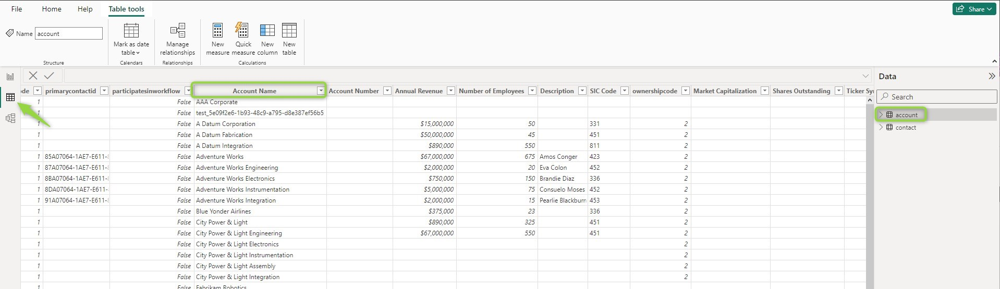
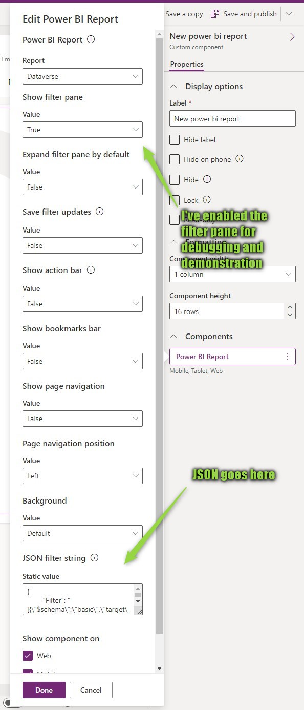
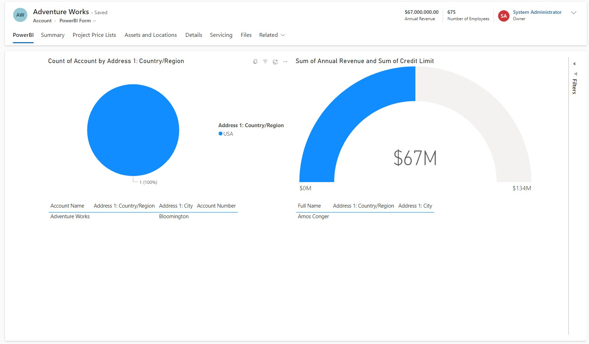
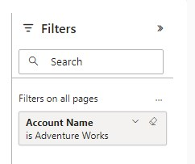
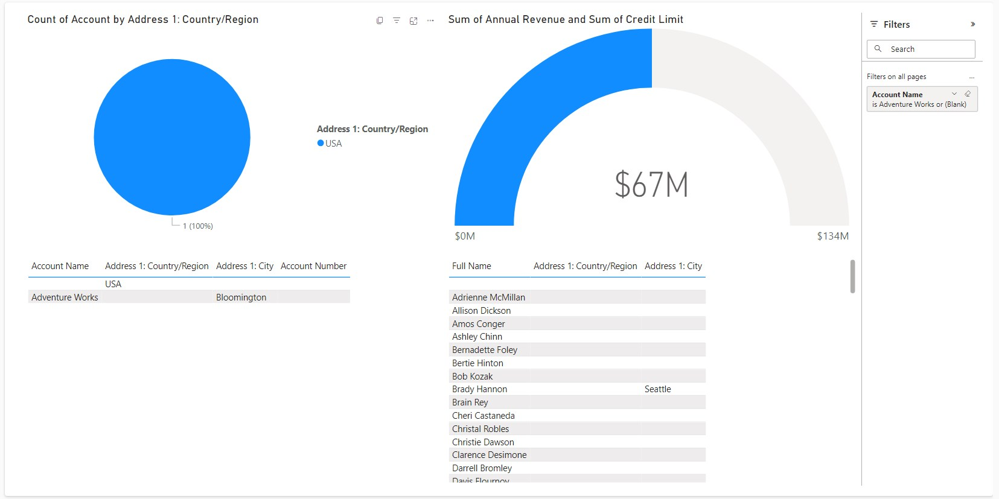
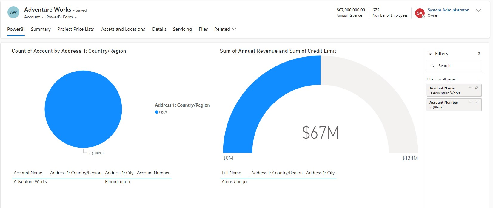

In [this post](/post/powerbi/embedded-report) of the PowerBI series, we embedded a report in a Dynamics form. But I think you also noticed that this was somewhat pointless because the report showed the same data on every record, it lacked context. This time we are going to fix this with a filter!

# Simple filter
To set a filter first, we need to find out the table and column name of the target column in the PowerBI report. You can find these in the _Table View_ when opening the report in the Desktop App.



From here, fill the following Template by replacing the \<tags>:
```
{
    "Filter": "[{\"$schema\":\"basic\",\"target\":{\"table\":\"<PowerBI Table Name>\",\"column\":\"<PowerBI Column Name>\"},\"operator\":\"In\",\"values\":[$a],\"filterType\":1}]",
    "Alias": {
        "$a": "<CE Column Logicalname>",
    }
}
```

> **Note**: The ugly formatting is on purpose! When I prepared this article I had to follow the advice [here](https://powerusers.microsoft.com/t5/Building-Power-Apps/How-does-the-table-binding-or-JSON-filter-string-work-in-the-new/td-p/1834916) to remove all line breaks in the _Filter_ property of the JSON as this is an encoded JSON.

The result for my sample looks like this:
```
{
    "Filter": "[{\"$schema\":\"basic\",\"target\":{\"table\":\"account\",\"column\":\"Account Name\"},\"operator\":\"In\",\"values\":[$a],\"filterType\":1}]",
    "Alias": {
        "$a": "name",
    }
}
```




Now the report looks much different! Of course, my report for this series is not well designed for this scenario, the only thing that makes sense is the filtered contact grid. 
Notice how the _Pie Chart_ for the country changed: When we selected an account manually in the Dashboard/Embedded Report, it got a _cross highlighting_, but the filter applies to the whole page, so the visual is simply filtered. 
I have also enabled the _Filter Pane_ in the PCF settings to show you the effects on the displayed report.

 

## Or filter
You can also filter one PowerBI column to 2 different CE fields. This is also [the sample Microsoft provides](https://learn.microsoft.com/en-us/power-apps/maker/model-driven-apps/embed-powerbi-report-in-system-form). With the operator "In" we can just define a second _Alias_ (aka Parameter) for the Filter like this:
```
{
    "Filter": "[{\"$schema\":\"basic\",\"target\":{\"table\":\"account\",\"column\":\"Account Name\"},\"operator\":\"In\",\"values\":[$a,$b],\"filterType\":1}]",
    "Alias": {
        "$a": "name",
        "$b": "accountnumber"
    }
}
```

Again, I'm not good with these samples, but notice here how 2 Accounts are listed now, one with an empty (_Blank_) name for the empty accountnumber of the CE record and one with name of the CE record.



## And filter
And finally, you can filter on multiple fields matching with AND. For that, you simply define 2 filters like this:
```
{
    "Filter": "[{\"$schema\":\"basic\",\"target\":{\"table\":\"account\",\"column\":\"Account Name\"},\"operator\":\"In\",\"values\":[$a],\"filterType\":1},{\"$schema\":\"basic\",\"target\":{\"table\":\"account\",\"column\":\"Account Number\"},\"operator\":\"In\",\"values\":[$b],\"filterType\":1}]",
    "Alias": {
        "$a": "name",
        "$b": "accountnumber"
    }
}
```
Sorry for that long line, but if I put a linebreak there, you can bet someone will copy it blindly and be frustrated for it not working.

The result looks pretty much the same as in the first picture, the name and number match up. 



## Considerations
I don't have any knowledge of a way to connect two filters in the JSON as an or and that poses an interesting architectural requirement: While I can match two or more CE columns to one PowerBI Column I can't match one CE column to multiple PowerBI columns.

How could I run into this? Just an example: You have migrated the accounts of 2 legacy systems into CE and put the respective account number into the `accountnumber` field. Now the designer of the PowerBI Dataset aggregates from both systems as well and tries to deduplicate the accounts, he puts in 2 columns for `accountnumberA` and `accountnumberB` to be able to fill both of them. 
Now you will have trouble solving this. If the dataset also contained an `accountnumber`, which one would it be in case of a deduplication? One of the CE records would show an empty report. Splitting it in CE won't help either, it still would not match in case of a deduplication where both numbers are filled.
The dataset designer can't even solve this on his own if he would match the CE accounts on his side as he still has to put 2 `accountnumber`s into one field, which will not work unless you can afford a `contains` filter-operator.
A deduplication on CE side will likely not be possible on CE side, because if it had, you would have done it in the first place.

One thing you could do is to feed back a new number back to CE based on the dataset, lets call it `reportnumber`. This could be the deduplicated `accountnumber` in the dataset, pushed to CE via a [Dataflow](/tags/dataflows). Now you can filter CEs `reportnumber` against PowerBIs `accountnumber` and will always get the correct result.

## Summary
Filters make embedded PowerBI reports much more useful! To apply a filter, you enter a JSON in the configuration of the PowerBI PCF in the Dataverse form and reference the correct PowerBI table and column names as well as the logicalname(s) of the CE field(s) on the form. The result is a prefiltered report which can for example show all orders for the customer from an ERP system without needing a full integration via [Virtual Entities](/tags/virtual-entities/) or similar technologies. You can filter one PowerBI column by multiple CE fields or multiple PowerBI columns with an AND. An OR filtering on multiple PowerBI columns is not possible, you can only filter a single PowerBI column with an OR by using the IN operator.