Did you know PowerBI Dashboards can be published to Dynamics? Its a great feature! Not only has PowerBI many options for displaying data that the regular Dynamics Dashboards lack, but it also as more options in styling. Not to speak of the possibility to integrate data from non Dataverse sources. 

## Step 1: Connecting to Dataverse
If you haven't already, first install PowerBI Desktop. That can be done at the Microsoft Store or at [app.powerbi.com](https://app.powerbi.com/) by selecting the Download Icon at the top right. Technically I don't think we will be using any feature today that would not work in the browser version at [app.powerbi.com](https://app.powerbi.com/), however the best practice from my analytics colleagues is: You are going to need a feature of the Desktop version sooner or later, so simply always use PowerBI Desktop.

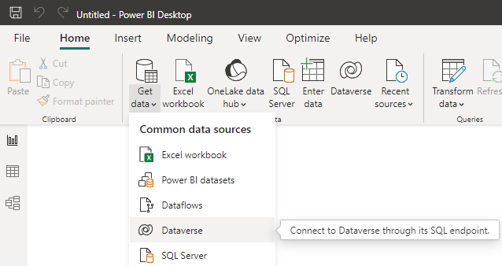

When creating a new Report, in the top ribbon, select _Get Data_. Here you can choose from a lot of connections, for this post we will use _Dataverse_. 
After entering your credentials you will be presented with a screen holding all available Dataverse instances and all tables within it. For the demonstration I chose Account and Contact, since these 2 have a relationship that we will display later.

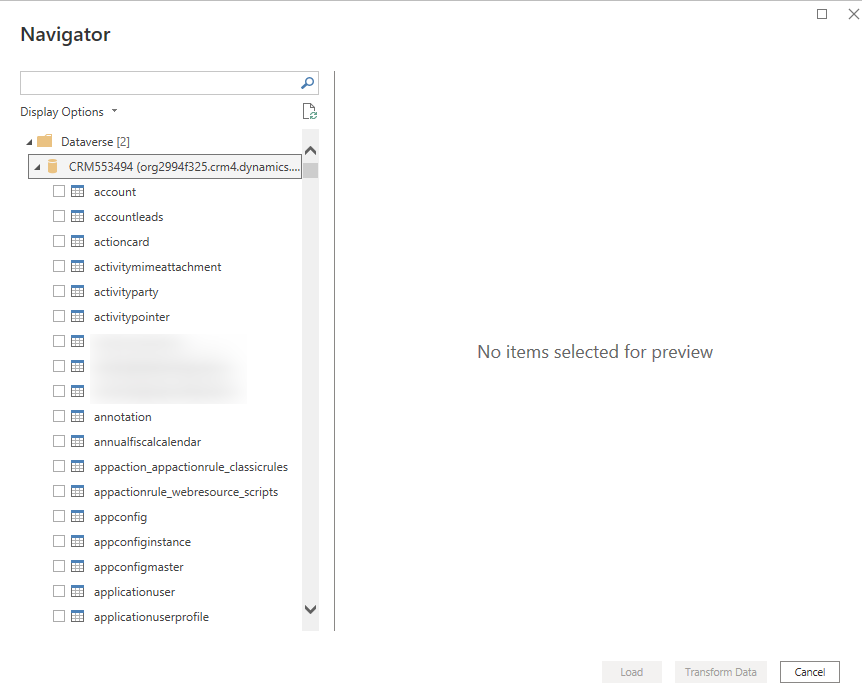

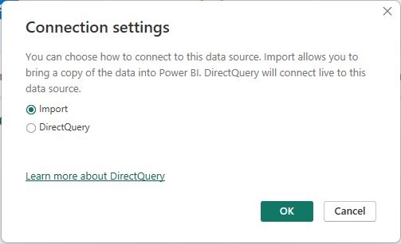

## Step 2: Transform Data
Here we are actually not going to do a lot for the first Dashboard. You should be aware that you can introduce new columns here, delete others to reduce the model and correct column values. That would actually be needed here since in the later screenshots you will see that "USA" is also written as "U.S." and "United States" in the sample data. But at this stage I wouldn't have known that issue, only after visualizing it I can go back to fix it in _Transform Data_.

But I wanted to show you a cool detail here: I suspected needing to map the optionset values to friendly names. But it did that in the base language for me!

 

## Step 3: Relations
PowerBI also recognizes the relationships between these entities. Unfortunately there are 2 of them. The parentcustomerid where the contact references the account its belonging to. And primarycontactid where an account selects its main contact. PowerBI will can only have one of the two in the model, trying to create a star in the dependencies, a doubled relationship would hamper that structure.

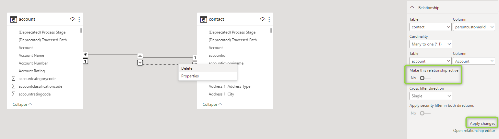

## Step 4: Visualizing
Yeah, I don't want to talk to much about it. Apart from me never getting it to a beautiful state, it does not matter to much for the later stages. Be creative here. I used a account/country pie chart, an account list, a contact list and a gauge with the annual revenue for the demo: If I select a country in the pie chart, the account list is filtered. If I select an account there, the contact list gets filtered accordingly. The gauge filtering of course works for both of these filtering operations.

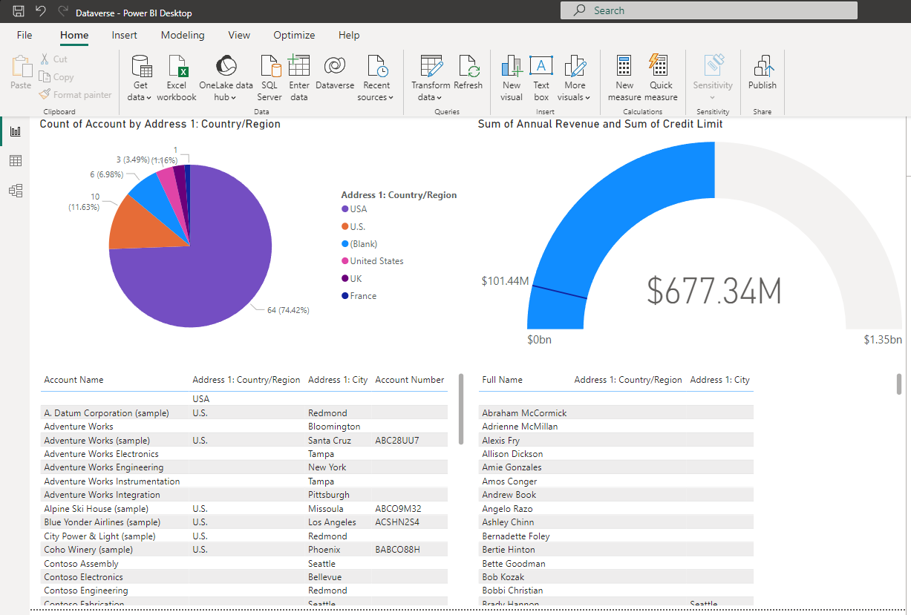

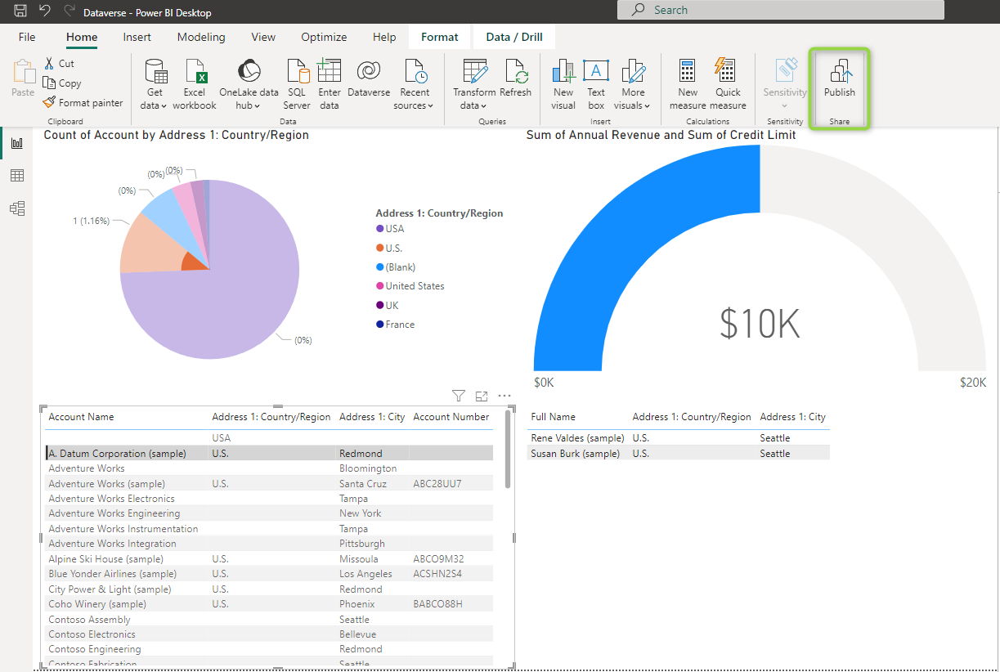

## Step 5: The PowerBI Service
In the screenshot above I already marked the publish button. We will use it now to upload the report to the PowerBI Service. For the demo the "MyWorkspace" default value is fine, but for an enterprise project you will probably want to have a dedicated workspace for your Dataverse Dashboard.

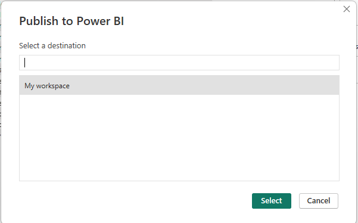 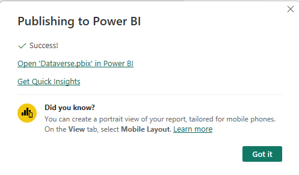 

Now we continue at [app.powerbi.com](https://app.powerbi.com/). We cant show the Report as Dashboard in Dynamics, we need a PowerBI Dashboard! We can just create that in the Workspace and then navigate to the Report again and use the _Pin to Dashboard_ option from the ribbon to pin the current page. Make sure no unwanted filters are active, because these would be snapshotted as well! 

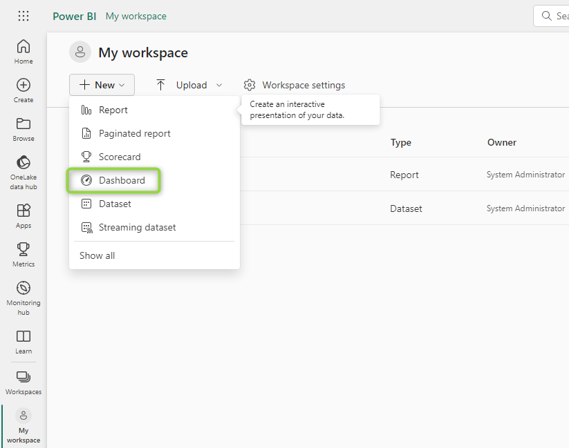

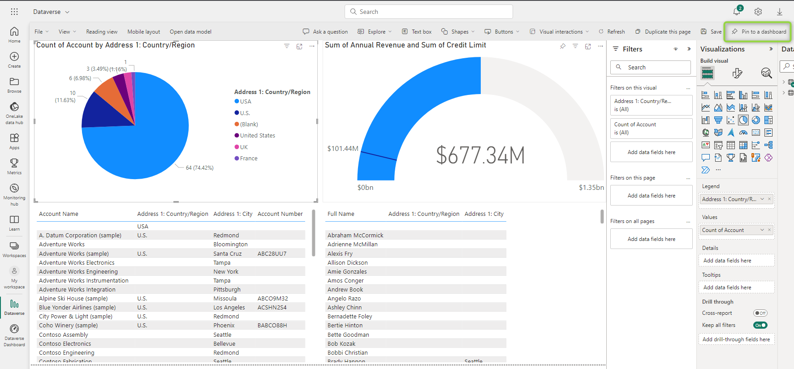 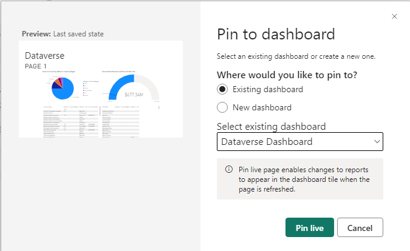 

Now the Dashboard looks like the report and we can proceed showing it in Dynamics, but there is one more step to ensure the data stays up to date: The scheduled refresh. For this, head back to the Workspace, find the dataset and select the _Scheduled Refresh_ Icon. Here you will need to configure which account to use for the refresh and how often to refresh. Usually Daily is sufficient, but sometimes you will need quicker refresh rates. If they get really low you will have to take a look at your performance as well, because data might be outdated by the time it was processed by the service. On the other hand some systems might have very long times between data changes, for example budgetary databases only being updated once a year.

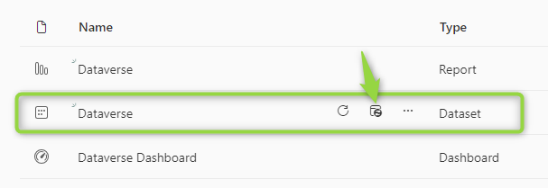 

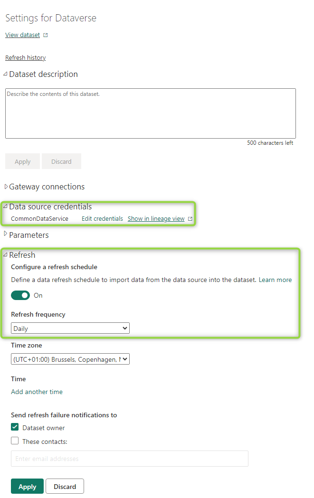 

## Step 6: Embedding in Dynamics
Now the data is published (yet only available to the members of the workspace), kept up to date and part of a dashboard that we can publish. PowerBI Dashboards in Dynamics cannot be created for the whole system, only as personal Dashboards. So, head to an app with Dashboards and select _New PowerBI Dashboard_.

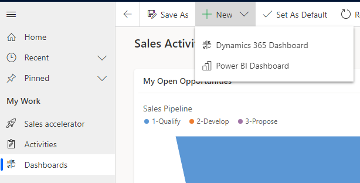 

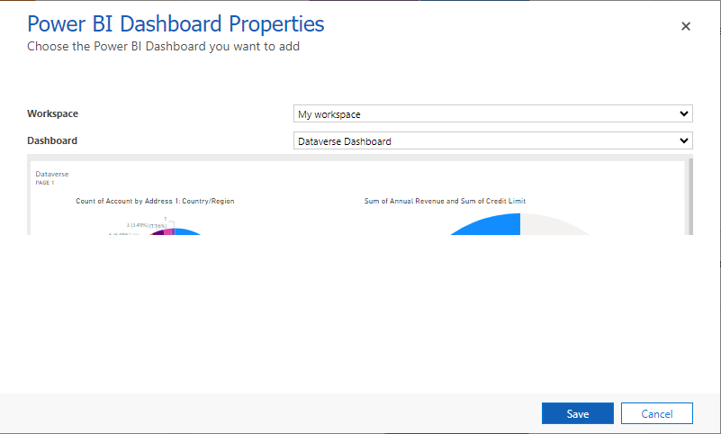 

In the wizard we select our Dashboard from step 5 and then it is done!

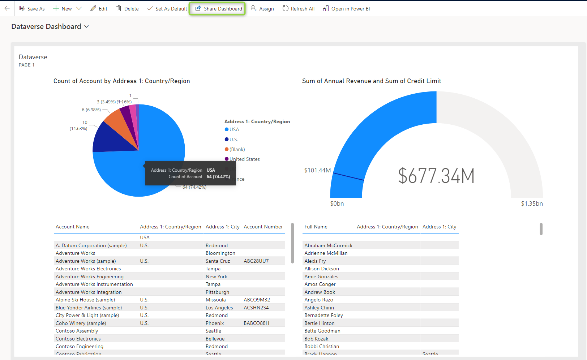 

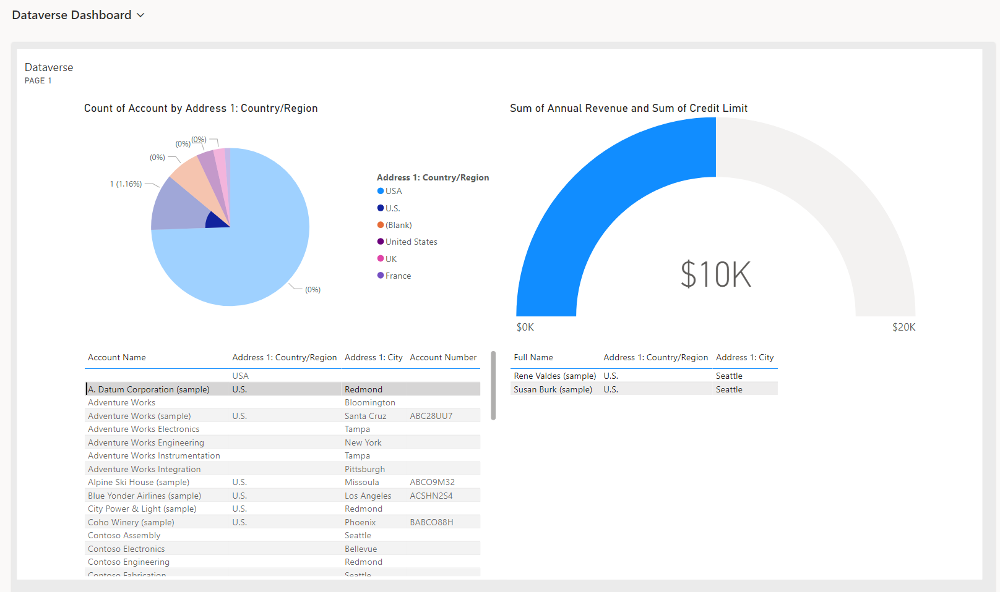 

## Step 7: Sharing
Now of course not every user should go through these steps just because this is a personal Dashboard! Lets share it. I've again marked the share button in the screenshot above. But that's not enough! The users can then select the dashboard, but they wont be able to see its contents since they dont have access to the PowerBI Service Components we created.

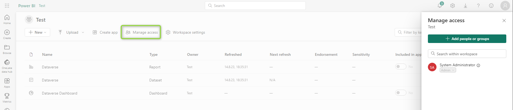 

When adding the users here, it is sufficient to only add them as viewers. They will still be able to use the filtering, but they cant alter the dashboard. This contributor capability should only be given to few users who are actually maintaining the report with you.

## Summary
While the article is quite long due to its many pictures, the actual time it takes to make such a dashboard short. The most time spent in PowerBI is usually the modeling part. Since we used a Dataverse source here and just kept everything as is, that was quick as well here. While publishing such a dashboard is arguably more complex than just creating a system Dashboard in Dynamics, you have much more freedom designing the Dashboard in PowerBI. Also the possibility to include other data sources is a real game changer, but thats something for another article.