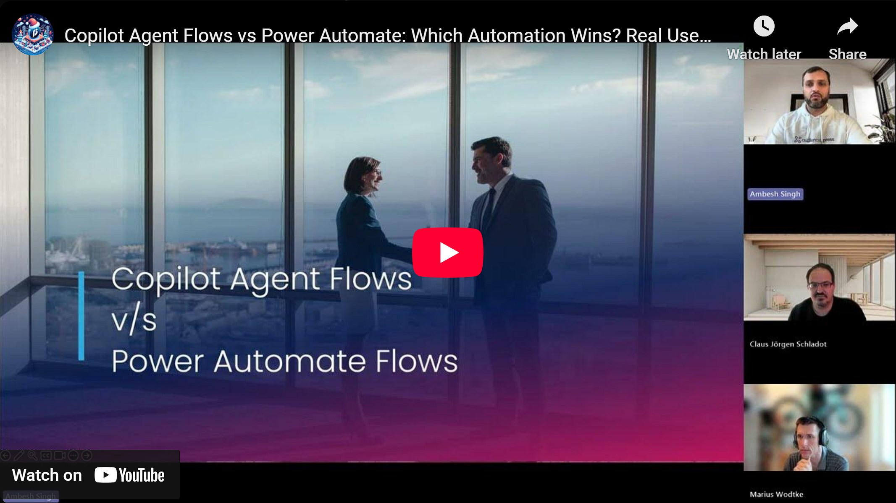

The concept of the Power Collab group is easy: Everyone shares and everyone learns! With people from different parts of the Power Platform, we can all learn something new for aspects we may not be using every day. Join us in this recording and learn as well!

Check it out [here](https://youtu.be/jFioKu_KZbw).

