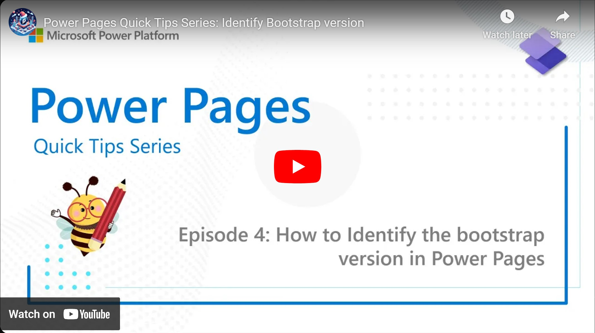

Ambesh already showed us how to enable Bootstrap 5 for new Power Pages, but how do you know which version is active on an already existing Power Page? This video holds the answer!

Check it out [here](https://youtu.be/ik2xb5PqARQ).

