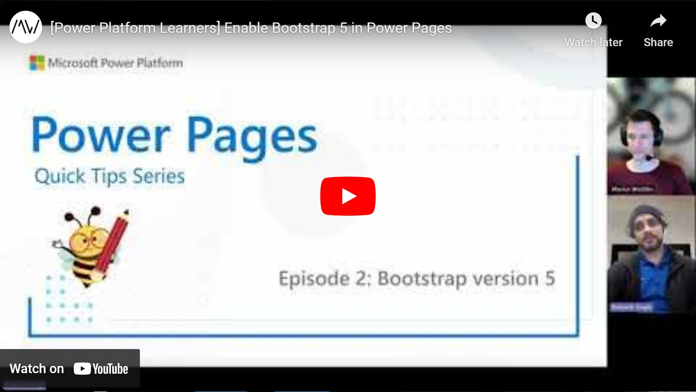

In this episode of the Power Pages Quick Tips, we talked about Bootstrap 5, the newest version of the framework which claims to be more lightweight and faster, which should of course also translate to quicker Power Pages as well.

Stay tuned and subscribe to the channel, the rest of the crew will join us soon for more tips & tricks around the Power Platform.

Check it out [here](https://youtu.be/KkaupFk_GX8).

