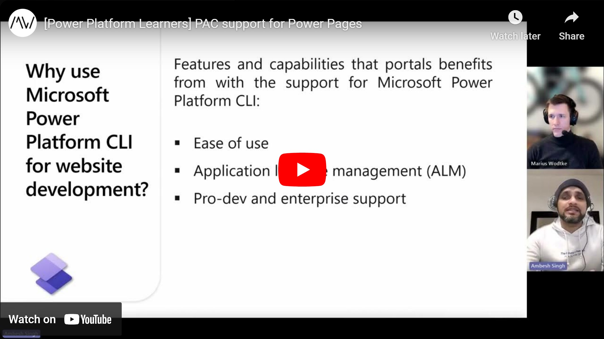

This episode of the Power Pages Quick Tips is about the Power Apps CLI (aka PAC or Power Platform CLI) and how it can be used for a more ProDev experience with Power Pages. It enables us to download and upload a given Portal, for example, to move between stages or build up version control.

Stay tuned and subscribe to the channel, the rest of the crew will join us soon for more tips & tricks around the Power Platform.

Check it out [here](https://youtu.be/KkaupFk_GX8).

