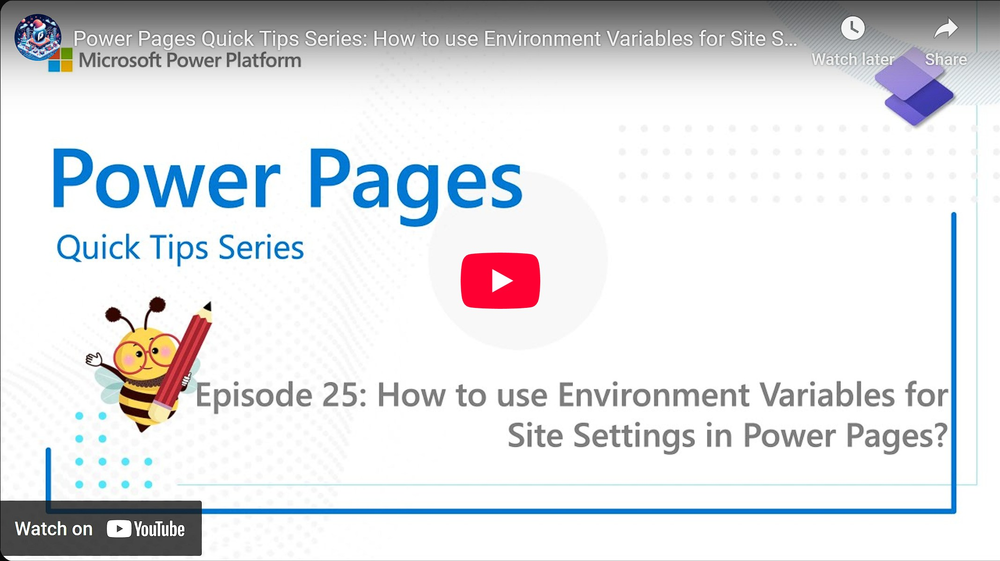

Welcome to the Episode 25th of the Power Pages Quick Tips Series. In this episode, we are going to talk about How to use Environment Variables for Site Settings in Power Pages?

Environment variables are the variable that holds configuration values specific to an environment that the application or features can reference.

When working with environment variables for site settings? , it's important to follow best practices to ensure efficient and effective management. Use environment variables to define site settings values across various environments with the enhanced data model. While the standard data model relies on deployment profiles, the enhanced model allows for dynamic configuration of environment-specific settings using environment variables.

Check it out [here](https://youtu.be/ZdQ8xUVJ9Xk).

