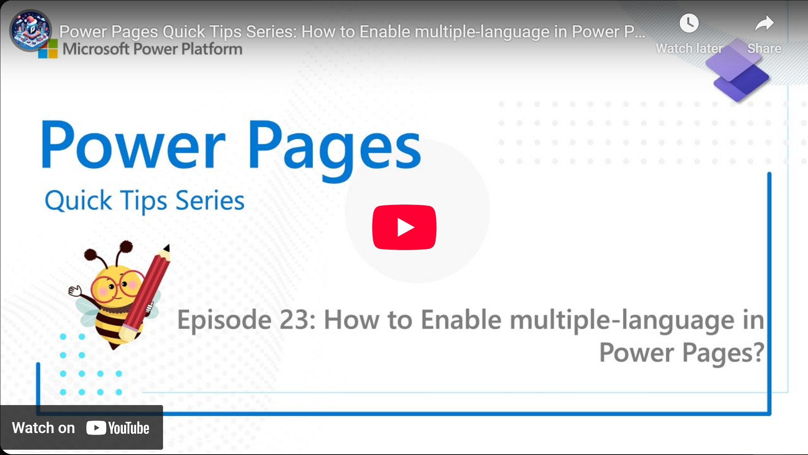

The [content snippets](/post/ppl/power-pages-snippets) do not only allow changing texts on standard pages, they also allow us to translate pages. In this video we are exploring how we can enable a new language in Power Pages.

Check it out [here](https://youtu.be/UBltc6haCwQ).

