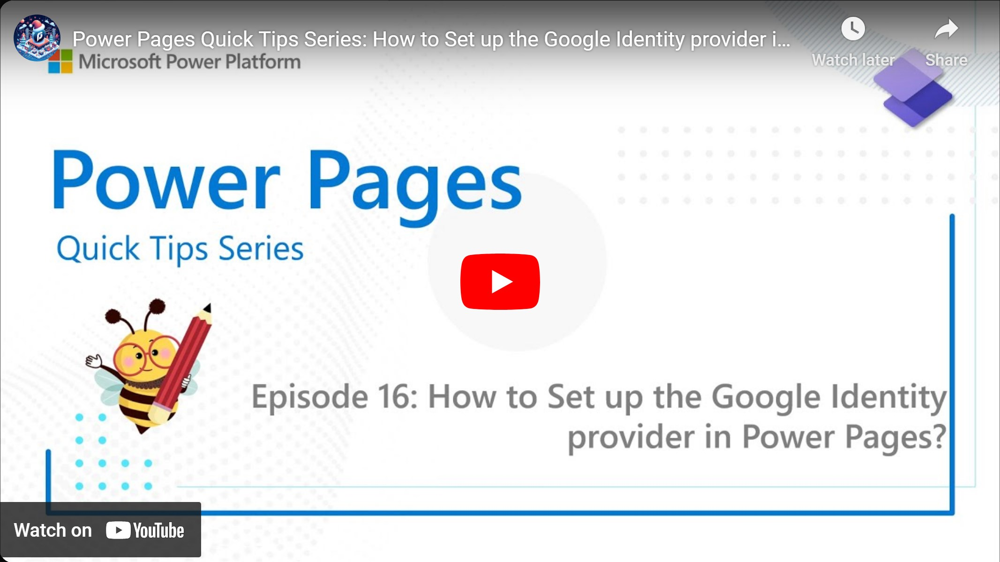

Power Pages has multiple Identity providers for handling Authentication and Google accounts can be used as such. Learn here how to set it up to enable login with a Google account to for example allow your customers to login to your Power Page.

Check it out [here](https://youtu.be/dgjgPMHuGVk).

