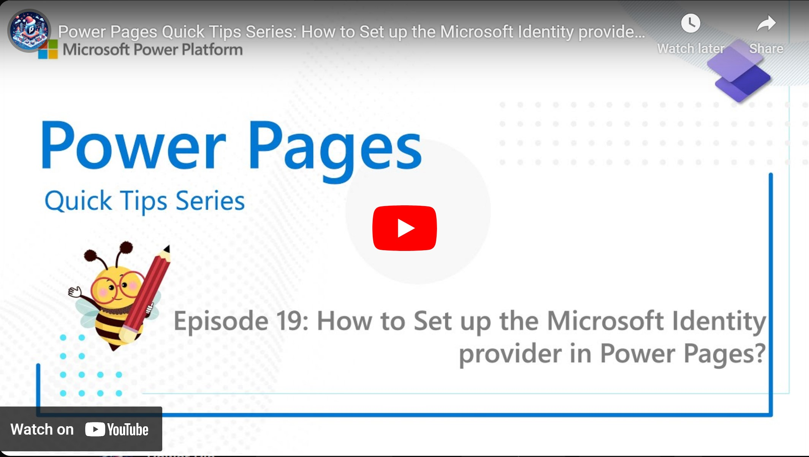

Power Pages has multiple Identity providers for handling Authentication and naturally Microsofts own Entra Id is one of them. Learn here how to set it up to enable login with a Microsoft account to for example allow your employees to login to your Power Page.

Check it out [here](https://youtu.be/i3DmsbveH2Y).

