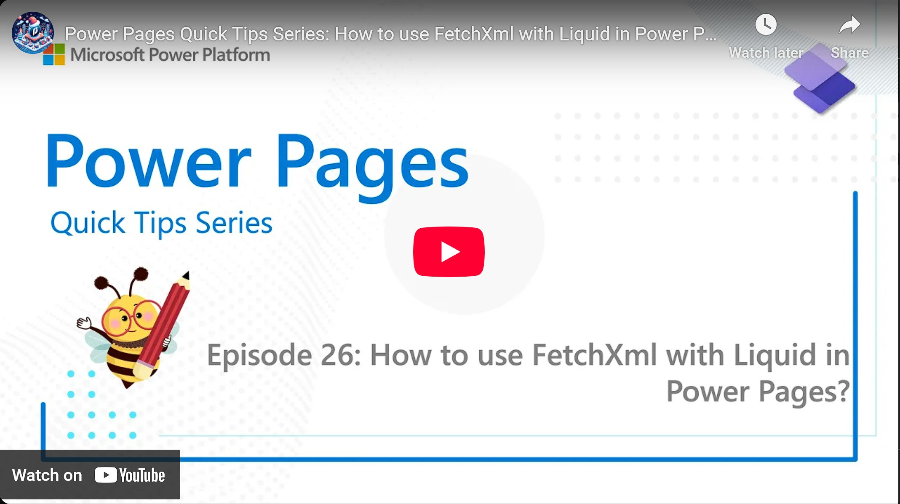

Did you know you could directly query Dataverse from Liquid? This enables you to display data in a unique ways the OOTB methods wouldn't allow. Want to learn more?

Check it out [here](https://youtu.be/z8XNtMgWyQ8).

