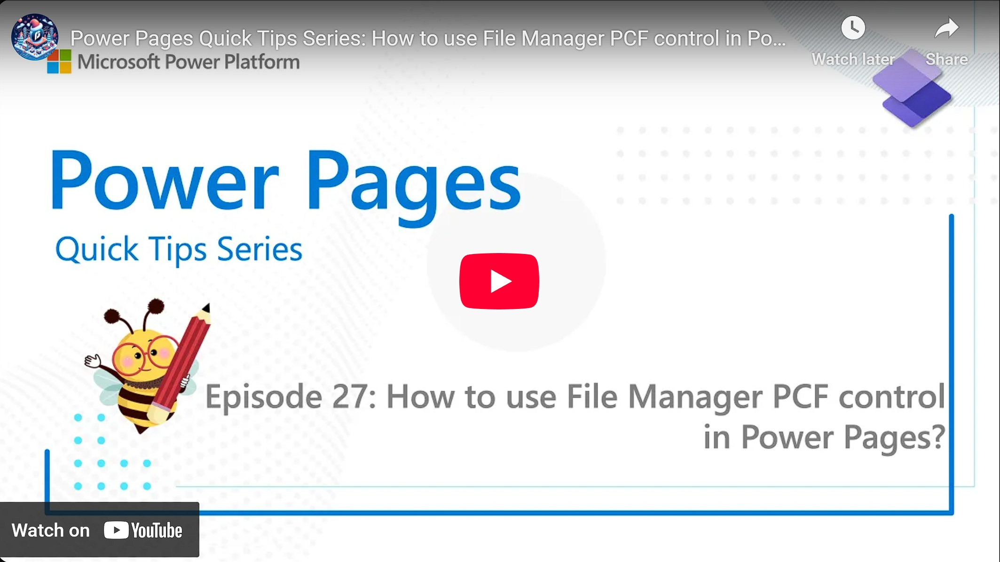

The File Manager PCF for Power Pages is a tool to allow users to easily upload one or more files. In contrast to the OOTB control, this will upload the data to an Azure Storage, rather than burdening your Dataverse storage. Want to learn more?

Check it out [here](https://youtu.be/JCWzkCALu8g).

