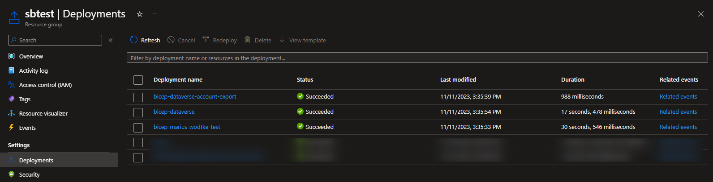

Technically you know everything you need to from the [first 3 articles](/post/servicebus) of this series. But as you develop more and more functionality and the amount of subscriptions or topics grows, there will be configuration errors happening. The most typical thing: Someone configures a new subscription for dev and test, finishes their feature and then forgets about it. Some time later the listener gets released to production and won't start due to the missing subscription.

This can be mitigated by using Infrastructure as Code (IaC). This ensures that when the feature is completed and the code for the listener is checked in, the infrastructure for it is checked in alongside, preferably in the same Pull Request. 

## Bicep
The tool we will be using for this today is Bicep. It was developed by Microsoft for deploying Azure Resources. I won't go too much into the very basics of this tool, if you are stuck with my explanations, MS Learn has a [full learning path](https://learn.microsoft.com/en-us/training/paths/fundamentals-bicep/) providing much more help.

But that much information we need: To deploy (execute, interpret, whatever) the contents of a .bicep file, we will need [the Azure CLI](https://learn.microsoft.com/en-us/cli/azure/install-azure-cli-windows?tabs=azure-cli) installed. I also recommend installing the Bicep Extension if you are using VS Code, as this will grant you autocomplete features as well as linting, always welcome features if not having a firm grasp on a new language. 

## servicebus.bicep
In a bicep file, you define resources that receive parameters and when executed, the resource will be turned into a real thing in Azure. We can also define modules that group such resources, but let's worry about that later, just be aware, that we are about to define a module in the servicebus.bicep file.

```
param serviceBusName string
param location string = resourceGroup().location

resource serviceBusResource 'Microsoft.ServiceBus/namespaces@2022-10-01-preview' = {
  name: serviceBusName
  location: location
  sku: {
    name: 'Standard'
    tier: 'Standard'
  }
}
```

Our Resource here is `Microsoft.ServiceBus/namespace`. It has a location like "Western Europe", an SKU which I hardcoded here to _Standard_ and _Basic_ won't offer the Topic I'm about to configure and _Premium_ is quite expensive and will only be used in heavy load or special security requirements. Notice the `param serviceBusName` which is something you need to pass if you want to deploy this.

## topic.bicep
Next is another module I called topic. Here are some interesting bits as well:
The service bus has an `existing` before its definition. That means we don't want to create it, but we want to validate its existence. And we can use it as the parent for our topic after that.
The topic parameter is an object, so you need to pass something more complex. This of course is a parameter you don't want to specify in the CLI, but later we will define a main.bicep where we can code some complex objects.
Lastly, this module calls another module, called subscription.bicep. And it does so with a loop `[for subscription in topic.subscriptions: ...]`. The `dependsOn` also specifies that this deployment cannot start before the topic is created. 

```
param serviceBusName string
param topic object

resource serviceBusResource 'Microsoft.ServiceBus/namespaces@2022-10-01-preview' existing = {
  name: serviceBusName
}

resource serviceBusTopic 'Microsoft.ServiceBus/namespaces/topics@2022-10-01-preview' = {
  name: topic.name
  parent: serviceBusResource
  properties: {
    autoDeleteOnIdle: 'P10675198DT2H48M5.477S' // Never
    defaultMessageTimeToLive: 'P14D'
  }
}

module subscriptionModule 'subscription.bicep' = [for subscription in topic.subscriptions: {
  name: '${deployment().name}-${substring(subscription.name,0,min(length(subscription.name),25))}'
  params: {
    serviceBusName: serviceBusResource.name
    topicName: topic.name
    subscription: subscription
  }
  dependsOn:[
    serviceBusTopic
  ]
}]
```

## subscription.bicep
Of course, this file also needs to be present. And its probably the most important for this article as the subscriptions and rules are the thing that connects this article to the Dynamics Service Endpoint specifics.

```
param serviceBusName string
param topicName string
param subscription object

resource serviceBusResource 'Microsoft.ServiceBus/namespaces@2022-10-01-preview' existing = {
  name: serviceBusName
}

resource serviceBusTopic 'Microsoft.ServiceBus/namespaces/topics@2022-10-01-preview' existing = {
  name: topicName
  parent: serviceBusResource
}

resource serviceBusSubscription 'Microsoft.ServiceBus/namespaces/topics/subscriptions@2022-10-01-preview' = {
  parent: serviceBusTopic
  name: subscription.name
  properties: {
    isClientAffine: false
    lockDuration: 'PT5M'
    requiresSession: false
    defaultMessageTimeToLive: 'P14D'
    deadLetteringOnMessageExpiration: true
    deadLetteringOnFilterEvaluationExceptions: false
    maxDeliveryCount: 10
    status: 'Active'
    enableBatchedOperations: true
    autoDeleteOnIdle: 'P10675198DT2H48M5.477S' // Never
  }
}

resource serviceBusRule 'Microsoft.ServiceBus/namespaces/topics/subscriptions/rules@2022-10-01-preview' = [for rule in subscription.rules: {
  parent: serviceBusSubscription
  name: rule.name
  properties: {
    filterType: 'CorrelationFilter'
    correlationFilter: { 
      properties: union(
        contains(rule, 'entity') 
        ? { 'http://schemas.microsoft.com/xrm/2011/Claims/EntityLogicalName': rule.entity } 
        : {}, 
        contains(rule, 'message') 
        ? { 'http://schemas.microsoft.com/xrm/2011/Claims/RequestName': rule.message } 
        : {})
    }
  }
}]
```

As you can see, I've hardcoded most of the settings for the Subscription here. That's because I don't see any necessity to alter any of these between different subscriptions of the same endpoint. For the rules, this is a different story. Each has its unique filters, for the Dataverse endpoints, these will usually be the _EntityLogicalName_ and _RequestName_. Notice the ternary operators that allow for one of the parameters to be empty. This for example allows for configuration on the message _Associate_ which simply has no entity.

## main.bicep
The last file for today: main.bicep. This puts it all together, provides some parameters and is the one we are going to deploy.

```
param serviceBusName string
param location string = resourceGroup().location

var topics = [
  {
    name: 'dataverse'
    subscriptions: [
      {
        name: 'account-export'
        rules: [
          {
            name: 'accountUpdate'
            entity: 'account'
            message: 'Update'
          }
          {
            name: 'accountCreate'
            entity: 'account'
            message: 'Create'
          }
        ]
      }
    ]
  }
]

module serviceBusModule 'servicebus.bicep' = {
  name: '${deployment().name}-${serviceBusName}'
  params: {
    serviceBusName: serviceBusName
    location: location
  }
}

module topicModule 'topic.bicep' = [for topic in topics: {
  name: '${deployment().name}-${topic.name}'
  params: {
    serviceBusName: serviceBusName
    topic: topic
  }
  dependsOn: [
    serviceBusModule
  ]
}]
```

We've seen object parameters in the modules for topic and subscription and here we see how to fill this parameter. It became a rather deep object with the topic, its subscriptions and the rules of this subscription. A note on that: I expected list objects to be separated by a comma, but the linter quickly flagged that mistake to me.

This file still specifies a parameter to be set `serviceBusName`. This will have to be specified in the CLI when calling the file.

## Deploying
The first step, logging in `az login`. This will open a browser to handle the authentication.
Next depending if you have multiple subscriptions: `az account set --subscription "MySubscription"`.
And then we can already deploy `az deployment group create --name bicep --resource-group sbtest --template-file 'main.bicep' --mode Incremental`. The 2 things you might want to change here are a) the `--resource-group` which is probably not called sbtest in your environment and b) the deployments `--name` could be more descriptive. But please note that there is a maximum of 64 characters allowed for deployment names and inside the modules the name is appended with the current resource name! For the subscription deployment this is attempted to mitigate assuming there might be quite long subscription-names `name: '${deployment().name}-${substring(subscription.name,0,min(length(subscription.name),25))}'`. 

After the execution, you can check on the successful (or failed) deployment at the resource group.



## Summary
With our 4 levels of nested resources (namespace, topic, subscription, rule) we also created 4 files to specify those resources. servicebus.bicep to create the namespace, topic.biceps to crate the topic below and subscription.bicep creates the subscription and rules below the topic. main.bicep now specifies the parameter object and calls the modules and is the file that is referenced in the deployment. 
But with those in place, all we need to do for new functionality with a new subscription is to add it to the `topics` variable and redeploy. This approach also ensures the same settings for all subscriptions and allows you to change them for all subscriptions in bulk. Nifty, if you have 20+ subscriptions.
I hope this approach saves you some headache on deployment day as it should just be a CLI command to be run and if it worked for the test/staging environment, why wouldn't it for the production?