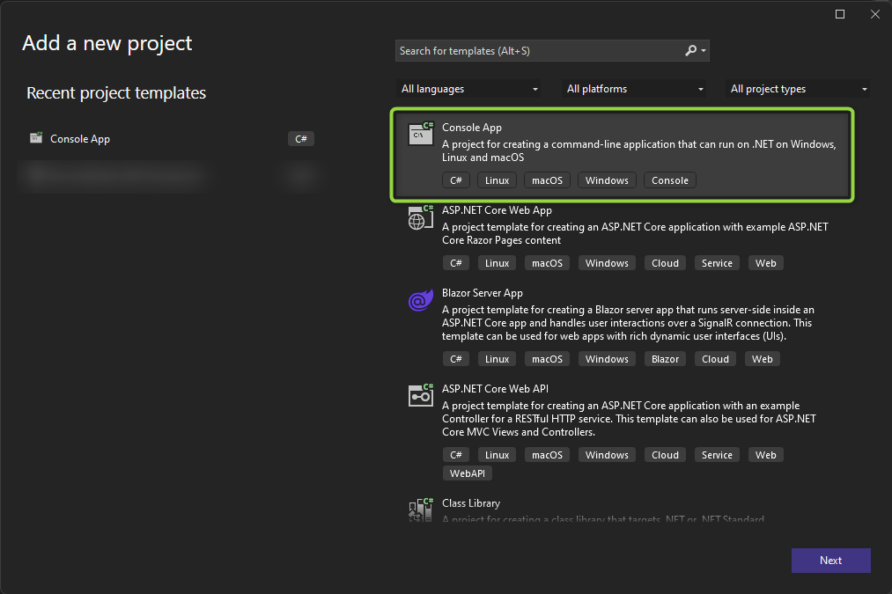
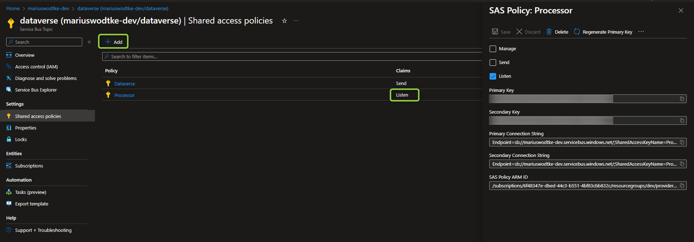
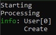

In [the last post](/post/servicebus/webjob) we already set up a working processor for Dataverse events. But what if AppServices and WebJobs are not preferred or are simply not possible for you. An example would be because you are on OnPremise infrastructure or Azure VMs or the Azure Kubernetes Services are used. There has to be an option to create a processor without such helper technologies, right? Yes, of course there is and here we are going to explore how.

## General preparations
You can find the full project code [here](https://github.com/Kunter-Bunt/D365ServiceBusProcessors/tree/main/DataverseEventProcessorPlain). 

Something else often forgotten in this kind of articles is the description of the used dependencies (here NuGets):
- `Azure.Messaging.ServiceBus` => Contains the classes for Connecting to Service Bus
- `Microsoft.Extensions.Configuration`/`.Json` => Used for reading appsettings.json
- `Microsoft.Extensions.Logging.Console` => Using the Console as a Logging Output, may not be required if you use a different logging mechanism
- `Microsoft.PowerPlatform.Dataverse.Client` => RemoteExecutionContext class for Deserialization
- `Azure.Identity` => Only if you will use a managed identity, if you are OnPremise, you can skip this

And of course check out [the first post](/post/servicebus/exporting-events) of this series where we set up the service bus and our possibility to send events to this service bus. So by now everytime you create an account, a message should pop up in your subscription. Of course it might also be helpful to have read [the last post](/post/servicebus/webjob) as well for some context (e.g. regarding managed identities) as this is problably the easiest method to set up a processor.

## The project
We will start by creating the project. I am choosing .NET Core here as by now the CRM SDK for .NET Core (Microsoft.PowerPlatform.Dataverse.Client) has reached General Availibility and I expect Microsoft to push us further in the .NET Core Direction in the future.



Next we install the NuGets to make sure the code will compile, here's the list again for a quick copy: `Microsoft.Azure.WebJobs.Core`, `Microsoft.Azure.WebJobs.Extensions.ServiceBus`, `Microsoft.Extensions.Logging.Console`, `Microsoft.PowerPlatform.Dataverse.Client`.

And next is code. We only need two classes, program.cs and functions.cs. I chose the same split here as the WebJobs, technically of course this can all be written into the program.cs.

```
var config = new ConfigurationBuilder().AddJsonFile("appsettings.json").Build();
var sbNamespace = config.GetSection("AzureServiceBus")["fullyQualifiedNamespace"];

var client = new ServiceBusClient(sbNamespace,new DefaultAzureCredential(), new ServiceBusClientOptions());
```

So just like with the WebJob i created a file called appsettings.json, marked it for CopyToOutputDirectory and its content looks like this:
```
{
  "AzureServiceBus": {
    "fullyQualifiedNamespace": "mariuswodtke-dev.servicebus.windows.net"
  }
}
```
This "fullyQualifiedNamespace" is passed to the `ServiceBusClient` alongside the `DefaultAzureCredential` for logging in with the managed identity and `ServiceBusClientOptions` which you might want to customize depending on your open ports as these do change wether you use TCP or WebSockets here.

As promised int the preparations, you dont need to use a managed identity, if you use regular SAS keys like we did with Dataverse it will look like this.
```
var config = new ConfigurationBuilder().AddJsonFile("appsettings.json").Build();
var sbConnectionString = config.GetSection("AzureServiceBus")["connectionString"];

var client = new ServiceBusClient(sbConnectionString);
```
```
{
  "AzureServiceBus": {
    "connectionString": "Endpoint=sb://mariuswodtke-dev.servicebus.windows.net/;SharedAccessKeyName=Processor;SharedAccessKey=REDACTED;EntityPath=dataverse"
  }
}
```
This of course has the problem, that the SAS key is in the appsettings.json, so this plain file would need to be guarded. And for example the risk of the secret being committed to source control is always present.

To gain such a connection string, you can copy the approach from the policy of [the first post](/post/servicebus/exporting-events), just this time with the _Listen_ claim. 



```
var functions = new Functions();

var processor = client.CreateProcessor("dataverse", "account-export", new ServiceBusProcessorOptions());
processor.ProcessMessageAsync += functions.ProcessQueueMessage;
processor.ProcessErrorAsync += functions.ProcessError;

await processor.StartProcessingAsync();
Console.ReadKey();
```

Next we are creating a processor on the subscription. Here the `ServiceBusProcessorOptions` might be interesting if you want to limit concurrent processing to 1 (MaxConcurrentCalls) like I suggested last time. Then we add the functions that will be the processors for the message and potential errors and finally call `StartProcessingAsync` to start processing. Because this method returns as soon as processing has started, I need to block the programm from exiting afterwards.

And finally we need to take a look for the Functions class:
```
public class Functions
{
    private ILogger log;

    public Functions()
    {
        log = LoggerFactory.Create(_ => _.AddConsole()).CreateLogger("User");
    }

    public Task ProcessQueueMessage(ProcessMessageEventArgs args)
    {
        DataContractJsonSerializer serializer = new DataContractJsonSerializer(typeof(RemoteExecutionContext));
        var message = serializer.ReadObject(args.Message.Body.ToStream()) as RemoteExecutionContext;

        log.LogInformation(message?.MessageName);

        return Task.CompletedTask;
    }

    public Task ProcessError(ProcessErrorEventArgs args)
    {
        log.LogError(args.Exception.Message);

        return Task.CompletedTask;
    }
}
```
So the `ProcessError` does nothing much for error handling, it just reports the error here, but you can do more advanced stuff here like immediately dead-lettering a message in case of certain errors.

But like mentioned in the WebJob post, JSON deserialization is problematic here. But .NET binary is as well! You shall not use the `BinaryFormatter` in .NET 6.0 anymore due to security issues. We can argue that we control the incomming messages, but the green squiggles are not beautiful and no static code review will like it, forming a constant source of needing to justify ourselves. So looking back at the problems mentioned last time: `Newtonsoft.JSON` has problems with properties of `RemoteExecutionContext` not being settable. `System.Text.JSON`s problems start with the DateFormats and continue with the Collections not being writable after initialization. That would need a lot of [custom converters](https://learn.microsoft.com/en-us/dotnet/standard/datetime/system-text-json-support) to fix this. The `JavaScriptSerializer` would work, but is not supported for .NET Core. But luckily `DataContractJsonSerializer` does work as shown above (and it would work for a WebJob as well if you let the SDK pass you the message as string).

> **_IMPORTANT:_** The _Message Format_ on the Service Endpoint in Dataverse needs to be set to "JSON" for this to work.

And then again there is no logic, just logging a value of the context out to the console to proof that the deserialization worked.

## The result
So if we do a debug run now, the output should look a little something like this.



Of course I can't make suggestions for deployment here because I don't know where you are deploying to. But essentially you need to make sure the content of the _bin_ folder is at the server and then make sure the .exe is always running when the server is running. It is not enough to just execute the .exe, because it will stop working as soon as the server restarts. Something like the _Windows Task Scheduler_ can help to overcome this.

## Summary
In this article we formed a very generic processor for Dataverse messages in an Azure Service Bus. This processor can run on virtually any hardware and operating system. Just make sure the correct .NET runtime is installed and it will run. 
The project is only 60 lines of code in total, but of course it is missing the most important thing: Your logic! So I won't bother you any more, lets start coding.