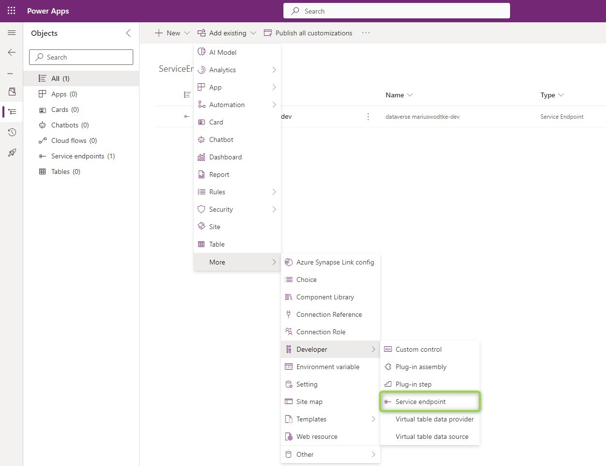
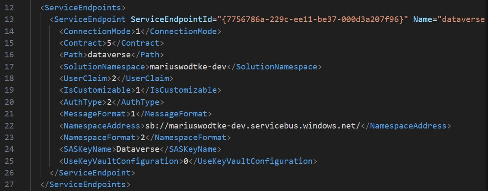
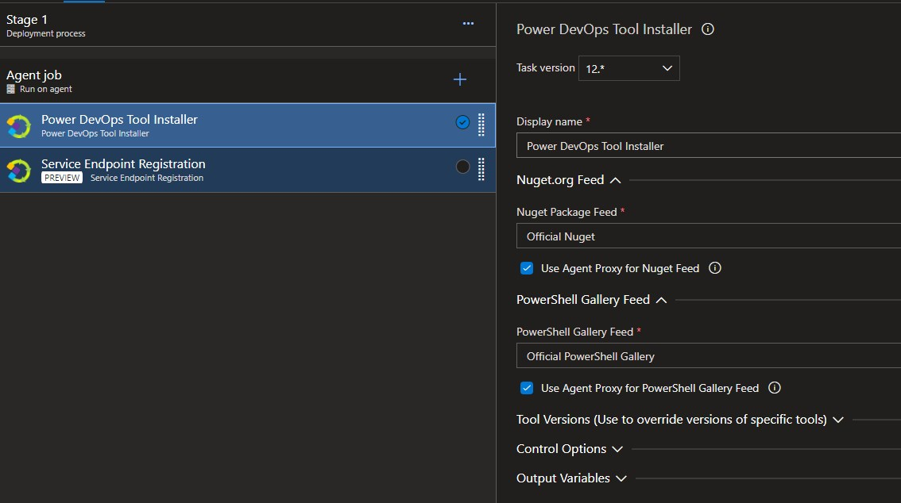
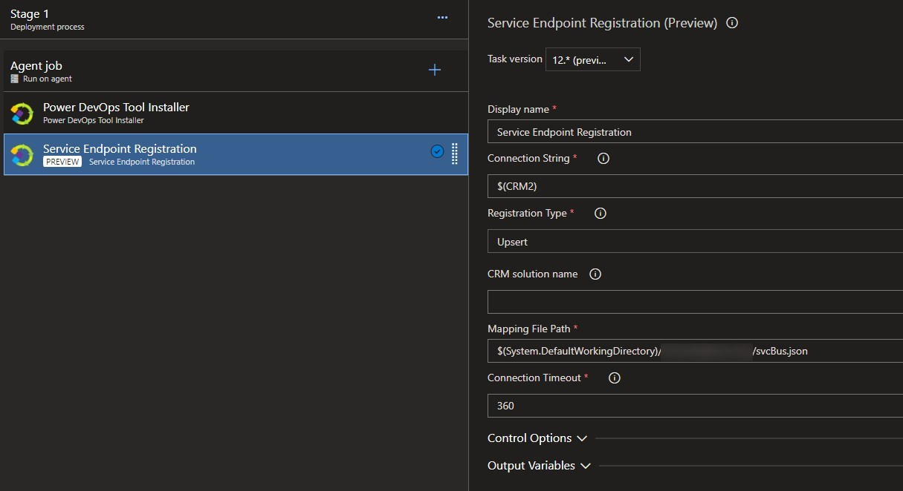
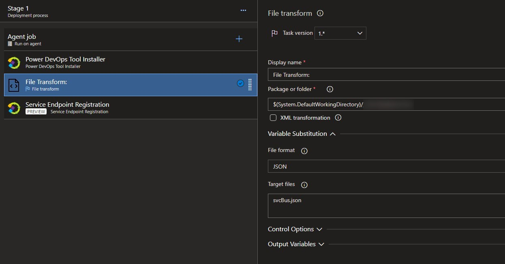
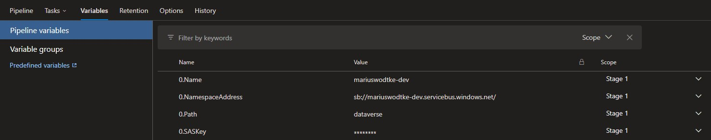

After finishing a development it's time to deploy it. In [the last post](/post/servicebus/biceps) of [this series](/post/servicebus), we covered how to deploy the Azure Service Bus. But the Service Endpoint in Dynamics linking it needs to be deployed as well!

## What's the problem?
At first glance, it seems easy since you can put the Service Endpoint into a solution, but inspecting the customization.xml reveals the problem. The Namespace and Path (Queue or Topic) are in the export while the SAS Key is not. The SAS Key not being there is of course positive, but the Namespace and Path being present means deploying the solution will overwrite these properties. That would mean we are using the same Topic for each Environment and then differentiate in the subscriptions. And that's something I suggest against due to security concerns as explained in [the first post](/post/servicebus/exporting-events).





## A simple solution
So how to handle it? Well, without making some sort of handstand, you can follow the following steps:
1. Make a separate solution that only contains the Service Endpoint.
1. Add the steps of it to your regular solution.
1. Export the Service Endpoint solution and import it to the target environment.
1. Connect the Plugin Registration Tool to the target environment.
1. Change the settings for Namespace, Path and SAS Key to the correct values and save.

And then you never deploy the Service Endpoint Solution again! That is possible because the flexible parts like the Steps and Images are part of your other solution but it's also a crux since this needs to be known by all other developers and the knowledge of how this is a one-time setup process must never vanish. Risky...

## A pipeline solution
And also it is a manual effort. One-time per environment only, but there are always reasons why you prefer automation.
For this, we will use the help of the [Power DevOps Tools](https://marketplace.visualstudio.com/items?itemName=WaelHamze.xrm-ci-framework-build-tasks) of Wael Hamze. A tool we don't need that often anymore since Microsoft has published a similar set of tasks, but it includes the perfect task for the job.





And the question of course is: What is the content of svcBus.json?
You can find the [class definition here](https://github.com/WaelHamze/xrm-ci-framework/blob/master/MSDYNV9/Xrm.Framework.CI/Xrm.Framework.CI.Common/PluginRegistration/ServiceEndpt.cs), but I will provide you with a sample as well.

``` json
[
  {
    "Id": "7756786a-229c-ee11-be37-000d3a207f96",
    "Name": "__Name__",
    "NamespaceAddress": "sb://__Name__.servicebus.windows.net/",
    "Contract": "Topic",
    "Path": "__Path__",
    "MessageFormat": "JSON",
    "AuthType": "SASKey",
    "SASKeyName": "Dataverse",
    "SASKey": "__SASKey__",
    "UserClaim": "UserId",
    "Description": "",
    "Url": null,
    "AuthValue": null,
    "Steps": []
  }
]
```

Putting the secret directly into the file is another security concern, so I've already prepared this sample for the [File Transform Task](https://learn.microsoft.com/en-us/azure/devops/pipelines/tasks/reference/file-transform-v1?view=azure-pipelines). This task will take your variables and replace the properties of the JSON file. Because of the array enclosure, we need to prefix the variables with a "0." for the first element, "1." for the second, and so on.





I'd still suggest putting the steps to a regular solution, there is no problem in deploying them regularly. You just have to make sure the Guid of the Service Endpoint is the same as on the Development Environment, but since that was in the exported customizations earlier, it should be no problem to configure properly.

A quick note on YAML Pipelines: Variables can also be defined here with a dot, so it would look like
``` yaml
variables:
- name: 0.Name
  value: 'mariuswodtke-dev' 
```
or you use a variable group to have the traditional mode of entry which is probably preferred for the secret.

## A generic solution
What if you can't use the _Power DevOps Tools_? E.g. because you are not using Azure DevOps or you are not allowed to install the Tasks. Well, we can still code this! After all, Service Endpoint is a table and we can update a record there, especially since we can assume that the Guid is constant.

So with C#, this can look like this:
``` c#
var namespace = "sb://mariuswodtke-dev.servicebus.windows.net/";
var secret = "secret";
var svcenpt = new Entity("serviceendpoint", new Guid("7756786a-229c-ee11-be37-000d3a207f96"));
svcenpt.Attributes.Add("namespaceaddress", namespace);
svcenpt.Attributes.Add("saskey", secret);
OrgService.Update(svcenpt);
```

Or with Powershell:
``` ps1
Set-PSRepository PSGallery -InstallationPolicy Trusted
Install-Module Microsoft.Xrm.Data.Powershell -Confirm:$false

$conn = Get-CrmConnection -ConnectionString $connection

$namespace = "sb://mariuswodtke-dev.servicebus.windows.net/";
$secret = "secret";
Set-CrmRecord -conn $conn -EntityLogicalName serviceendpoint -Fields @{"namespaceaddress" = $namespace; "saskey" = $secret} -Id "7756786a-229c-ee11-be37-000d3a207f96" -Upsert
```

And I think if you use something like Java and have created or updated a record in this language you can transfer the approach.

## Summary
Deploying Endpoints is a little trickier than wished for but with the right strategy, we can make it work safely. After every deployment of the Service Endpoint, some settings like Namespace, Path and SASKey need to be updated. This can happen manually or be automated.
No matter what approach you choose, I recommend a separate solution that is deployed only once to each new environment e.g. because its Version Number is constant. Nevertheless, the Pipeline Solution/Generic Solution is a safeguard in this because it makes sure that the Service Endpoint is in the correct state after every deployment. They can also help with key rotations and with frequent environment changes.