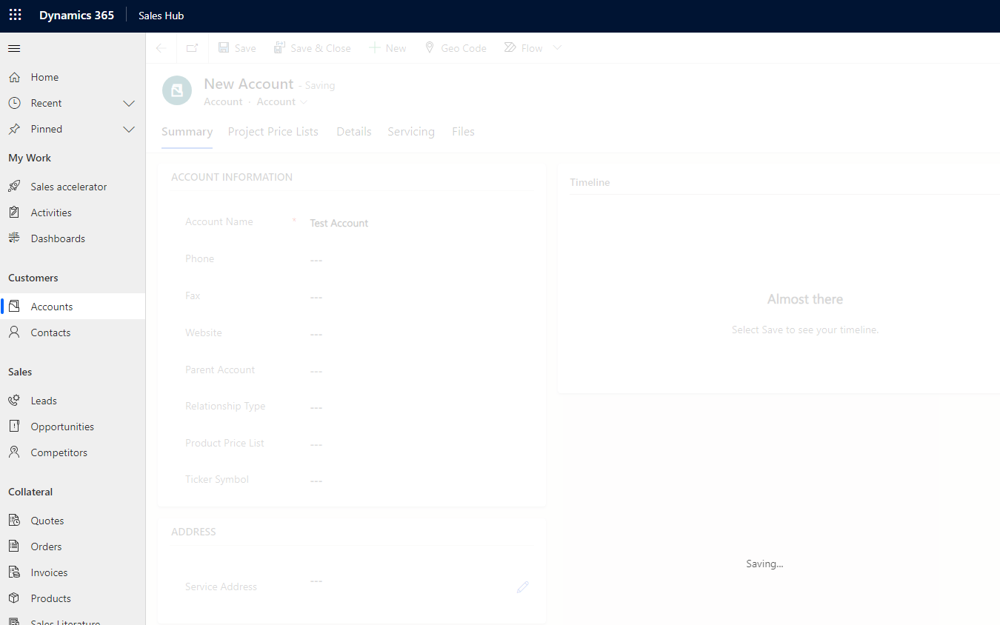

Are you aware of the Service Endpoints of Dataverse? These are integration options to process Dataverse events like Create and Update outside of Dataverse/PowerPlatform. This "Outside of Dataverse" can be things like an API hosted anywhere, but it can also be an _Azure Service Bus_ and that is what I want to discuss here.

# What is Service Bus
I will skip deeper explanations here, just the most important concepts: Service Bus is a message queueing service. So a _queue_ in Service Bus is really what the name says, a queue. The sender pushes messages in and the listener extracts them from oldest to newest. 
The second concept is a topic. The sender still pushes messages to that topic, but from here the message can go into 0 to n subscriptions from where the listener(s) read from, still, oldest to newest. Think of it like a frontdesk queue: You arrive and voice your request and get told to which queue you should enqueue to get the right employee for your request. But unlike the real world, the frontdesk assistant can also clone you and enqueue you at 2 or more "queues" (aka subscriptions) at the same time. 
And the third import concept is the buffering. A message is not gone from the queue as soon as it is read, instead it needs to be completed. That means if there is an error in processing the message, it wont be completed and therefore will be read again after the timeout period for processing is over. You can configure what will happen to messages that can't be processed within x attempts. Those messages can (and should) be moved to a dead-letter queue, where you can revisit them, for example after fixing a bug in your code.

# Why not simply use Plugins instead
Usually you would use a Plugin to process the Dataverse events but there are some key indicators that might lean you towards a Azure Service Bus and a _Listener_ instead:
- You are integrating a system that has outages. The Service Bus will buffer the messages during the outages.
- You are integrating a table that has frequent operations or a considerable amount of data. The Service Bus will buffer the messages and the listener will push them over at the rate the other system is able to receive them.
- You need libraries and don't want to use the unsupported ILMerge. A listener deployed to Azure (or any OnPremise Server) can use as many NuGets and Libraries as it likes.
- You are integrating a system that is behind firewalls that do not allow inbound connections. The listener can be deployed inside the network, connecting only outwards to pulling messages from the Service Bus instead having them pushed into the network.
- You need to be able to deploy fixes during business hours. Service Bus will buffer the messages, while a Dataverse deployment would yield a disturbance for the users.

So with these arguments, a lot of integration topics gain from using a Service Bus. Then there are almost always benefits if you can not or do not want to use Power Automate with its own retry mechanisms. 

# Creating a Service Bus
We will create the Service Bus in the Azure Portal. Use the search box at the top to search for the Service "Service Bus", select it and then "+ Create".


I suggest to use the Standard SKU. Premium is quite expensive and will only be viable for really big message volumes, volumes so big that we would question Dataverse as the Datastore for that amount of transactions anyways. On the other hand, Basic is quite cheap, but lacks the Topics feature which is super handy.
Also I do suggest to create different Service Bus Namespaces for different environments/stages of Dataverse. Based on the properties in the deployment, Microsoft might disagree on this, but splitting production and dev/test resources is always a good idea.


Next is the topic, I've named it "Dataverse" here: In another post about deployment we will explore the fact that having more topics or queues as endpoint increases the effort of deploying them. Therefore it makes sense to at least group the matters to not have more than a handfull of topics for Dataverse in the Bus.
Just to have a sample: In a project we did not stick to the single topic and introduced a second one when an integration needed a lot of entities and triggered on update of many fields of these entities. This would have pushed messages to existing subscriptions for fields the connected logic should not trigger. That could have been filtered out in code, but balancing the effort an new endpoint was the easier option.


The Subscription is named "account-export" here, mimicing an integration. Since we will be pushing more events in the future, this subscription needs a filter as well. Since they will not show well, the properties to filter on are "http://schemas.microsoft.com/xrm/2011/Claims/EntityLogicalName" and "http://schemas.microsoft.com/xrm/2011/Claims/RequestName". And maybe if you are not using separate Bus/Topic as suggested: "http://schemas.microsoft.com/xrm/2011/Claims/Organization".

For simple scenarios you can just filter on a single entity like "account". For this just set a correlation filter like in the screenshot. Sometimes you will also want to filter on the Message "Create" or "Update", if there is maybe also a Delete event being pushed to the Bus! This can be handled with the SQL filters:
```
"http://schemas.microsoft.com/xrm/2011/Claims/EntityLogicalName" = 'account' AND
(
	"http://schemas.microsoft.com/xrm/2011/Claims/RequestName"='Create' OR
	"http://schemas.microsoft.com/xrm/2011/Claims/RequestName"='Update'
)
```


And lastly we need a Policy on the topic to allow Dataverse to push messages. We will only need send permissions for now, listening will be part of the next post.


# Configuring the Service Endpoint
Now we need the Plugin Registration Tool. This can be included as NuGet to an existing Project or you download it from [here](https://www.nuget.org/packages/Microsoft.CrmSdk.XrmTooling.PluginRegistrationTool) ("Download Package"), change the extension from .nuget to .zip and unpack it. The path for me looks something like "\\.nuget\packages\microsoft.crmsdk.xrmtooling.pluginregistrationtool\9.1.0.184\tools\PluginRegistration.exe" of course things like the version might differ for you.
Connect to your enviroment and then Register a new Service Endpoint with the Policy we just created. Please note that the wizard did not recognize it being a Topic and that I changed the format from _.NET Binary_ to _JSON_ for the sake of this tutorial. But I assume you already have a favorite anyways, one tip if you can use WebJobs: _.NET Binary_ works well here!
But I dont want to overcomplicate that here: When doing your first development, stick to your preferred format for now, you can still change it until you have the first listener done.


And from now everything runs as if we were registering a normal plugin. Just be sure to make it asynchronous.


# Checking the results
Ok, everything is set up now, lets create an Account and then we should find it in the Service Bus.




After creating the Account, the Topic lists a Message in the subscription. Using the Integrated Service Bus Explorer at the Subscription lets us peek the message and indeed it is our Account.
Here is also a picture of the Properties, this is important because the Filters we created earlier do not work on the body of the message, only on the properties! I cannot filter on _body.target.name_ being present.


# Summary
This was obviously only part one of the journey. We have now exported messages in a fixed format being set by Dataverse, but someone needs to interpret and process these messages. That is something we will discuss in the future articles and we will also cover how this can be deployed between environments. But for now lets celebrate our achievement for today: We exported Dataverse events to Azure without writing a single line of code!