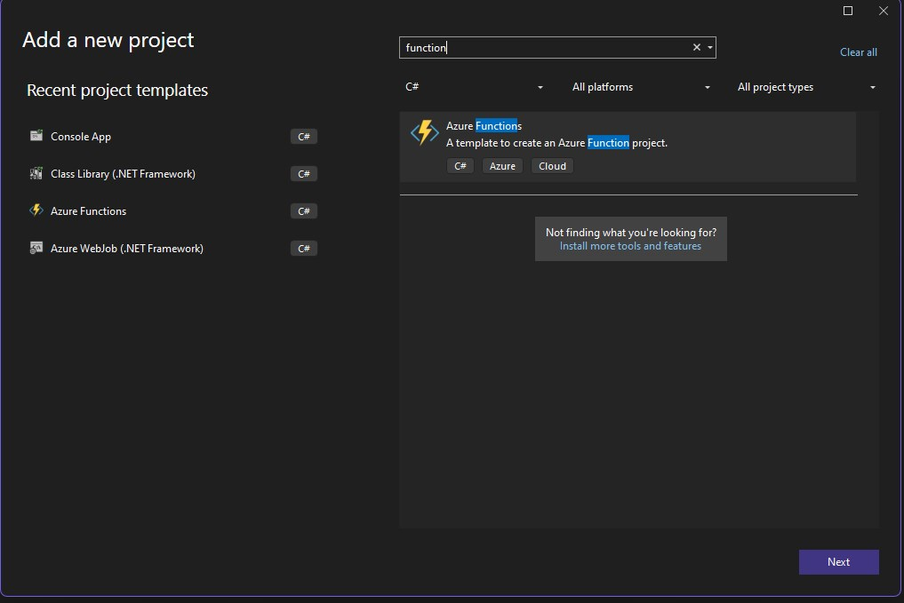

We already covered [a webjob](/post/servicebus/webjob/) and [a plain console app](/post/servicebus/console/) as processors. This time we will take a closer look at _Azure Functions_. These are interesting as a consumption-based processing option, apart from that you will recognize many of the patterns applied in [a webjob](/post/servicebus/webjob/).

## General preparations
You can find the full project code [here](https://github.com/Kunter-Bunt/D365ServiceBusProcessors/tree/main/DataverseEventProcessorFunction). 

Something else often forgotten in this kind of article is the description of the used dependencies (here NuGets):
- `Azure.Messaging.ServiceBus` => Definitions of 
- `Microsoft.Azure.Functions.Worker` => Bindings to Service Bus
- `Microsoft.Extensions.Logging` => Used for logging output
- `Microsoft.PowerPlatform.Dataverse.Client` => RemoteExecutionContext class for Deserialization

And of course, check out [the first post](/post/servicebus/exporting-events) of this series where we set up the service bus and our possibility of sending events to this service bus. So by now every time you create an account, a message should pop up in your subscription.

## The project
This time, the setup of the project is a little more involved, we have a wizard. The first stages of the project type _Azure Functions_ are as usual, but then we define your first trigger and here we will select _Service Bus Topic Trigger_.

 

Again we get started with 2 classes, Program.cs and Function1.cs, I'll start with Program.cs.

```cs
using Azure.Core;
using Azure.Identity;
using Microsoft.Azure.Functions.Worker;
using Microsoft.Extensions.Configuration;
using Microsoft.Extensions.DependencyInjection;
using Microsoft.Extensions.Hosting;
using Microsoft.PowerPlatform.Dataverse.Client;
using Microsoft.Xrm.Sdk;

var host = new HostBuilder()
    .ConfigureFunctionsWebApplication()
    .ConfigureServices(services =>
    {
        services.AddApplicationInsightsTelemetryWorkerService();
        services.ConfigureFunctionsApplicationInsights();
        services.AddTransient<IOrganizationService>(_ => {
            IConfiguration configuration = _.GetService<IConfiguration>();
            var dataverseUrl = configuration["DataverseUrl"];
            return new ServiceClient(
                new Uri(dataverseUrl),
                async _ =>
                {
#if DEBUG
                    var cred = new VisualStudioCredential(); // DefaultAzureCredential is painfully slow in local debugging.
#else
                    var cred = new DefaultAzureCredential();
#endif
                    var token = await cred.GetTokenAsync(new TokenRequestContext([$"{dataverseUrl}/.default"]), CancellationToken.None);
                    return token.Token;
                });
            });
        })
    .Build();

host.Run();
```

Notice here how I've sneaked an authentication for a managed identity, [read more about that here](https://community.dynamics.com/blogs/post/?postid=09f639ba-5134-4bd1-8812-04e019b7b920).
Apart from adding the `IOrganizationService` the class stayed as it was set up by the project template.

Next up is Function1.cs.

```cs
using Microsoft.Azure.Functions.Worker;
using Microsoft.Extensions.Logging;
using Microsoft.Xrm.Sdk;

namespace DataverseEventProcessorFunction
{
    public class Function1
    {
        private readonly ILogger<Function1> _logger;

        public Function1(ILogger<Function1> logger)
        {
            _logger = logger;
        }

        [Function(nameof(Function1))]
        public async Task Run(
            [ServiceBusTrigger("dataverse", "account-export", Connection = "AzureServiceBus")]
            RemoteExecutionContext message)
        {
            _logger.LogInformation(message.MessageName);
        }
    }
}
```
This looks pretty similar to what we had with the webjob, the `ServiceBusTrigger` attribute is registered on startup and connects the function to the service bus. Of course, you may rename the function!

Don't forget to check the authentication setup for the service bus, it is identical to [the webjob](/post/servicebus/webjob/#handling-authentication). All the other configurations may also be taken from that post, but be aware, that Functions do not support nested configurations, this means we will need to specify our service bus configuration like this `  "AzureServiceBus__fullyQualifiedNamespace": "mariuswodtke-dev.servicebus.windows.net"` in the local.settings.json.

## Setting up the Function App
Much easier in this case with the Azure Portal, but surely we will follow up someday with a bicep automation. A special thing here is that the wizard will auto-create 3 more resources, an Application Insights, Storage Account and App Service Plan. The latter might surprise, given that we will host on a consumption basis, but inspecting the App Service Plan reveals, that its SKU Y1 is for consumption purposes. I encourage the consumption here unless there are special requirements because scaling happens based on the number of events, which is perfect for such a service bus use case, where the Function will scale based on the messages ready to process.


## Deploying
This works pretty much like [the webjob](/post/servicebus/webjob/#deploying), so I will just run with the pictures for some guidance here.

 

 


## Result
You can look at the logs via the _Overview_ page of the Function. Besides your function, there is a button _Invocations and More_, which will take you to the most recent executions. Keep in mind that these are provided through the Application Insights, which means they will be lagging by a few seconds to minutes.


But right now we should not see anything here, even if there are already messages in the service bus. This is because we first need to configure the environment variables.


And from here on out, we will see the same output as [the webjob](/post/servicebus/webjob/#result).

## Summary
Azure Functions are a great choice for our service bus message processor due to the free quotas, event-based scaling and the good Visual Studio template, which allows for a really short time-to-deployed-prototype. If you are already familiar webjobs, the triggers in functions will be very familiar to you and also setup and deployment is very similar. The big disadvantage historically was that functions only supported .Net Core. But with the general availability of `Microsoft.PowerPlatform.Dataverse.Client`, that is no longer a problem!