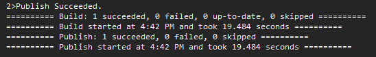

In [the first post](/post/servicebus/exporting-events) of this series, we started with sending Dataverse Events to a Service Bus. Of course that in itself does not have any value, we need to do something with these Events!
So in this article, we will create a processor for these events, specifically a WebJob on Azure.

## General preparations
You can find the full project code [here](https://github.com/Kunter-Bunt/D365ServiceBusProcessors/tree/main/DataverseEventProcessor). 

Something else often forgotten in this kind of article is the description of the used dependencies (here NuGets):
- `Microsoft.Azure.WebJobs.Core` => General Webjobs stuff in Program.cs
- `Microsoft.Azure.WebJobs.Extensions.ServiceBus` => Bindings to Service Bus
- `Microsoft.Extensions.Logging.Console` => Using the Console as a Logging Output, may not be required if you use a different logging mechanism
- `Microsoft.PowerPlatform.Dataverse.Client` => RemoteExecutionContext class for Deserialization

And of course, check out [the first post](/post/servicebus/exporting-events) of this series where we set up the service bus and our possibility of sending events to this service bus. So by now every time you create an account, a message should pop up in your subscription.

## The project
We will start by creating the project. I am choosing .NET Core here as by now the CRM SDK for .NET Core (Microsoft.PowerPlatform.Dataverse.Client) has reached General availability and I expect Microsoft to push us further in the .NET Core Direction in the future.


Next, we install the NuGets to make sure the code will compile, here's the list again for a quick copy: `Microsoft.Azure.WebJobs.Core`, `Microsoft.Azure.WebJobs.Extensions.ServiceBus`, `Microsoft.Extensions.Logging.Console`, `Microsoft.PowerPlatform.Dataverse.Client`.

And next is code. We only need two classes, program.cs and functions.cs, I'll start with program.cs

```
var hostBuilder = new HostBuilder();
hostBuilder.ConfigureWebJobs((context, builder) => {
    builder.AddServiceBus(options => options.MaxConcurrentCalls = 1);
});
```
These first lines contain an important concept used in WebJobs: The HostBuilder. It configures the WebJob before it is run, this allows the WebJobs to be "triggered" and not just be a continuously running application. Well actually they are of course but things like waiting for a new message are not an explicit code operation but a definition within the Functions.
We are adding a Service Bus here, we will discuss later how the WebJob knows which Service Bus we want to connect to. The option for MaxConcurrentCalls = 1 makes the job process one message after another. This is great for debugging and usually makes sure the receiving database does not get overwhelmed. But it can also lead to a bottleneck within your processor. An idea for this I have seen in projects is to make this a variable in the appsettings that is set to 1. The value is then either scaled in deployment or directly in the running AppService on Azure by an Administrator. If you connect to Dataverse make sure to not use a value bigger than 10 because a) it won't scale well and b) you might get issues with the ServiceClient since you cannot open to many connections to Dataverse.

```
hostBuilder.ConfigureLogging((context, b) =>
{
    b.AddConsole();
});
```
Next is logging, I'm just using the Console here, but I still wanted to include this to the post, to make you aware that there are more options here, like Application Insights if you want to stay within Azure.
Once everything is configured we build and run the HostBuilder. This `RunAsync()` will block the console indefinitely and usually it throws here if you misconfigured something.

```
var host = hostBuilder.Build();
using (host)
{
    await host.RunAsync();
}
```

Ok, over to the Functions.cs. As the name suggests, this is the entry point for our functionality. 
```
public static void ProcessQueueMessage([ServiceBusTrigger("dataverse", "account-export", Connection = "AzureServiceBus")] RemoteExecutionContext message, ILogger log)
{
    log.LogInformation(message.MessageName);
}

```
Technically, these are only 2 lines of code, but a lot is going on. I'll start with the `ServiceBusTriggerAttribute`, the first parameter ("dataverse") here is the topic and the second one ("account-export") is the subscription. The Connection parameter ("AzureServiceBus") is just a reference to the settings, so a quick dive into the appsettings.json file.
```
{
  "AzureServiceBus": {
    "fullyQualifiedNamespace": "mariuswodtke-dev.servicebus.windows.net"
  }
}
```
So the parameter refers to this setting. The setting can directly contain a connection string ("AzureServiceBus": "Endpoint=sb://mariuswodtke-dev.servicebus.windows.net/;SharedAccessKeyName=Dataverse;SharedAccessKey=REDACTED;EntityPath=dataverse") or an object as shown that spares the secret. Again I will refer you to a little later how that connection will actually work if we only pass the namespace URL of the Service Bus.

Back to the Functions.cs code, the `ServiceBusTriggerAttribute` decorates the real parameter of the function `RemoteExecutionContext message`. `RemoteExecutionContext` is part of the `Microsoft.Xrm.Sdk` namespace and is the object we passed to the Service Bus, the WebJobs SDK will automatically deserialize it.

> **_IMPORTANT:_** **If you followed the first post exactly, you will receive an error here**. This is because Newtonsoft.JSON refuses to deserialize `RemoteExecutionContext`. There is a simple solution to this: Change the _Message Format_ to ".NETBinary", this format will be deserialized. If it needs to be JSON for some reason you can skip the automatic deserialization by specifying message as string (`string message`) and then deserializing yourself. The JavaScriptSerializer does work, but is exclusive to .NET Framework. (Check [the post about plain console processing](/post/servicebus/exporting-events) for a working JSON solution)

## Setting up the App Service
I will do this via the Azure Portal, after all, if you do something in Azure the first time around, it's the easiest way to achieve a result quickly.


So I used the _+ Create_ in my Resource Group, searched for "Web App" and filled the first tab. Some notable settings are the _Runtime Stack_ which I matched to the project runtime. For the App Service Plan, I created a plan in the Free tier, not something to use for production but a great option for a first test. Web Apps can be moved between App Service Plans if you later create a paid plan.

Now in the newly created App Service (Web App) navigate to _Identity_ and turn the System Assigned Managed Identity on.


## Handling Authentication
And now we lift the secret of how the authentication works! So the WebJob SDK will automatically use the Managed Identity we just assigned, so the only thing we need to make sure is that this Managed Identity is authorized to access the Service Bus. This is done in the IAM Section of the Service Bus.


> **_IMPORTANT:_** This needs to be done on the whole Service Bus (Namespace). The IAM Section is also available on the topic, but the WebJobs SDK wont be happy with that. This is one of the reasons I suggested a seperate Service Bus per stage. If that is not possible, you can fall back to the _Shared Access Policies_ of the topic, but you will need to store them securely, for example in an Azure Key Vault.

And we can do the same thing locally as well! Just authorize your own account as _Azure Service Bus Data Receiver_ and then in Visual Studio under _Tools_ => _Options_, find the _Azure Service Authentication_ and authenticate your account. Now Visual Studio can provide this Identity to the WebJobs SDK and you are ready for a debugging run of your 

> **_NOTE:_** I've used a specific account for my Visual Studio here because my real account is not in the same Tenant, which often leads to problems and requires the components to manually set the tenant id, which usually means injecting the Identity manually. In this situation its easier to just create a new account, assign it a password and then enable that for the Azure Resources you want to access from your Code.

## The result
Now it's time for a debug run, but well, there is not much logic in my function. It just prints the `MessageName` to prove that the deserialization works. Note the interfaces implemented by `RemoteExecutionContext`, it does implement the `IPluginExecutionContext` that you will already know from regular plugins. So everything is as expected, the `InputParameters` will contain the "Target", if you have configured a PreImage it will be in the `PreEntityImages` and so on.


## Deploying
After the successful debug let's deploy. While later you should look into Pipelines with GitHub or Azure DevOps, a first deployment (or publish) can happen directly from Visual Studio.




After the deployment, you can check the logs at the App Service. Navigate to WebJobs there and select the Logs Icon.


## Summary
So I guess it's your turn now to implement the real logic. In this post, we created a .NET Core Console Application, configured and deployed it as WebJob, worked on a passwordless authentication and finally deployed it to Azure to process the messages. So the only thing left to do is to implement what shall actually be done with the message. Shall it be written to a third database/application? Do you want to enrich the Dataverse record? Maybe some advanced processing? I guess your stakeholders have something ready for you!


