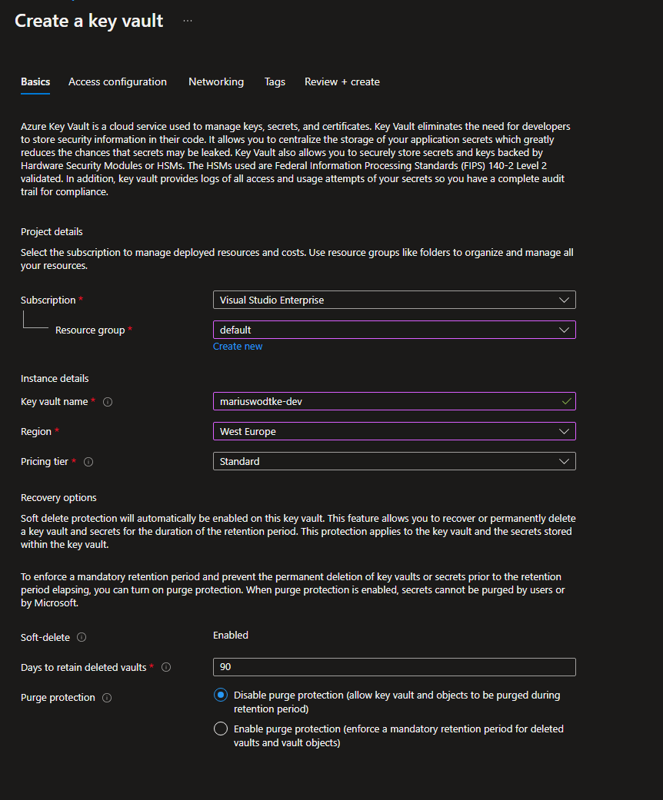
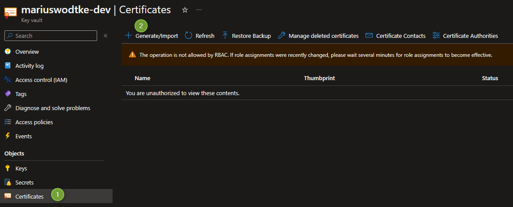
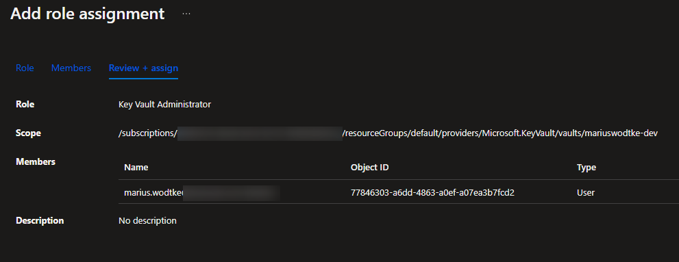
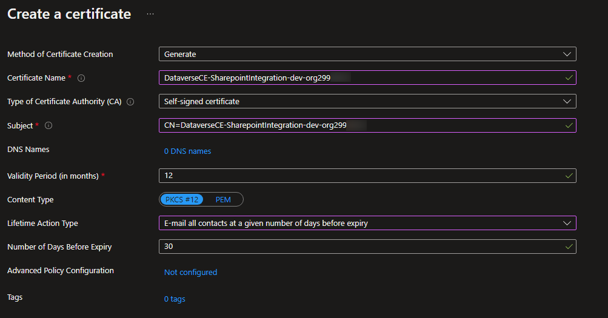
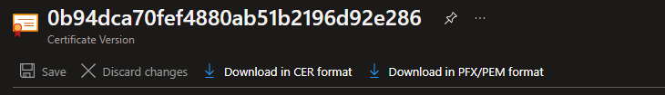
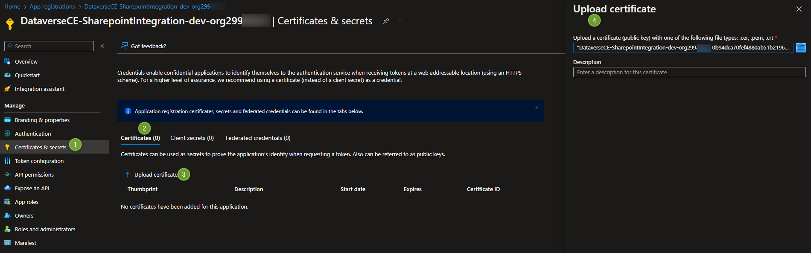
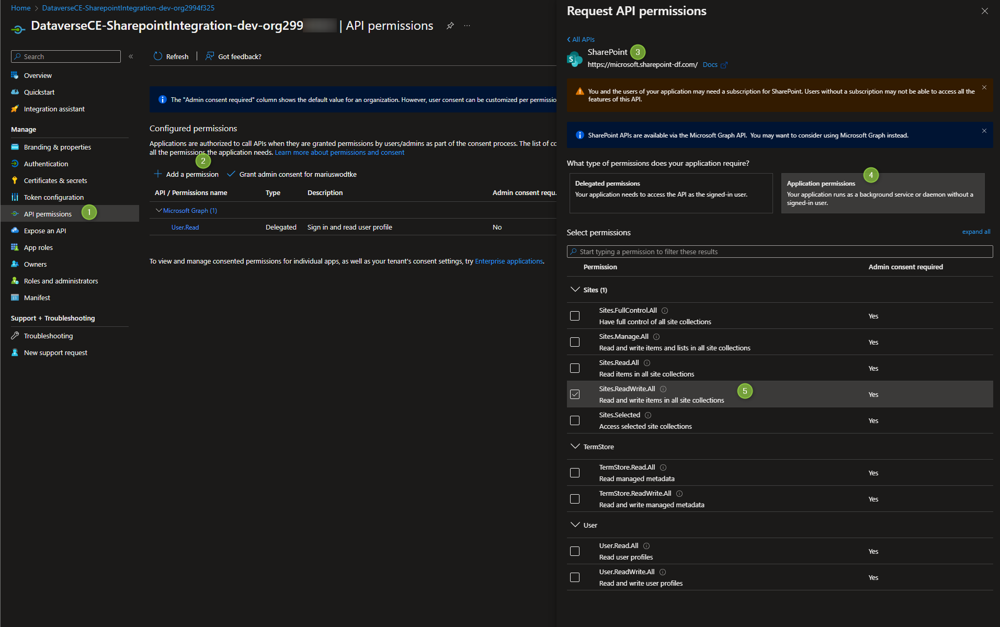
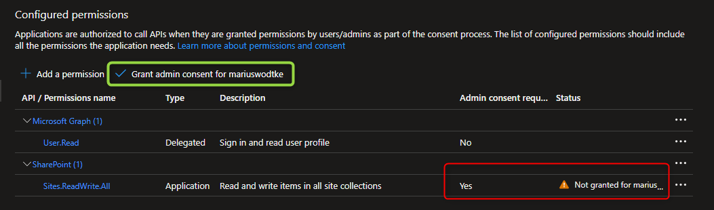

As this blog focuses on everything around Dataverse and how to integrate it, its now time to talk about Sharepoint. 

Dynamics CE has a Sharepoint integration, but it lacks. It works well with everything a user does manually but fails as soon as the requirements want the system to do something for the user. "Create a default folder structure", "We need folders for all the records in the table", "Automatically upload a generated file" and so on. 

In this post we will create an AppRegistration that will resemble a service user for talking to Sharepoint. This is done for integrating with Sharepoint via backend code like C#. You can also do this integration with Power Automate, but having done this for a customer much preferring Power Automate my humble opinion is: Its not worth it. Determining the folder position alone is too complex and by the amount of actions executed, the Flows actually become quite slow. 

## The Portal Way
So if you like to point an click, we can set up a service user via the Azure Portal. All you need is an active Subscription, the cost will be minimal.
First we need a KeyVault, maybe you do already have one, otherwise search for _Key Vault_ in the search box at the top, select the KeyVault and _+ Create_ to start the creation process. Standard SKU is absolutely enough and for the name you need to be globally unique. For my name thats quite easy, I've added a -dev here just in case I will use the KeyVault for anything else in the future, in this case it is important to create separate KeyVaults for different stages and topics because once you give some application access to the contents it has access to all the secrets of this KeyVault. The other settings can stay as default for this tutorial, you can skip the other tabs and directly create the KeyVault.



Next head to the Certificates section on the left menu and Create a Certificate. But even though I am the owner of the subscription I cannot access the KeyVault:



But as I am the owner of the KeyVault Azure Resource I can simply add myself appropriate permissions. Under _Access Control (IAM)_, select _Add role assignment_. For my purposes I chose the _Key Vault Administrator_ role (although _Key Vault Certificates Officer_ would have been sufficient for today) and my own account of course.



So after a full reload of the page I can now add a Certificate. I like to name them as I want to name the App Registration. So here I am creating it for the Dataverse <-> Sharepoint Integration and for the development instance. Because its not that easy to differentiate the environments with the auto generated names of my demos, I do also add the domain name of the instance here. You could also handle that via tags, or you dont need it at all, because you named the environments correct in the first place. Subject will be the same as the name, just with a prepended _CN=_. I do change the _Lifetime Action_ with these because the Certificate will need to be handled manually anyways to email me instead of auto renew. 



After creating the certificate, select it and then its only version. From here you can download as CER (the public part of it) and as PFX (the private part). We will need the CER for the AppRegistration and the PFX for the actual Application as kind of a password (although this technically works differently).



Now we will create the App Registration. You can use the search box again to search for "App registrations" and select them. Then _+ New Registration_ to create a new one and we will name it like we named the certificate. So for me DataverseCE-SharepointIntegration-dev-org... Everything else stays as default. 

Next switch to _Certificates & Secrets_, and Upload a Certificate, as shown in the picture below.



After this step, the application we will build in the next post, will be able to **authenticate** against our Active Directory. However, it is not **authorized** for Sharepoint yet. This is done in the section _API permissions_. Select _Add a permission_, in the Tab _Microsoft APIs_ find Sharepoint. Here we are looking for _Application Permissions_ and then theoretically we would like to use _Sites.Selected_, so that the Application can only interact with certain sites. But the problem is: There is no GUI for selecting the sites on the Portal or Sharepoint, this has to be done via Powershell Modules and thats something we will explore further down. So in this case we will have to go with _Sites.ReadWrite.All_.



Last thing now: Grant admin consent. As shown below this is a button that just needs to be pressed to grant the permissions. Well at least if you have that kind of access. In a corporate environment you might not be that priviledged and might have to ask an administrator for assistance, but in this demo tenant of course I wont need this.



And thats it, the App Registration is now granted permissions and we can use it as an identity to integrate with Sharepoint!

## The Powershell Way
But especially in the aforementioned corporate environment the _Sites.ReadWrite.All_ Permission is far to powerfull. What you want here is the _Sites.Selected_ and then enable the App for individual sites.
This can be done with the Powershell command `Grant-PnPAzureADAppSitePermission` from the `PnP.PowerShell` module. 

But since we are using Powershell here anyway, lets do the whole thing with Powershell.
1. Install the module: `Install-Module -Name PnP.PowerShell -SkipPublisherCheck -Scope CurrentUser` (-SkipPublisherCheck is technically not needed but helps with unattended scripts since you dont need to confirm the download.)
2. Connect to your Sharepoint Site, $sharepointUrl stores the full url here, e.g. ht<span>tps://crm123456.sharepoint.com/sites/Contoso: `Connect-PnPOnline -Url "$sharepointUrl" -Interactive`
3. Next we are going to create the AppRegistration. $tenantDomain holds the domain name of the tenant, in this case crm123456.onmicrosoft.com and $appName is the name of the app, so we can use something like DataverseCE-SharepointIntegration-dev again: `$appRegistration = Register-PnPAzureADApp -ApplicationName "$appName" -Tenant "$tenantDomain" -Store CurrentUser -SharePointApplicationPermissions "Sites.Selected" -Interactive`
Please note that this action also creates the Certificate. Both the PFX and CER are dropped to the folder where you execute the command. It also uploads the CER to the AppRegistration and sets the Permission - _Sites.Selected_. So a lot of the steps we executed by hand earlier, making the Powershell command far less error prone.
You might want to upload the PFX to a KeyVault anyways to store it safely.
4. For `Grant-PnPAzureADAppSitePermission` we need the ClientId, we will save it from the returned information of `Register-PnPAzureADApp`: `$clientId = $appRegistration."AzureAppId/ClientId";`
5. Next we will grant Read/Write permissions to our AppRegistration:`$permission = Grant-PnPAzureADAppSitePermission -Permissions "Write" -Site $sharepointUrl -AppId $clientId -DisplayName $appName`
6. As needed: We actually saved the Id of the Permission to be able to manipulate it, there are 4 levels of permission, _Read_, _Write_, _Manage_ and _FullControl_ but the later two you cannot use with the `Grant-PnPAzureADAppSitePermission`, you will have to use this command: `Set-PnPAzureADAppSitePermission -Permissions "FullControl" -PermissionId $permission.Id `
As said this is optional because you might simply be fine with _Read_ or _Write_.

To elaborate on point 6: _Manage_ will be needed to for example manipulate metadata columns, so not the content, but the schema around. So needing to add metadata columns to a list will require the _Manage_ privilege while just setting a value to an existing column only requires _Write_. _FullControl_ is for things like circumventing the bin, or not creating a new history version with an update of a document. So it is more of a rare use case, but I have needed this for a tool migrating documents together with metadata since setting the metadata after the upload created a new version of the file, essentially doubling the occupied space.

If you need to enable the app for second sharepoint later, you can look up the client id in the _Overview_ section of the AppRegistration in the Azure portal and then start at point 4 with setting the `$clientId = "6ba7b810-9dad-11d1-80b4-00c04fd430c8"`.

Here is the consolidated full script:

```
$sp = Read-Host -Prompt "Enter the Url of the Sharepoint Site you want to use the principle with, e.g. https://crm123456.sharepoint.com/sites/Contoso"
$appName = Read-Host -Prompt "Enter the Display Name of the Application in AAD, e.g. DataverseCE-SharepointIntegration-dev"
$tenantDomain = Read-Host -Prompt "Enter the AAD Tenants Primary Domain, e.g. crm123456.onmicrosoft.com"

Install-Module -Name PnP.PowerShell -SkipPublisherCheck -Scope CurrentUser

Connect-PnPOnline -Url "$sharepointUrl" -Interactive

$appRegistration = Register-PnPAzureADApp -ApplicationName "$appName" -Tenant "$tenantDomain" -Store CurrentUser -SharePointApplicationPermissions "Sites.Selected" -Interactive
$clientId = $appRegistration."AzureAppId/ClientId";

$permission = Grant-PnPAzureADAppSitePermission -Permissions "Write" -Site $sharepointUrl -AppId $clientId -DisplayName $appName
Set-PnPAzureADAppSitePermission -Permissions "FullControl" -PermissionId $permission.Id 
```

## Summary
So while creating the Sharepoint AppRegistration via the Portal is a good exercise for understanding how the components work together, doing it with the Powershell is a lot more fit for purpose. It reduces human error, is able to grant more granular permissions and once the script is set up, its much faster. Therefore I will always lean towards the 10 lines of code to create a service user for Sharepoint.

In the next post, we will actually use the service user to interact with our site. 

## Links
https://docs.microsoft.com/en-us/sharepoint/dev/solution-guidance/security-apponly-azuread

https://docs.microsoft.com/en-us/powershell/sharepoint/sharepoint-pnp/sharepoint-pnp-cmdlets

http://johnliu.net/blog/2019/2/flowninja-hack-78-modifying-modified-by-and-modified-time-with-microsoft-flow 