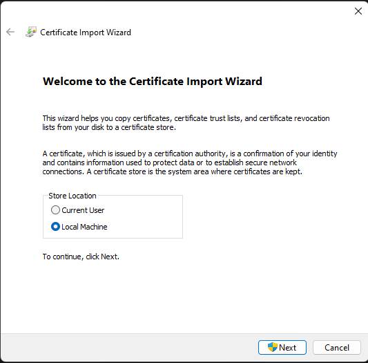
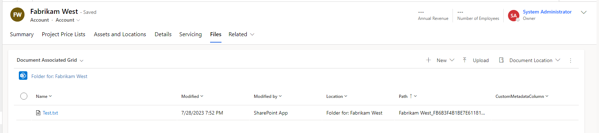
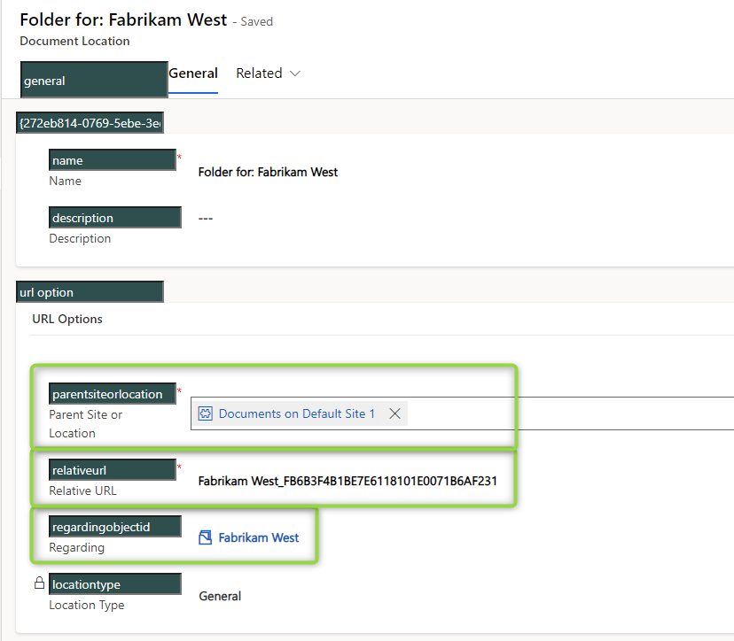

So now that we have a login from [the last post](/post/sharepoint/custom/appregistration), lets use it! In this post we will use PnP.Core to help us interact with Sharepoint. Afterall I am a CRM Developer and not a Sharepoint specialist, so a library to help my tasks is most welcome.

# Prerequisites
So I do assume you have the service principle set up. If not its time to head back [here](/post/sharepoint/custom/appregistration).
The next rather important consideration is PnP.Core as a library itself. It has a lot of dependencies, usually thats not a problem, but this means we wont be able to upload it to dynamics, no ILMerge or [Plugin Packages](/post/my-first-shot/plugin-packages) will help here due to unmanaged code in some dependencies. This means that this method is not for plugins, but for standalone tools, APIs etc. 

To give you some samples of what I have had to built that benefited from the help of PnP.Core:
- A tool that migrates a file archive from a fileshare to Sharepoint. Connect them to the according record in CRM by alternate key.
- An API function that takes a form filled by the user alongside pictures. The CRM user should be able to review the pictures when using the documents tab.
- A tool that cleans up all versions of documents, since the sharepoint storage was going overboard with frequent changes to large files.
As you can see, the first 2 requirements are a typical _take files and "connect" them to Dynamics_ while the 3rd sample is an exclusive Sharepoint problem, but the reality is: No matter if the requirements falls more to Sharepoint or more to Dynamics, in the end usually there is noone else to implement it so after all you as Dynamics developer need to somehow cover it.

Next, I will be using .Net Core in this tutorial. This is technically not required, but with the [general availability of the Dataverse Service Client](https://powerapps.microsoft.com/en-us/blog/dataverse-service-client-is-now-generally-available/) for .Net Core, I can't see a good reason anymore to stick with .Net Framework for external tools like the one we will be building here. 

And one last thing: I do somehow assume you do know how to use the Dataverse Service Client or the classic CrmServiceClient (IOrganizationService), so the code shown will completely ignore the CRM bits and instead will mock corresponding queries as simple variables to keep the focus on what we are trying to achieve: Integrating Sharepoint.

# Authenticating
Before we can manipulate the Sharepoint we need to log in. 

I've started with a Console App (.Net 6.0) and installed 2 NuGet packages _PnP.Core_ and _PnP.Core.Auth_. 
Then, with the new top level statements feature I can code directly into the Program.cs file:
```
using Microsoft.Extensions.DependencyInjection;
using Microsoft.Extensions.Hosting;
using PnP.Core.Auth.Services.Builder.Configuration;
using PnP.Core.Services;
using PnP.Core.Services.Builder.Configuration;

var authName = "certificate";
var siteName = "CRM"
var host = Host.CreateDefaultBuilder()
.ConfigureServices((hostingContext, services) =>
{
    services.AddPnPCore(options =>
    {
        options.PnPContext.GraphFirst = true;
        options.HttpRequests.UserAgent = "ISV|MariusWodtke|PnPDemo";

        options.Sites.Add(siteName, new PnPCoreSiteOptions
        {
            SiteUrl = "https://crmXXXX.sharepoint.com/sites/CRM"
        });
    });
    services.AddPnPCoreAuthentication(
        options =>
        {
            options.Credentials.Configurations.Add(authName,
                new PnPCoreAuthenticationCredentialConfigurationOptions
                {
                    ClientId = "cce5e182-eb79-40d9-abd6-3dc7c4c54718",
                    TenantId = "7cd962d3-c5b5-4762-89f3-0e72d8f8b08c",
                    X509Certificate = new PnPCoreAuthenticationX509CertificateOptions
                    {
                        Certificate = GetCertificate("CC4D7175E37641B38A4960BB8EFC8C56653DFF8E")
                    },
                });

            options.Credentials.DefaultConfiguration = authName;
            options.Sites.Add(siteName,
                new PnPCoreAuthenticationSiteOptions
                {
                    AuthenticationProviderName = authName
                });
        }
    );
})
.UseConsoleLifetime()
.Build();
```
This is very similar to the sample found in the [getting started guide](https://pnp.github.io/pnpcore/using-the-sdk/readme.html) of PnP.Core. I chose the "no appsettings.json" variant and changed the authentification credentials to use a certificate. While we are on the subject of certificate, if you haven't already, double click the .pfx file we created last time, select "Local Machine" in the first dialog window and then click next until the dialog finishes, the defaults should be fine. Now our computer knows the secret part of the certificate and will be able to use it for logging in. 



The retrieval of that secret is done by the `GetCertificate` method mentioned in the code above. It takes the Thumbprint of the certificate, which I do always find in the AppRegistrations _Certificates & Secrets_ section, but there are probably other ways as well. The code of this method looks like this:

```
X509Certificate2 GetCertificate(string certThumbprint)
{
    X509Store store = new X509Store(StoreLocation.LocalMachine);
    store.Open(OpenFlags.ReadOnly);
    var certs = store.Certificates.Find(X509FindType.FindByThumbprint, certThumbprint, false);

    if (certs.Count < 1)
        throw new ArgumentException($"No certificate found by Thumbprint: {certThumbprint}");

    return certs[0];
}
```

Since this method uses the `StoreLocation.LocalMachine` it is important that you select "Local Machine" when installing the certificate. If you didn't do so don't worry, you can install the .pfx again; or change the StoreLocation! The reason for me to use LocalMachine here is that it makes the deployment to servers easier where the programm might not be executed by the same account deploying the server, hence the CurrentUser installation yields problems in this scenario.

# Creating a file
Now lets actually do something! I will upload a file from my computer to Sharepoint. I know you are bursting of exitement for this amazing task, but doing this ensures that the login works and we have the correct permissions and then you can hop on doing other things and if you get weird errors you at least know its your code being broken and not the service principle or something like that.

To have a file to upload I added a file _Test.txt_ to the project, wrote "Hello World!" inside and set _Copy to Output Directory_ to "Copy always". Next comes the following code:

```
await host.StartAsync();

using (var scope = host.Services.CreateScope())
{
    var pnpContextFactory = scope.ServiceProvider.GetRequiredService<IPnPContextFactory>();
    using (var context = await pnpContextFactory.CreateAsync("CRM"))
    {
        var file = "Test.txt";
        var accountName = "Fabrikam West";
        var accoountId = Guid.Parse("fb6b3f4b-1be7-e611-8101-e0071b6af231").ToString("N").ToUpper();
        var foldername = $"{accountName}_{accoountId}";
        var list = await context.Web.Lists.GetByTitleAsync("Account");

        var folder = await list.RootFolder.EnsureFolderAsync(foldername);
        var spFile = folder.Files.Add(file, File.OpenRead(file), true);
    }
}
host.Dispose();
```

So, we used `IPnPContextFactory.CreateAsync` to get a Context like the ServiceContext you know from Dynamics. Next `PnPContext.Web.Lists.GetByTitleAsync` queries the library we are working in. Since the [Sharepoint standard series](/post/sharepoint/standard) focusses on the account, I've used it here as well.
Then we create a Folder in the library with `RootFolder.EnsureFolderAsync` where EnsureFolder works like a GetOrCreate, so there are no problems if the folder is already present. And finally we will call `Files.Add` to upload our file. Straight forward I guess. 
While I've left out all CRM calls you can already see that I've leveraged the knowledge from [the inner workings post](/post/sharepoint/standard/innerworkings) to make sure the folder is exactly named like Dynamics would name it. This has an interesting side effect, when I now open up the Account in Dynamics and head to the _Documents_ section, Dynamics will show me the uploaded file, likely because it also uses something like EnsureFolder to create it.



Thats cool, but I want to warn you about banking on this behavior: If someone changes the Account name by a single letter before opening the Documents section, Dynamics will generate a new, different folder.

Instead you should create a _documentlocation_ to connect them immediately. That way the changed name is not a problem, Dynamics finds the existing location and can show it. For this you will need to set these 3 fields:



regardingobjectid and relativeurl should be no problem, this is the account and the foldername. In simple scenarios parentsiteorlocation is simple as well, query for the documentlocation with relativeurl "account", so the logicalname of the entity. This stops being so easy when you have two sites with a Library "Account" since suddenly you have 2 documentlocations with the relativeurl "account" but different parent sites. Also if you want to connect to a location in the hierarchical setup, this gets trickier as well, but in this case you will already have to deal with that once you are creating the folder, because it then is no longer under the root folder but 2 folders deeper.

# Summary
But after retesting and writing this article, I really have to say PnP.Core makes it easy to dip your toes into "Sharepoint Development". Well we are not developing here, we are manipulating the content of the Sharepoint with programs. 
The setup is easy and the code you need to write to do basic manipulations is quite short. For more advanced manipulations that are not as intuitive as `Files.Add`, check out their great documentation with samples and tutorals here: https://pnp.github.io/pnpcore/index.html
The only downside to this SDK are its dependencies, making it unsuitable for Dynamics Plugins. This is why we will explore using the Sharepoint REST API in future posts as well. A little heads up: This is of course more cumbersome, so I do use PnP.Core whenever the requirements allow it.