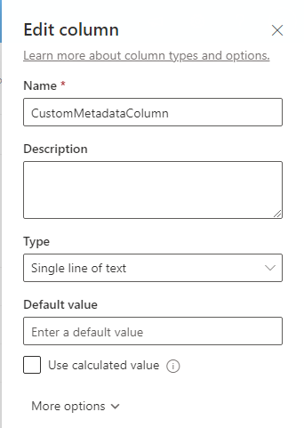
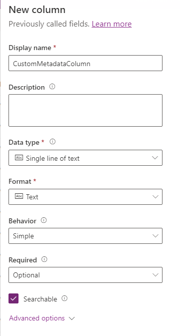
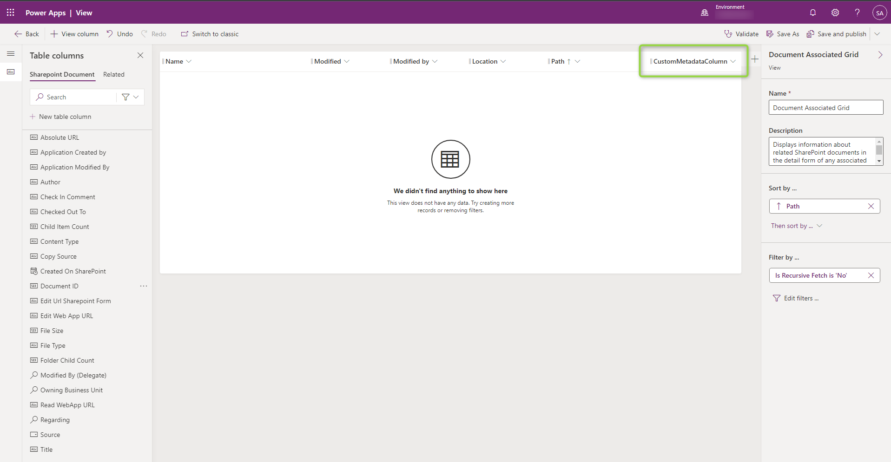
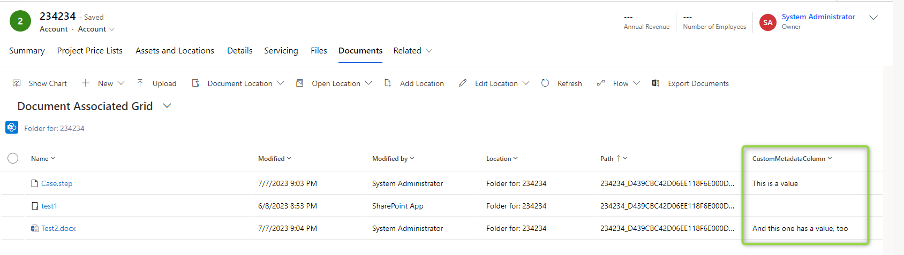
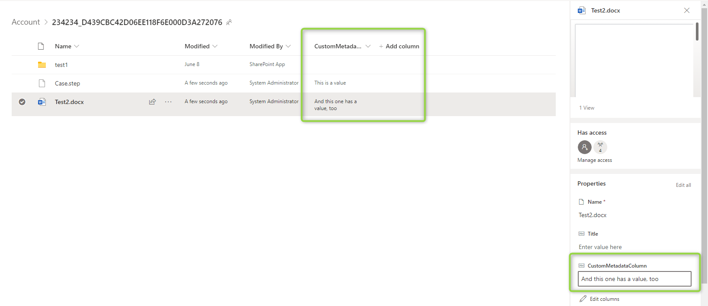
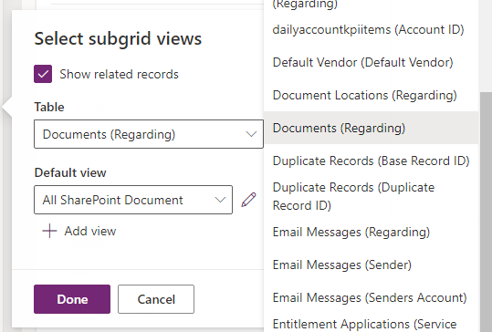
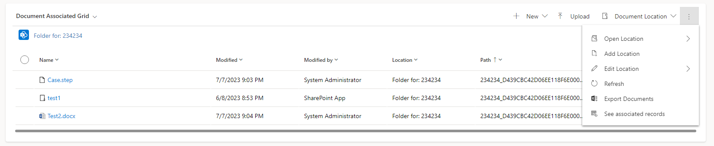
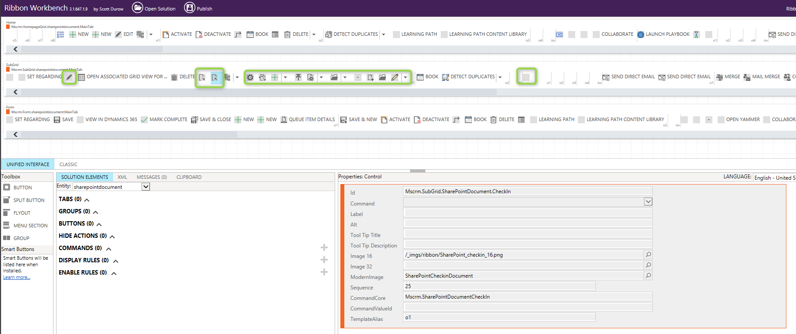
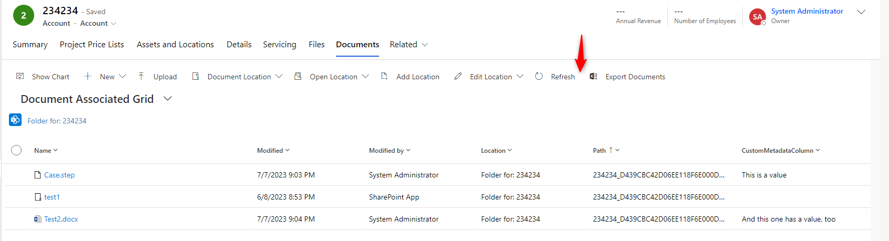

If you are not entirely happy with the default functionality shown in [the previous post](/post/sharepoint/standard/functionality), there are some options to tailor it. This article will discuss some customization options available to people and projects not willing to build extensive PCF controls or something similar.

## Showing Metadata 
The _Documents_ Tab shows a grid and you can customize it. The entity is called _Sharepoint Document_ (sharepointdocument) and has the "Document Associated Grid" which is shown by default and the "All Sharepoint Documents" is shown when you select to show all locations.

You can choose one of the predefined columns, maybe something like "Folder Child Count" might help the end users' experience. But you can also create custom columns. To do this, create a column in Sharepoint, then create it with the same **Display** Name and type. Just for _Choice_, I noticed that I needed to create it as a _Single Line of Text_ in Dynamics. Then you can add the new field to one of the views, displaying it to the user.

 

One note though: You can't edit these columns in Dynamics, you will have to switch over to Sharepoint with the _Open Location_ button.

## Displaying the view more prominent
You can add the Documents grid to other tabs as well, not requiring the user to visit the _Documents_ Tab. It even works with _Quick View Forms_ if you for example want to display the documents of the parent account at the child contacts. However please note, that displaying this grid won't create a location automatically like it happens in the _Documents_ Tab, the user will have to visit it once to create the folder. Or they use the _Add Location_ button to create it. 

To add the grid to an existing tab, in the Form editor select "Add Subgrid". In the dialog, select "Show Related Records" and then the relationship to display is "Documents".

## Customizing the Ribbon
Another customizing option can be realized via the [RibbonWorkBench](https://www.develop1.net/public/rwb/ribbonworkbench.aspx) of the [XrmToolbox](https://www.xrmtoolbox.com/). First, you need to create a new solution. Then add the _Sharepoint Document_ entity without any subcomponents. Now you can load the Solution into the RibbonWorkBench and start customizing.

For demonstration, I used the _Hide_ action on the _Flow_ Button which did not work for me in [the previous post](/post/sharepoint/standard/functionality) and published the solution to apply the changes.

Of course, you can also add new buttons or change _Display/Enable Rules_ on existing commands.

## Document Location
There is also the entity "Document Location" (documentlocation). It is not directly shown in the grid, but the records of this entity hold the information where the actual Sharepoint folder is and is shown in some parts of the grid. The display name is shown in the breadcrumbs of the navigation and the flyouts for the "Location" buttons of the ribbon. 

Since the default name is "Documents on Default Site 1" I can imagine users wanting that to change. They can of course via _Edit Location_, but if you can agree on a standard naming, an automation like a Flow could do that. But keep in mind that there might be multiple locations if users add an additional location, having them all named the same might lead to a nightmare finding the correct folder.

## Summary
While there are many fixtures with this integration, Microsoft has left room for us to customize the experience we have interacting with Sharepoint.
You can add the Sharepoint view to other tabs and manipulate the columns shown. You can also add custom columns and buttons to the view. You can also manipulate existing buttons to focus the user on his current task. Lastly, there are also some options to change the names on the locations, allowing easier sorting when having multiple.

In the next post, we will discuss more about the internals of the Sharepoint integration, which might help you to create more advanced modifications and extensions.