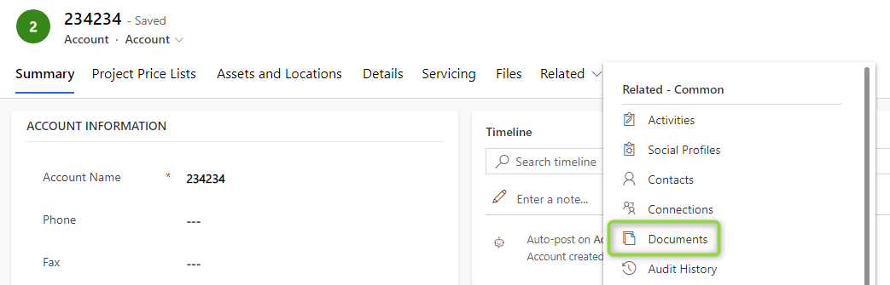
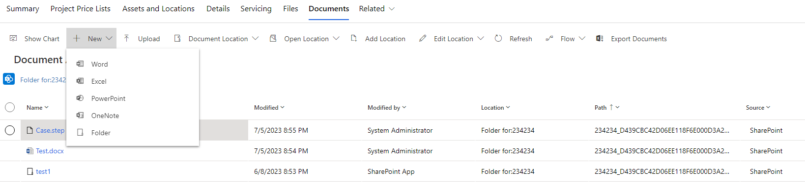
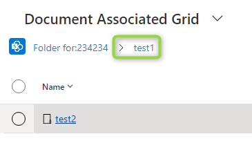
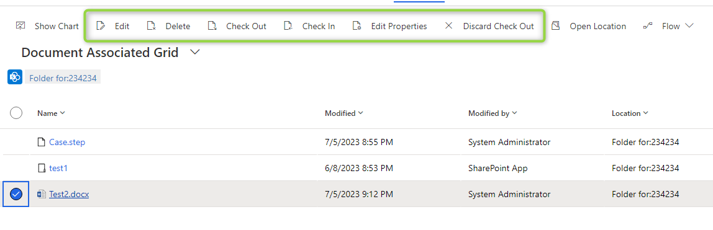
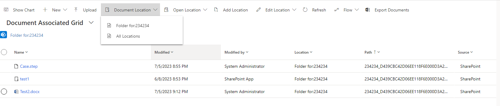
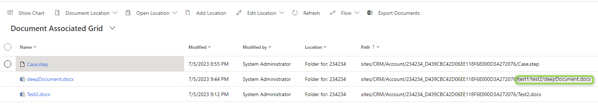
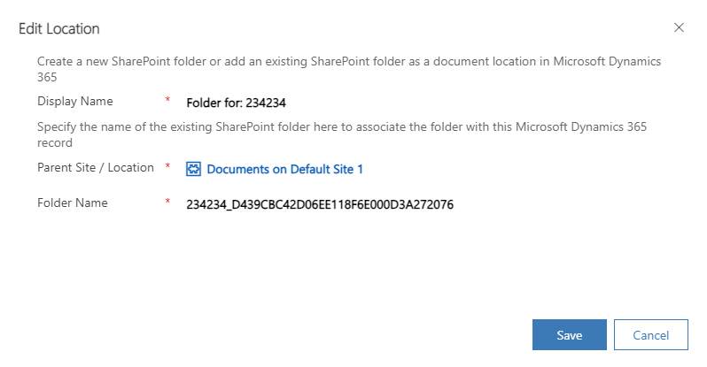
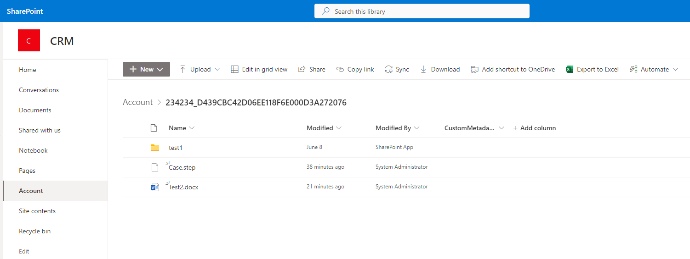

In [the previous post](/post/sharepoint/standard/setup) we set up the Sharepoint integration for our instance, what can we do now?

## The Documents Tab
On the entities where you enabled the Integration in the wizard, you should be able to access the _Documents_ Tab. This is the main hub for interacting with Sharepoint.
I will be working with the Account for this post as I enabled this entity when setting up the integration.

## New/Upload/Preview/Download
With the _+ New_ button you can create new documents, but only subfolders and some of the most common Office formats. For everything else, you would use the _Upload_ button which displays a dialog to select a file from your computer. 

Once you created/uploaded a file you can just double-click it to preview or download it in case there is no previewer in the browser like for the .step file in the image above.

If you double-click a folder you will navigate the grid inside the folder and the breadcrumbs will extend, you can use them to navigate up again.

## Check-In/Out/Edit/Delete
When you single-click a file (or mark the checkbox on the left) the ribbon changes. It now shows buttons for _Check in_/_Check out_, a feature to lock files for editing. In my experience, this is not used that much anymore since the office documents do support multiple users editing at the same time but maybe you will find this helpful when working with formats that do not support collaboration.

The _Edit_ button is something you won't need, it's the same as double click! _Delete_ should explain itself. A little bit more interesting is _Edit Properties_ as the name suggests that it allows editing the metadata columns. However, only the filename and title are available in the dialog, making it kind of a "Rename" button. 

Another potentially interesting button is the _Flow_ button which usually lets you execute a Flow on the selected record, allowing admins to define Flows like "Send file for approval". However, in my demo environment creating a Flow from here does not work! If you made it work somehow, let me know and I will happily update the article.

## Location Actions
There are several buttons for the "location", which means the folder that is connected to Dynamics. Let's first talk about _Add Location_. While Dynamics created a folder for you when you entered the _Documents_ Tab this does not mean it needs to be the only folder! With add location you can add a second location (and more) and they do not necessarily need to be on the same site!

When multiple Locations are created, the _Document Location_ Flyout comes in handy: Of course, now there are 2 different folders to check and you can use this flyout to switch between the folders. Or use _All Locations_ to display everything to gain an overview. It also helps that this view flattens all subfolders, displaying a path, very helpful when looking for items in more crowded structures. In this mode, you can't upload a file because the grid wouldn't know where to put the file.

You can also use _Edit Location_ to change things about the location. In the screenshots, you already saw that I changed the display name from its default "Documents on Default Page 1" to "Folder for: 234234". You can also change the foldername in Sharepoint here, but maybe unexpectedly that does not move the folder, instead, it creates a new one and leaves the already created content behind. It's still useful though: When a foldername is changed in Sharepoint this does not translate to the location in Dynamics, but with this function, you can move the location to the new foldername as well.

And finally: _Open Location_. This is the single most used button by me. It opens the folder in Sharepoint, giving full access to the Sharepoint features. I already documented that _Edit Properties_ does not let you edit custom metadata columns, but of course, in Sharepoint, we can! 

## Summary
The OOTB functionality of the Sharepoint integration is great for the average users' interactions: Upload, Edit and Download documents. Organize in folders and find files in the overview via _All Locations_. Whenever the views in Dynamics are not sufficient, you can always head over to Sharepoint with just 2 clicks. 

Everything is nicely connected to the structured data in the Dynamics record with the possibility to create more private secondary locations etc. So all in all in my humble opinion the OOTB view already provides a great experience working with documents. It might lack automation options and interaction with metadata, but we will discuss these topics in future articles in this series!