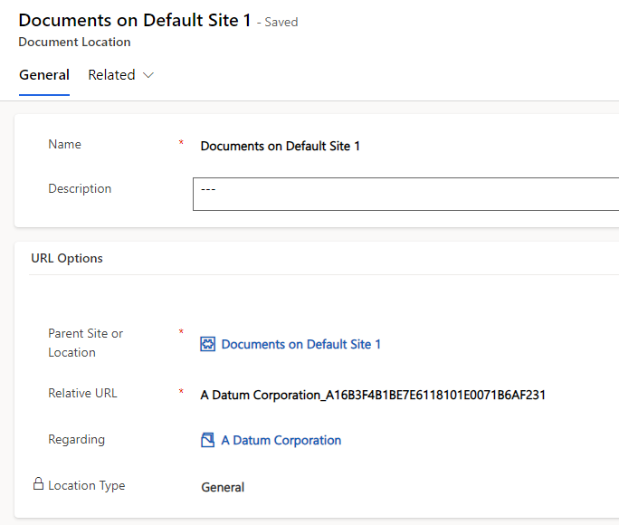
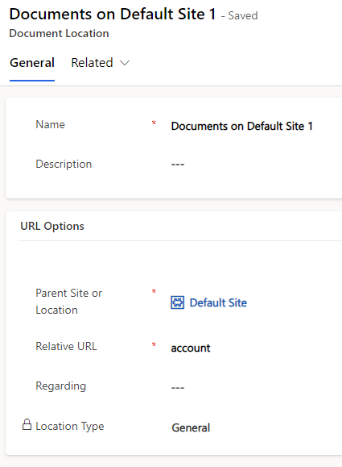
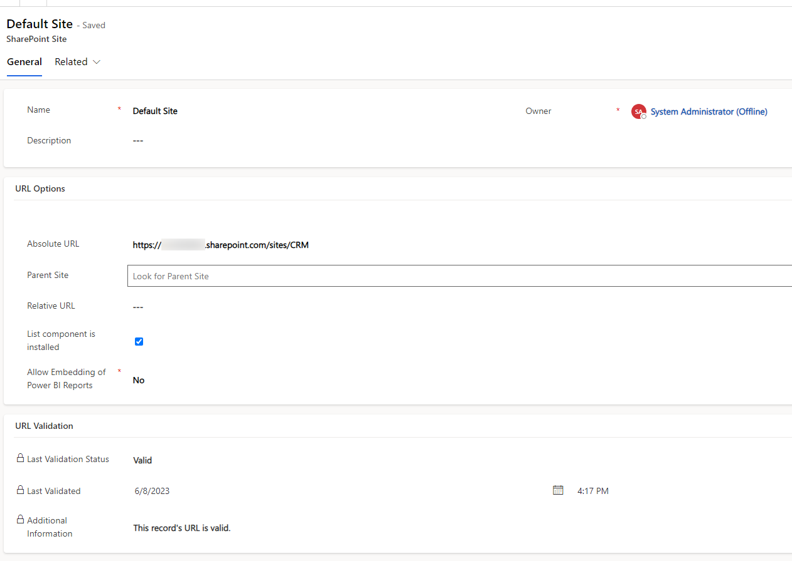

Having some knowledge about the inner workings of this integration is often beneficial. It helps you track bugs and understand what can work and what can not.
Of course, I have never seen the code of Microsoft and therefore this is merely a compilation of observations.

## The basics
While we talked a lot about the _Sharepoint Document_ [in the post about customizing](/post/sharepoint/standard/customizing), here we will talk about the _Document Location_. This entity mainly consists of a _Relative URL_ which holds the current path element and s _Parent Site or Location_ which is a hierarchical lookup to another _Document Location_ until eventually, this lookup will point to a _Sharepoint Site_.

Let's first talk about the other Document Locations: All those hold a relative URL as well, so if you go up from the leaf with URL "abc" to parent "def" and from there to another parent "ghi" these elements will result in a path "ghi/def/abc".

And the _Sharepoint Site_ has an _Absolute URL_. So if we assume that the "ghi" location looks up to the site "https://mycompany.sharepoint.com/sites/CRMDev" the final full URL to the Sharepoint folder would be "https://mycompany.sharepoint.com/sites/CRMDev/ghi/def/abc".
The sites can also be hierarchical. You could use this if you are going to integrate a lot of sites, making "https://mycompany.sharepoint.com/sites" the base and then adding on child sites with the concrete relative URL.

Why am I telling you all this? Dynamics is creating the sites for me [when setting up](/post/sharepoint/standard/setup) the Sharepoint Integration and the locations are automatically created when I open [the documents tab](/post/sharepoint/standard/functionality).
Because we might want to create our own locations! Or find out the URL of an existing location. Important things when you want to do some information with something like a flow.

## Common path patterns
The easiest is just {site}/{library}/{folder}. This is the default when no hierarchy is enabled. Dynamics creates a library for the entity with the entitylogicalname as URL and then the folders below it. In this situation, you can assume there are exactly two parents, one location that is not regarding any record and the site. This setup in three pictures:

With hierarchical its a bit more complicated: {site}/{library}/{folderParent}/{logicalname}/{folderChild}. So for example below the site we have the libary "account", then the URL of the account record folder, then another folder with a logicalname, e.g. "incident" and finally our folder regarding the concrete record. At the latest in this setup it's the best to think recursive: Step up to the parent until there is no parent left. Then combine the paths backward to get the full URL.

## When is a folder created
Dynamics only checks for the presence of a _Document Location_ which is _Regarding_ the current record when opening the Documents Tab. If one is present no folder or location is created, no matter if the existing location is valid!

But when a folder is created the _Relative URL_ is interesting: It is the primary field of the record (the "name" field) where it replaces some illegal characters, e.g. a dot (.) is replaced with an underscore (_). Then follows an underscore and then the Guid of the record in all uppercase and without dashes (-). In my sample "a16b3f4b-1be7-e611-8101-e0071b6af231" becomes "A16B3F4B1BE7E6118101E0071B6AF231". 

I think even if you are creating your folders, you should obey this scheme. It avoids some concurrency problems (the user opening the Documents tab while you are creating the folder) and it makes a lot of sense: The primary field is easy to identify for regular users while the Guid is unique, making sure there are no conflicts with identical folder names. Think about the contact here, it's quite common for people to have the same first and last name, leading to an identical _fullname_ without actually having a duplicate. This situation should have 2 different folders for the 2 records, therefore it's a good idea to always include the Guid.

## When something happens in Sharepoint
So it's a bad idea to rename folders in Sharepoint. Because it is not reflected in the locations in Dynamics. It's a one-way integration: Dynamics can create folders, write files, request a listing of files and download a file. All these operations are performed by the front-end component of Dynamics, no backend integration will sync back changes from Sharepoint. 

But if it happened you can fix it: Find out in the Office 365 Compliance Center Audit Log what was the original and new path of the renamed folder, find the document location with the original path element and change it to the new path. If some user has shortened my sample folders' name from "A Datum Corporation_A16B3F4B1BE7E6118101E0071B6AF231" to "A Datum Corporation" I just need to reflect that in the location record to fix the displayed error there is no folder with the relative URL "A Datum Corporation_A16B3F4B1BE7E6118101E0071B6AF231".

## Summary
The components of the integration are easy to understand, having the _Sharepoint Site_ as a base and then a variable amount of hierarchy in the _Document Location_. To get an effective URL you need to traverse the parents and combine the relative URLs backward. The grouping folders of the entities are named like the logical name of the entity and the actual folders for the records have a combination of the primary field and the records Guid to ensure uniqueness. 
The last important note is that Dynamics does not react to changes in Sharepoint. This is no problem when you upload a new file or create an additional folder, but renaming folders is a delicate matter that needs to be covered in your workflow. Or you simply agree to not rename them once created.