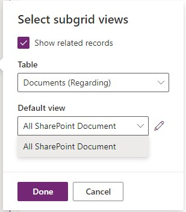
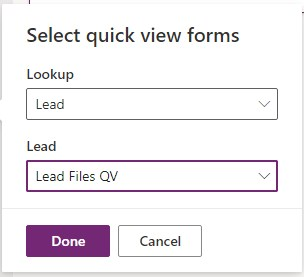
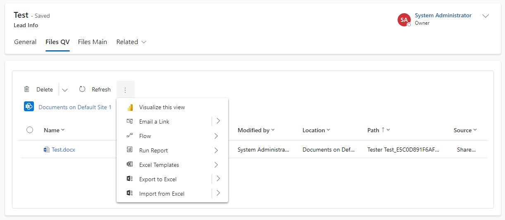
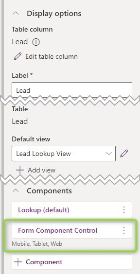
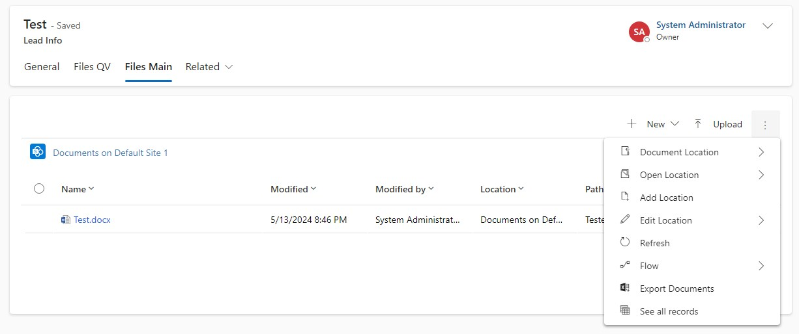
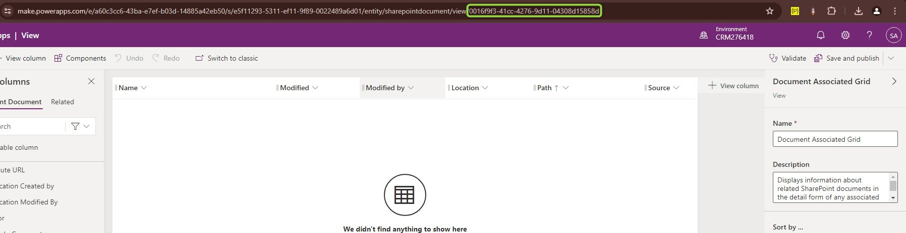
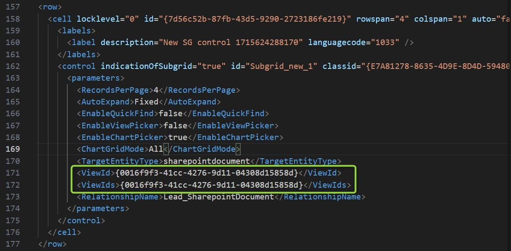
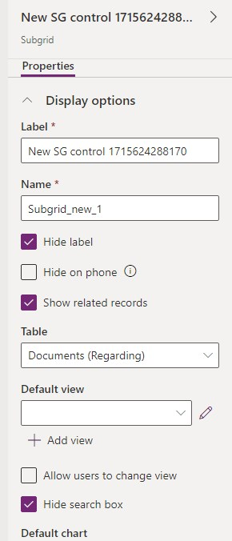

This article might sound like a very particular requirement, but I've heard it for the second time now: "The user should not need to navigate to the parent to work with its documents".

There are usually more questions involved like "Should this work like a hierarchy?" or "What does he need to do? Does he need to see the same documents at the parent?" but if it's really the flat and the same documents, there is an easy solution.

## Options
The obvious choice might be a Quick View form. If you were not aware: Quick View forms can show Subgrids! So we can include a Subgrid to the _Sharepoint Documents_ table and define this as the only component of a "Files Quick View" form that we will include in the child records form.

  

But here we have the problem that the _New_ and _Upload_ Buttons are missing as with other Subgrids included in a Quick View form.

The better option here is the [_Form Control Component_](https://learn.microsoft.com/en-us/power-apps/maker/model-driven-apps/form-component-control) which is a PCF by Microsoft that works similarly to a Quick View but allows editing the record shown. 

There is also a disadvantage: The form shown needs to be a _Main Form_ and it needs to be part of the app and be available to the user by security. This means our "Files" form will be selectable in the form picker of the parent table. 

 

This way we can have the full experience of files, with upload and document location actions etc. Great!

## One More Trick
Have you noticed that the screenshots of the result included the folder breadcrumbs? That's a little trick I've found by looking at what Microsoft does with the "Files" Tab for example at the Lead. I was not able to recreate the same experience on a custom entity and found that they used the _Document Associated View_. Up above you see that this view can not be selected for a Subgrid, but apparently, some of the integration experience is implemented into that view.

To fix this for our custom forms and entities we can manipulate the XML.
1. Put the form with your Files Subgrid to a new solution.
1. Export the solution. 
1. Unzip the solution to a local folder.
1. In the Customization.xml, find the place where the Subgrid is defined.
1. Replace the ViewId with _0016f9f3-41cc-4276-9d11-04308d15858d_ (or determine it with the screenshot seen below)
1. Save the file.
1. Rezip the (3) files **inside** the local folder.
1. Import the resulting zipped solution.

## Summary
While you can certainly use the knowledge from [the inner workings article](/post/sharepoint/standard/innerworkings/) to replicate document locations to child records, sometimes it's just easier to directly display the documents of the parent. 

To use this, first create a main form on the parent table that only shows a grid to the _Sharepoint Documents_. Then you bring a second lookup to the parent to your child tables form and use the [_Form Control Component_](https://learn.microsoft.com/en-us/power-apps/maker/model-driven-apps/form-component-control) Custom Control on the field. Next, we publish and are ready to even upload documents from the child entity using the subgrid on the form.