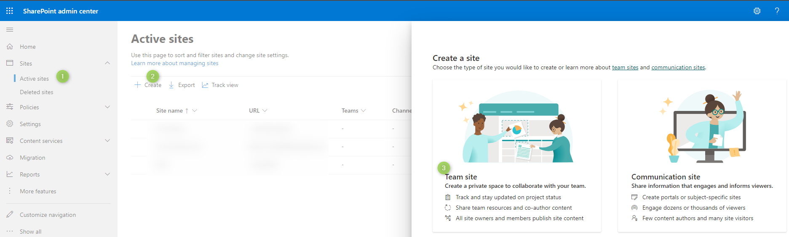
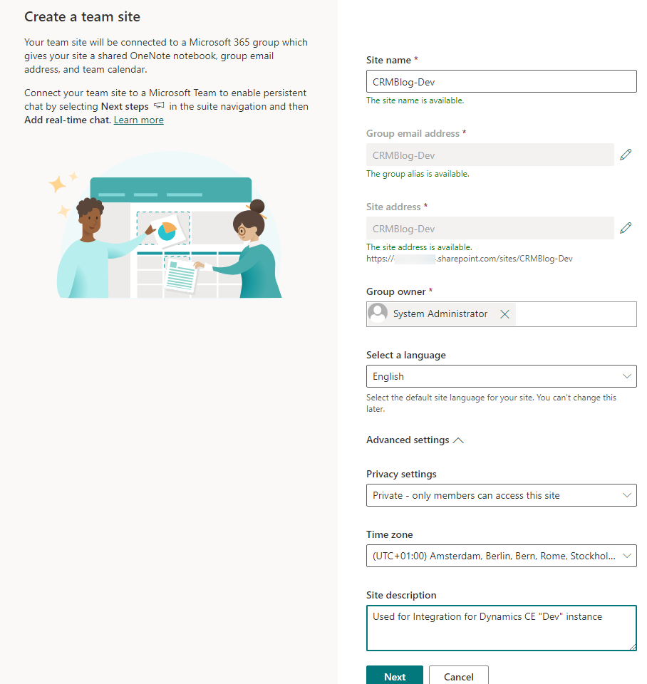
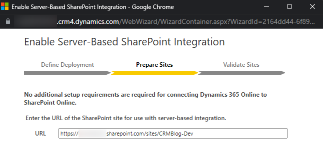
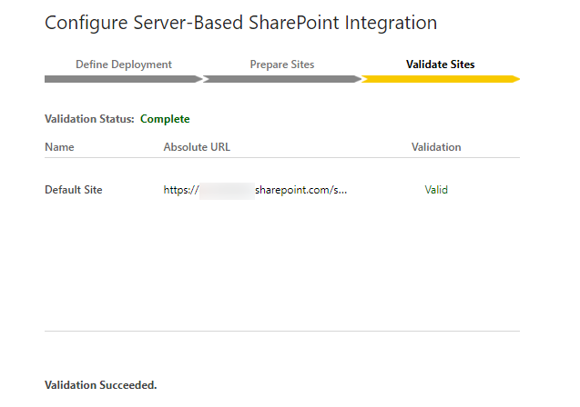
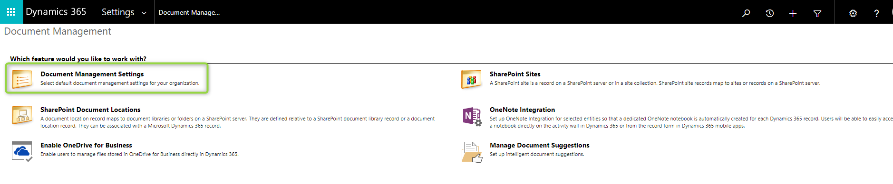
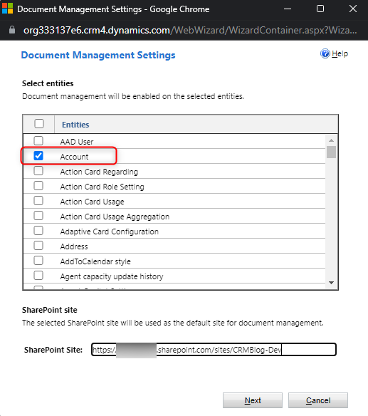
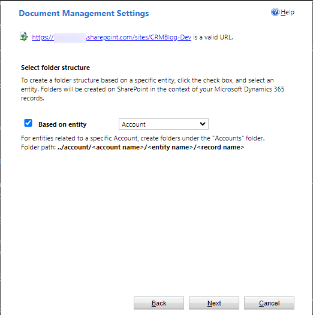
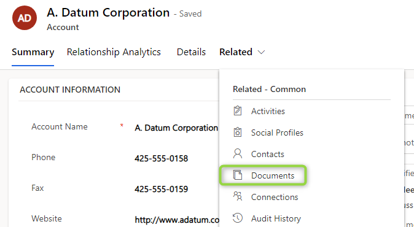
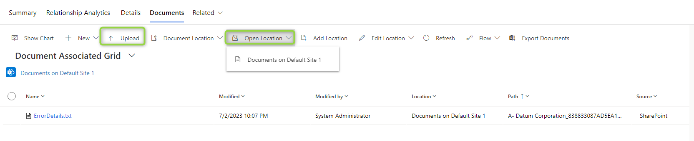
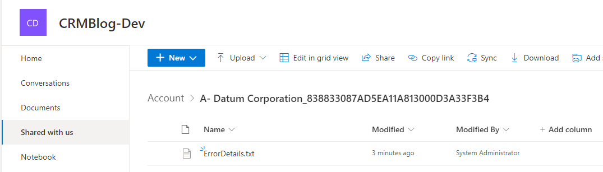

Well, ordering is broken now, but as I wanted to write more about Sharepoint integration with Dynamics CE I asked myself "shouldn't we talk about the standard integration first?"

After all, Microsoft evidently thinks its sufficient for most customers so why shouldn't you get happy with it. Also I am always relying on the standard experience for the frontend when automations are required. 

## Setting up a Sharepoint site
This is pretty straight forward, I only want to share two considerations here. First, use one site per environment, sharing the site between multiple environments just leads to confusion, compromises the separation in security and after all, Sharepoint is billed by capacity and not per site. Second, there can be only one "Default Site". Thats the site where Dynamics will auto create folders when a user visits the _Documents_ Tab of a record, so you should consider which site shall be your default site when you are planning with multiple sites to be integrated.

So first head to https://{tenant-domain}-admin.sharepoint.com/ where you replace {tenant-domain} with the domain of your Azure Active Directory tenant. 

> **_NOTE:_** You can also find the Sharepoint Admin Center via the quick links on the left menu at https://admin.microsoft.com/.

Head to _Sites_ -> _Active Sites_ and select _+ Create_ at the top. We need a _Team Site_.

Then give the site a name that shows its purpose well, maybe reference it being used for Dynamics CE and set yourself as owner. Check the _Advanced Settings_ here as well, making sure settings like the timezone are correct.

On the last screen you can also already add members to the site, they will be added to a Office 365 group that was created alongside the site.

## Authorizing Dynamics
In the _Advanced Settings_ (accessed from the cog symbol on the top right) choose _Document Management_ and _Enable Server-Based SharePoint Integration_.

> **_NOTE:_** This menu point vanishes after being performed.

Step through the wizard, if you are on an online Sharepoint site like described earlier, you can leave the standard settings until it asks for the URL, here you enter the URL of the site you created earlier.

## Connecting Dynamics
Next we need _Document Management Settings_.

On the first screen we need to enter the URL again and select the entities. Pleaso note that some entities are preselected for you! You probably want to use the "select/deselect all" check box and then select only the entities you want to enable. For me this will be the account. 

On the next page you can optionally enable a hierarchical folder structure which is interesting if you for example think all documents of an account should reside under this folder, so for example all documents on the related cases, opportunities, orders and so on. Of course this might make it a little harder finding the documents when searching in the sharepoint structure, but might make for a great view from the CRM side of things. I unselected this option here because it does not make sense with me only enabling account for the integration.

And then the wizard will create document libraries in Sharepoint for each entity. 

## Testing it
We are ready to go! Select an account in Dynamics, under _Related_, select _Documents_.

  

I've used the _Upload_ button here already and for the next step, use _Open Location_ to ensure that the document seen in the grid is actually in Sharepoint.

 

## Summary
Setting up the standard Sharepoint Integration for Dynamics CE is pretty straight forward and can be done in less than 30 minutes if you have enough priviledges to execute the wizards on Sharepoint and Dynamics side.

First we created a site on Sharepoint. Then we enabled the server-based integration from Dynamics to Sharepoint. After this we can connect the site to Dynamics, in this step we will also enable entities and optionally define a hierarchy. After that the integration is ready for the users, they can upload, preview or download documents, organize in subfolders and some more things. 

In my experience this works very well for most of the direct user interaction scenarios, so your users are hopefully already quite happy with these features, giving them quick access to documents through their Dynamics interface, all well organized within the records created by them.

Check out [the next post](/post/sharepoint/standard/functionality) for a deeper dive into the OOTB functionality of this integration.