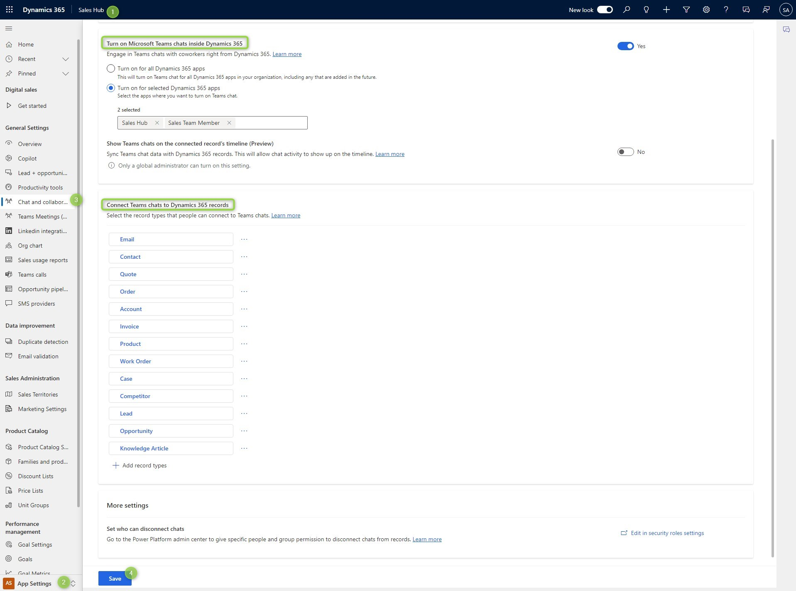
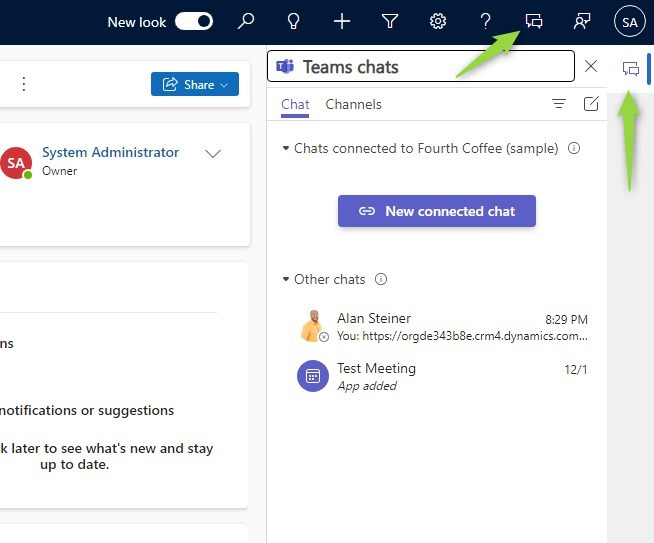

Let's chat! Sometimes a full team is just too much for a Dynamics record. A chat would be more lightweight and posts might be more visible to the participants, especially if the chat is not used that frequently.

## Setup
Enabling chatting is again at _Sales Hub_ -> _App Settings_ -> _Chat and Collaborate_. We can choose in which apps users can chat (by default the service apps are enabled here) and to which entities we can connect chats. Also take a close look at the second screenshot, if you select the ellipses of an entity in the configuration, you can customize the experience for the user. Most importantly some of those settings might be considered security-relevant, like self-joining chats.

> **Note:** In my environment it took around 15 minutes to show the features correctly after successfully saving the settings.

 

## Co-presence chatting
When someone is on the same record as you, you can start a chat with them. When Teams opens, the message box is prefilled with a link to the record. At first glance this seems not that helpful, the other side is already there! But adding a space (and thus converting the text to a link) reveals a nice feature of the app in Teams: The link is converted to a card and the open button behaves much like if you had added the tab.

## Connecting a chat
But the whole operation we performed before was only in teams. From Dataverse, there is no link from the record to the chat, so once it moves down the list of conversations, it will be hard to find. Also, it was just a message in the regular chat with me and my colleague, nothing dedicated to the record itself, making it hard to integrate others later on in the same matter because the chat history might contain other things. So, a really "new" chat tied to the record is better for storing the information shared!

This is done with the Chat buttons in the global ribbon or the drawer at the side. Here you can select an existing chat from your recent chats or create a new one. Since I think it makes sense to make a chat per record, I created a new chat here. And that works with only one additional participant! That way I can still have my private chat Alan and a dedicated "official" chat for that (Key-)Account.

Once connected, the chat shows in the timeline and a drawer at the bottom displays. And of course, opening the chat pane via the buttons will display it as well. But only if you are a member of the chat! The experience of a user that is not joined yet is something we will explore separately. Depending on the settings, you can also disconnect chats from the record. 

 

## Summary
At first look, the Chat integration is simple for both sides: The administrator just enables it for apps and entities and the user can just start by creating a new chat for a record. On second thought, configuring this feature might take months of discussions in larger corporations: Are users allowed to self-join? How do we limit the self-joining capabilities with the Write/Append privileges? Do we need to consider the information leak in Teams by the Bot/Note?
Nevertheless, Chats are a lightweight way to interact with colleagues with or without Dynamics access. The integration promotes the documentation of communication, even if it's a quick, unstructured communication. 