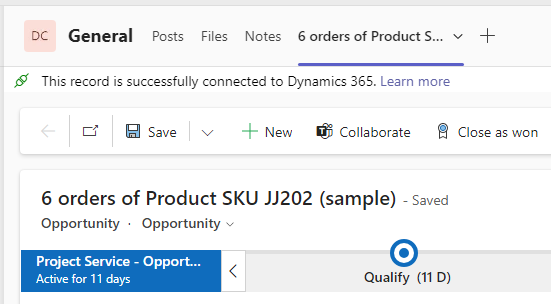

Teams is probably the most important app for almost all business users in companies that work in the Microsoft ecosystem. Therefore we should discuss the Dynamics Teams integration and what better way to do no than first exploring the standard features.

## Basic vs Enhanced Experience
MS quite cleverly named these to promote the fact that the _Enhanced Experience_ is better. It requires a Tenant Admin to enable while the _Basic Experience_ does, but getting an Admin on board for such an important integration should be no problem.
Nevertheless, we will only discuss the _Basic Experience_ in this post and save the _Enhanced Experience_ for another post. That is because many features stay the same, so we will first set a basis here and look at the improvements that can be achieved later.

## Enabling Teams
To enable the Teams integration, go to _Sales Hub_ -> _App Settings_ -> _Chat and Collaborate_. Here you can flick the switch "_Turn on the linking of Dynamics 365 records to Microsoft Teams channels_". Saving this will take a while. After that, you will find the _Collaborate_ button in the ribbon of the [supported records](https://learn.microsoft.com/en-us/dynamics365/sales/teams-integration/teams-collaboration#record-types-that-support-microsoft-teams-integration) which for example include Lead, Account and Contact. I will be using Opportunity throughout my demonstration.

> **_NOTE:_** Dynamics uses caching for the ribbon, so a simple reload of the record might not be enough for your browser to notice the new button.

## Using Collaborate for the first time
This will show a screen to take you to Teams. I use the web version here. In Teams, the Dynamics App first has to be added to the Tenant if it is not already installed. So while you did not need an Admin to enable the feature, you might need them now to install the app. If already in the tenant, the dialog that is automatically opened offers to open the app.

## Dynamics App in Teams
We are greeted with a Dashboard, but that demands to configure it in the settings. After selecting the environment and app there, it shows that this "Dashboard" is the whole app. Don't get me wrong, I'm not complaining here, I like this much more than just displaying a Dashboard as this is much more powerful.

# Connect to a Team
In a Teams channel, you have the + symbol at the top to add tabs, the Dynamics app will be displayed here.
First, we will add a record to the channel. You can search for a record, but chances are that the record you want to connect is already listed in _Recents_ because you recently edited it. And then it shows in this tab as if you had it open in the real app. But this time without the navigation.

We can also add a view, even to the same channel. This can even work with personal views (if shared with the members of the team), which can be a nice feature to pin the records that are relevant to a sales team. Since you can click records in the view and navigate further through lookups and subgrids, the users might not have the urge to switch to the full app we explored earlier.

> **_Issues:_** I had some trouble here at first doing it via the plus. After using the dropdown "Add to a team" once, it started working for all the teams. Unless members are not allowed to add apps.

# Documents
Did you see that "_This record is successfully connected to Dynamics 365_" with the record we added to the channel? This action was not only manipulating Teams but also Dynamics where a _Microsoft Teams Collaboration Entity_ is created, linking to the channel. This allows you to visit the _Documents_ Tab in the Opportunity and see the documents belonging to the Sharepoint Site connected to the Teams channel. For the demo, I created a file in the _Files_ Tab of the channel and I can see it in Dynamics as well.

Also, if you connected a ["regular" Sharepoint location](/post/sharepoint/standard/) before connecting the Teams, both locations can exist side by side.

# Connect to a chat
In my chat with Alan Steiner, I added the record as well. This at first looked very similar to adding a record to a team, but at second glance there are some differences. You don't have the option to link a view and also the connected record does not show the "_This record is successfully connected to Dynamics 365_" message, meaning that the files from this chat are not connected to Dynamics. Still useful when collaborating without a full team!

# Connect to a meeting
In a meeting, you can also connect to a record. Similar to the chat, no views and no "full connection". Also as a side pane, this looks different and not as powerful as the full forms. But it allows you to create tasks and notes for the Opportunity without leaving the context of the Meeting and should someone need the full form everyone now has the "pop-out" button at the top right as well. A link in the chat would also do, but certainly, it is more professional if you prepare this ahead of time in the meeting options.

# Using Collaborate again
Back when we added our record to a team, it got connected to Dynamics. When we select the _Collaborate_ button again, the team will be shown. We still can not do much from Dynamics apart from jumping to the correct team. _+ Create a new connection_ works just like the _Get Started_ in the beginning and takes us to Teams.

# Outlook
That was quite a heap of useful features with this integration. But did you notice how everything starts at Teams? The only direct action from Dynamics you can take is to add/edit files once the Teams connection is established. And that will change when we enable the _Enhanced Experience_ which we will explore in the [next post]().