In [the previous post](/post/teams/collab-basic), we explored most of the collaboration features already, but what is better in the _Enhanced Experience_? The answer is simple, the creation/connection of Teams Teams (no, this is no mistake, it was not me naming the groups in Teams "Teams") can happen from Dynamics.

## Enabling the Enhanced Experience
Just like with the _Basic Experience_, the _Enhanced Experience_ is enabled under _Sales Hub_ -> _App Settings_ -> _Chat and Collaborate_. This time however it's not enough to be an Administrator of Dynamics CE, but be a "Tenant Administrator". My Global Admin role in my Tenant is of course enough, but for bigger corporations, this means that one of the few administrative Accounts needs to be enabled as an Administrator for the Dynamics Environments as well to accept the permissions pictured in the second screenshot. Don't forget to save your new settings!

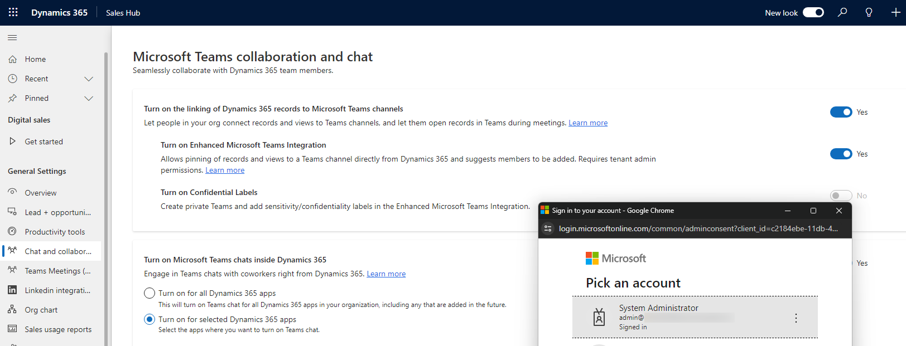

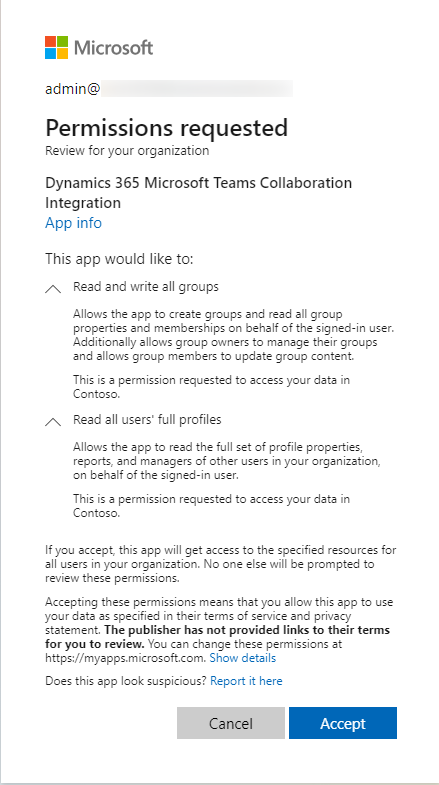

## Connecting a Team
After enabling the enhanced integration, at first, there seems to be no difference. However, the _italic_ text at the bottom of the dialog has vanished and when clicking "Get Started" in the _Collaborate_ dialog, it will not take you to teams directly but show you some more options.

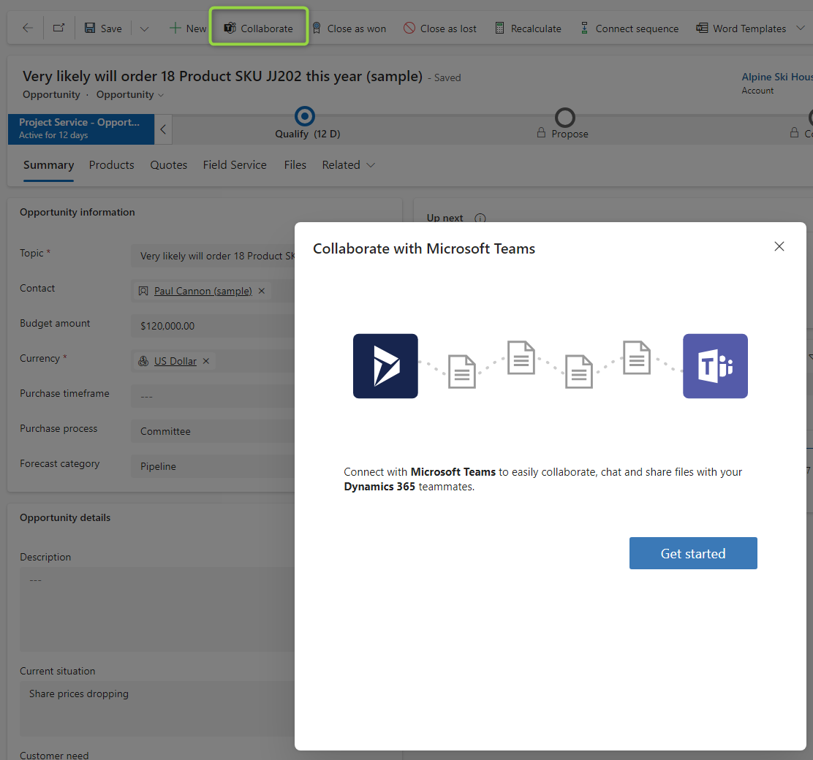

We can see the list of our Teams directly in the wizard and also have the option to create a new Team which we will explore in the next section. After selecting the team, we also have to select a channel as well.

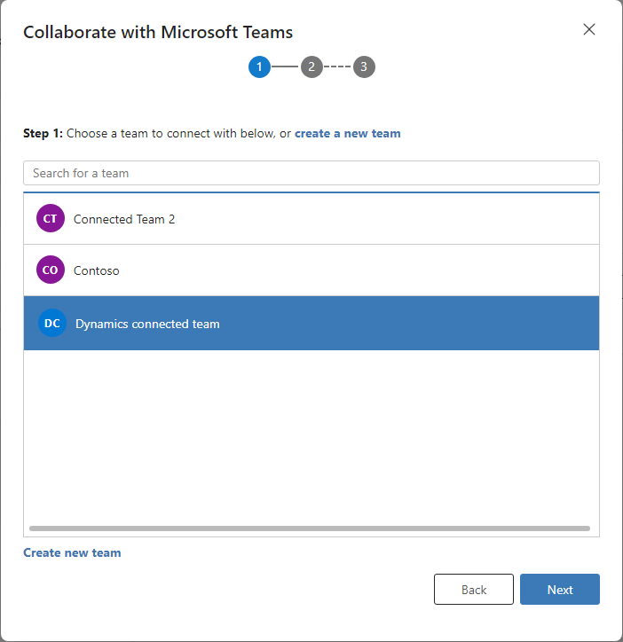

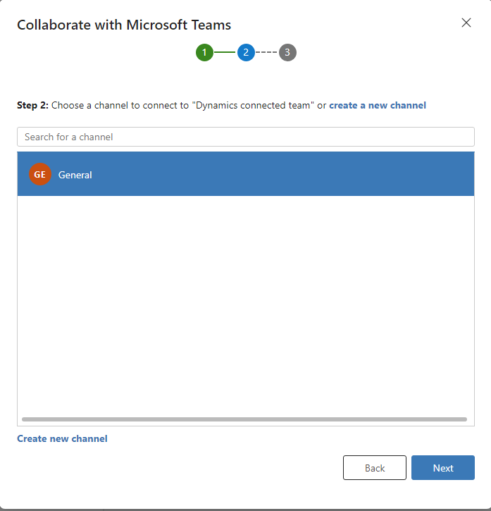

Then we may select members to be added to the team (and channel if it's private). Here you will not just see anyone but people you as Sales Team (via Connections), 
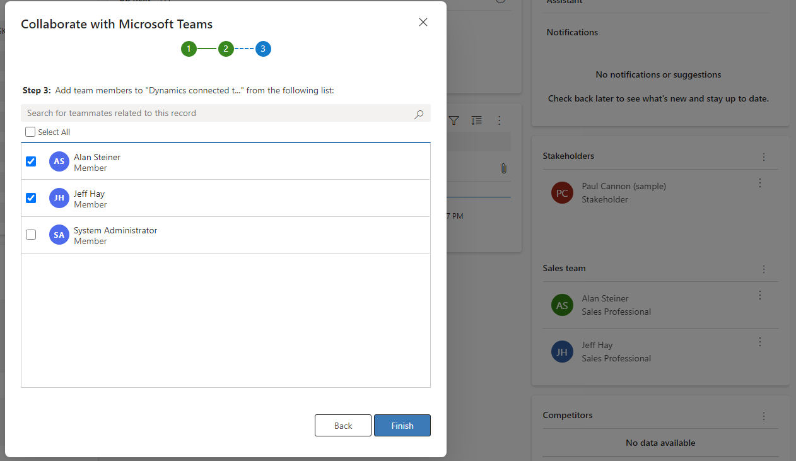

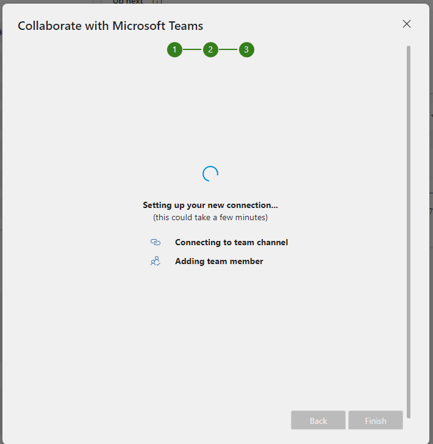

After the dialog completes, we are redirected to Teams (in a new Tab), directly to the channel's new Tab for the record. As expected the people I selected to be added to the Team are now members.
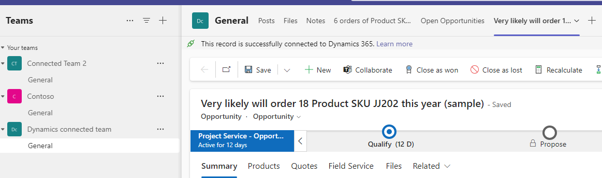

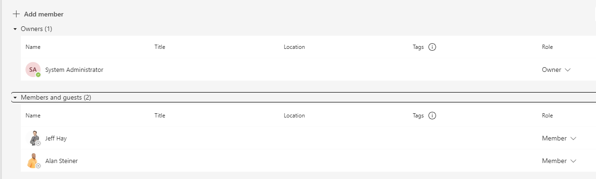

## New Team and Channel
In the previous section, we selected existing Teams and Channels. But in both steps, we had the option to create something new as well. Creating a new Team already comes with a General channel, but we also have the option to create new channels, even private ones. No other options are presented (*aside from the Sensitivity Label in the next section), so any special channel options you will have to set in Teams after being redirected.

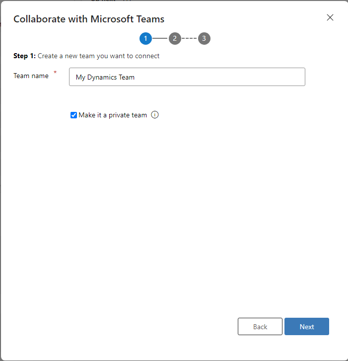

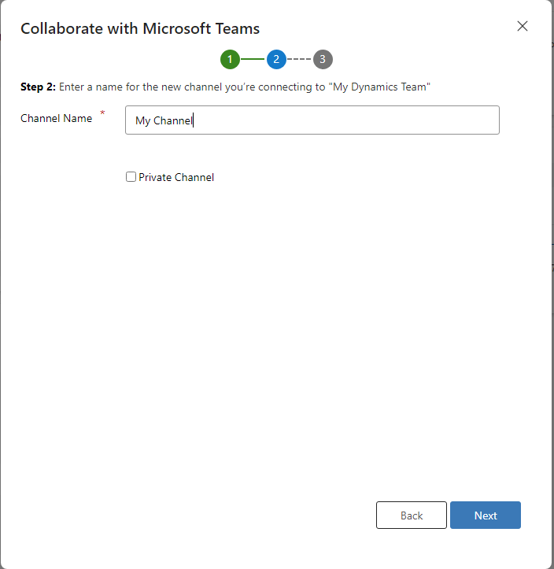

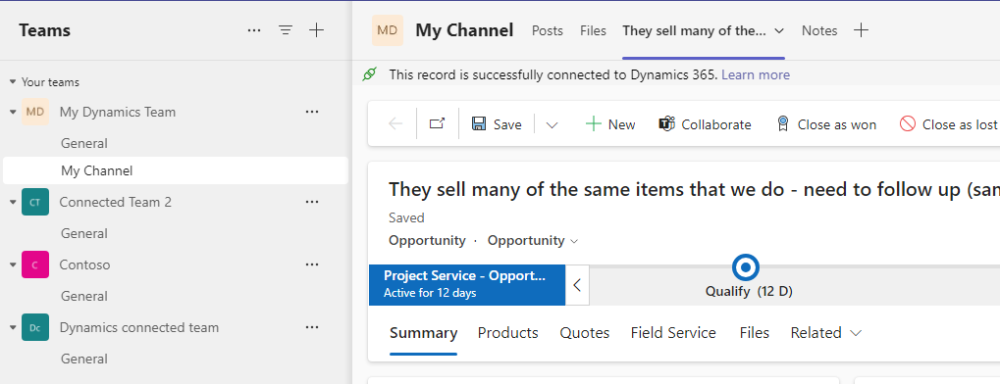

## Sensitivity Labels
If you want to enable Sensitivity Labeling in the Team creation as well (the third switch under _Sales Hub_ -> _App Settings_ -> _Chat and Collaborate_), some more permissions are required for Dynamics.

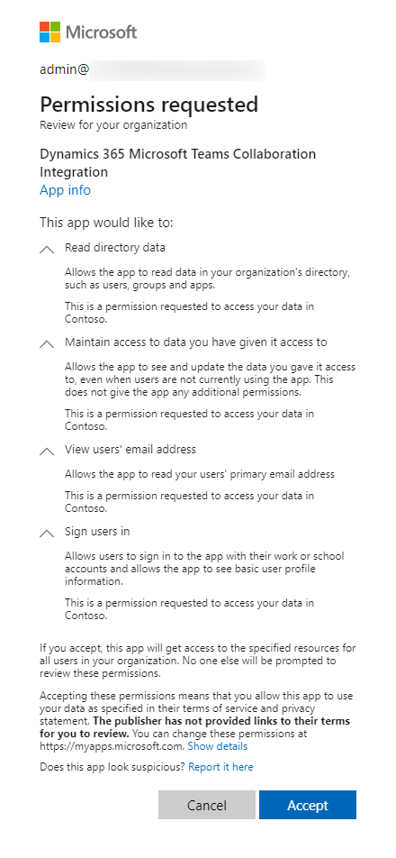

Then, to see the labels, they need to be enabled for Teams in their Scope. If you think about leveraging this option, I assume your organization already uses these labels for Teams and they are already set up. If your tenant looks like mine and is totally blank in this regard, [follow the steps listed here](https://learn.microsoft.com/en-us/purview/sensitivity-labels-teams-groups-sites#how-to-enable-sensitivity-labels-for-containers-and-synchronize-labels) (including the quite extensive sub-articles) to configure. And after that give Entra ID some time to process it to prevent yourself from questioning your sanity!

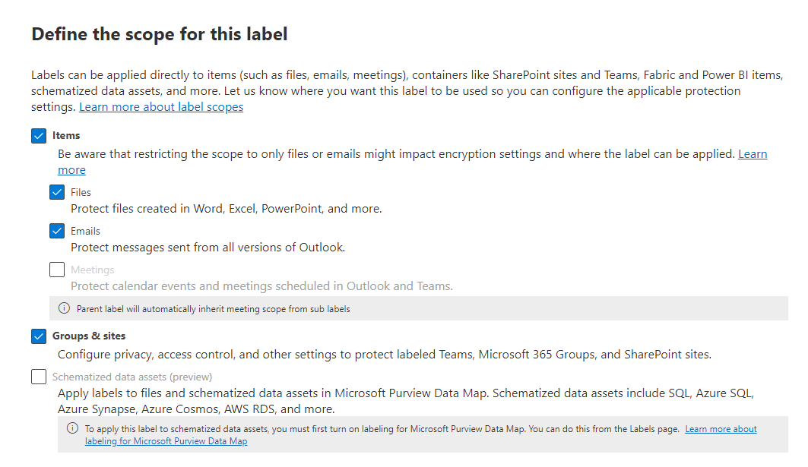

Once you start seeing the labels in the regular creation process within Teams you should also start seeing them in the dialog in Teams.

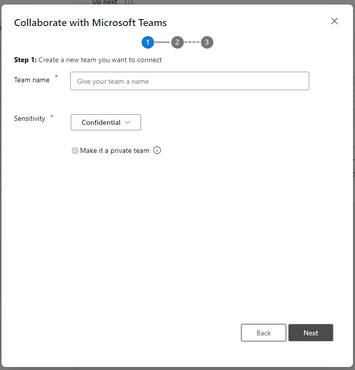

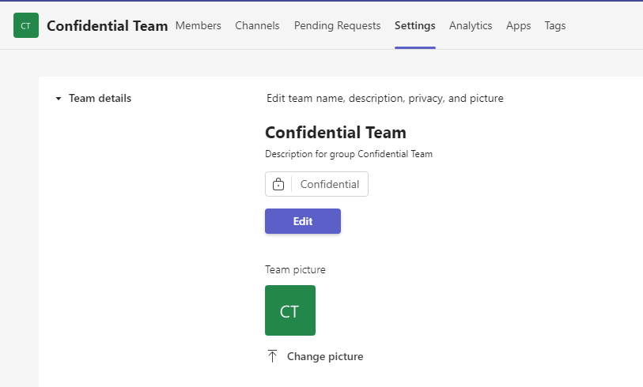

## Outlook
As we saw, the enhancement here is mainly that we get this dialog for the team directly in Dynamics and we don't have to work in 2 applications when we start in Dynamics, which is always great. 
If you and your users will love this is mainly a question of what is their primary application, Teams or Dynamics CE. The Dynamics users will probably love this because they never leave their home soil to connect with their colleagues. A user that primarily uses Teams will probably just start the process from Teams as before. 

Details may always change. Stay up to date with [the official documentation](https://learn.microsoft.com/en-us/dynamics365/sales/teams-integration/teams-collaboration-enhanced-experience) as well!