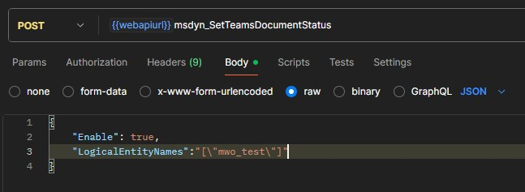
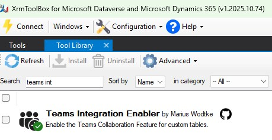
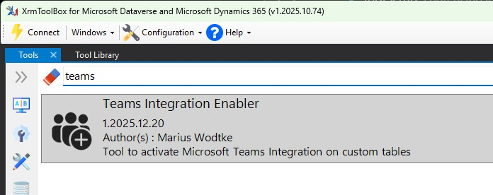
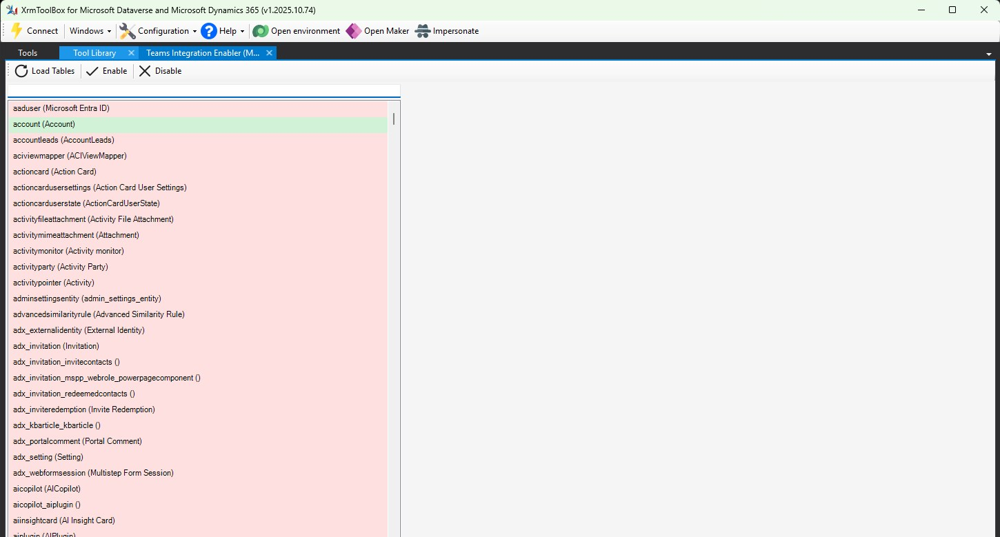
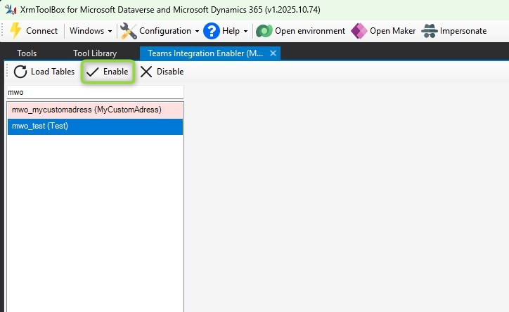
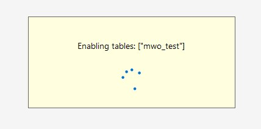
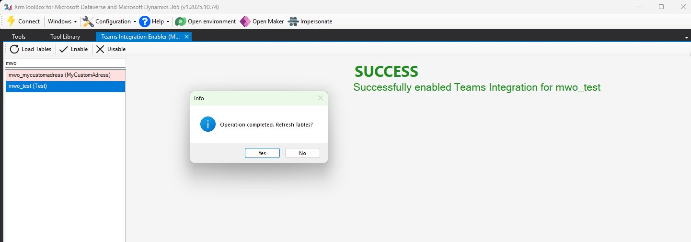
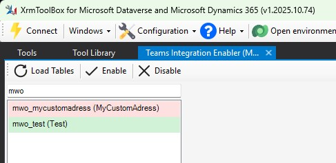
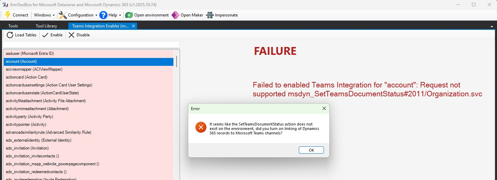
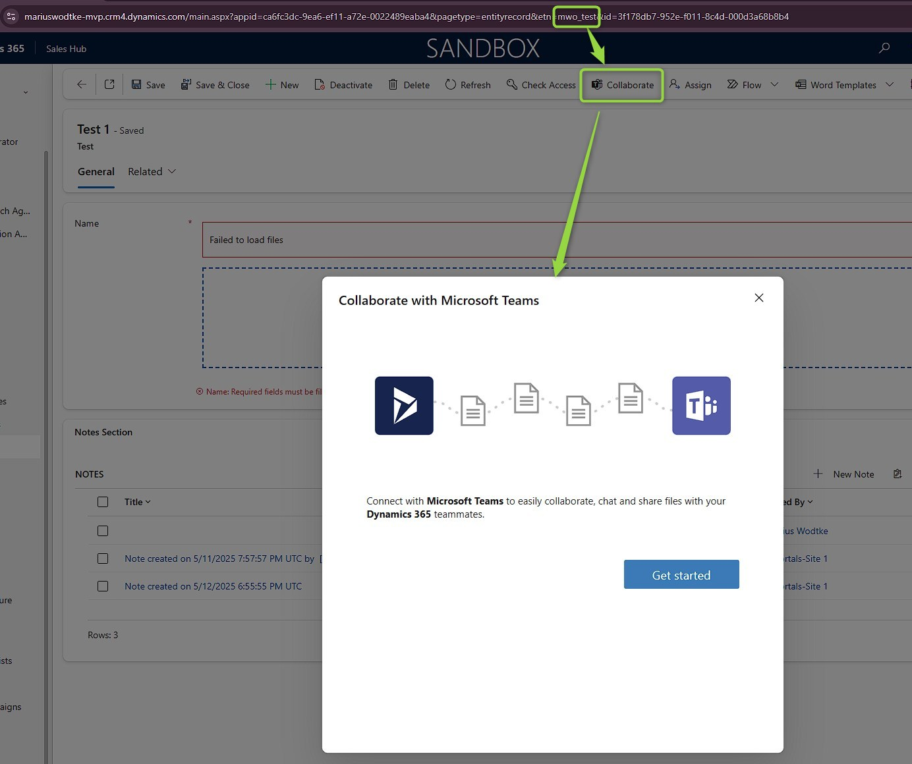

In previous articles we already covered the [basic](/post/teams/collab-basic/) and [enhanced teams collaboration experience](/post/teams/collab-enhanced/). For this article I assume that you have followed at least the setup for the basic collaboration, as otherwise you won't have a Teams integration to work from!  
However, enabling this feature only enables the experience on a set of OOTB and Microsoft first party tables. At the time of writing [the documentation](https://learn.microsoft.com/en-us/dynamics365/sales/teams-integration/teams-collaboration#record-types-that-support-microsoft-teams-integration) lists 35 tables. 

However, the docs also refers to an [msdyn_SetTeamsDocumentStatus](https://learn.microsoft.com/en-us/dynamics365/customerengagement/on-premises/developer/integration-dev/teams-integration-using-code?view=op-9-1) action that we may use to enable other tables, including custom tables, for Teams. 

## Using Postman
It is unfortunate here that MS does not provide a UI to manipulate the status of this integration for individual tables. As the provided action is called with a body and the POST method, we cannot use a simple browser to call it (at least not without some extensions or Console JS). 

Spoiler: In the next section I will introduce you to an XrmToolbox tool that makes it effortless, but here I also want to introduce you to the way you can do such things with Postman if you come across a similar functionality that no one has written a tool for yet.

Fortunately, I don't have to start a full tutorial for setting up Postman for talking to Dynamics here, fellow MVP [Sanjaya (Softchief) has already covered this well](https://softchief.com/2021/08/18/step-by-step-connect-dynamics-365-online-from-postman-using-webapi-auth-2-0-authentication/)!  
From here we simply want to append the the name of the unbound action `msdyn_SetTeamsDocumentStatus` and push the documented body, e.g. the following one to activate Teams Collaboration on the entity with the logical name `mwo_test`.

```
{
    "Enable": true,
    "LogicalEntityNames": "[\"mwo_test\"]"
}
```



Check Sanjayas tutorial linked above to see how `webapiurl` is constructed, it is the base url of your environments OData API (e.g. https://XXX.crmY.dynamics.com/api/data/v9.2/).
Also notice that the double quotes inside the value of `LogicalEntityNames` need to be escaped in order to ensure this parameter forms a valid list of strings.

An one last note here: For me this action always returns a success as long as the table exists, no matter if the table is valid for activating teams. A prime example where this is never going to work is the `activityparty` which is completely uncustomizable. You can check if the operation was successful in the entity metadata with the attribute `IsMSTeamsIntegrationEnabled`.

## Using the Teams Integration Enabler
As promised, here comes an easy tool to achieve this. As this is also my first tool for the XrmToolbox, bare with me, Tanguy already had to, because I didn't have the workflows down yet...

As we have a graphical tool, we'll have a graphical tutorial here as well.















Please note that the table metadata is sometimes slower than we are clicking refresh tables. Should your table still be reported "red", try the Load Tables button two or three more times, likely it will turn "green" soon ;)



Should you receive an error like this, you probably have not followed the steps in "Enabling Teams" of [the Basic Collaboration article](/post/teams/collab-basic/). More specifically, a solution `msdynce_OfficeProductivity` is required which seems to be bundled with the Dynamics standard apps of Customer Service and Customer Experience (Sales & Marketing). On a Dev-Environment, which does not have Dynamics apps by design, this error can be triggered reliably.

## Result & Summary



No matter if you chose to do this with the XrmToolbox tool or Postman, the final result should look something like this. The enabled table now has the _Collaborate_ button, which will open the dialog to connect the record with a teams channel. From here of course the experience will change depending on wether you did configure the [basic](/post/teams/collab-basic/) or [enhanced teams collaboration experience](/post/teams/collab-enhanced/). 

At the time of writing I am not aware of limitations for the custom tables, you can activate the integration for any table that allows customizations, also for OOTB and other first party or ISV tables. You can also deactivate the integration on the 35 preenabled tables if you for example would wish to only activate collaboration on opportunities but not on accounts.

The enabled status is stored in the table property `IsMSTeamsIntegrationEnabled`. This status will also be transferred with a solution, should you have selected the option to _Include Table Metadata_ at the table in question. 

[You can find the tool as well as links to the source here](https://www.xrmtoolbox.com/plugins/plugininfo/?id=7e01b65d-b6da-f011-92b8-7ced8d44e4bd).