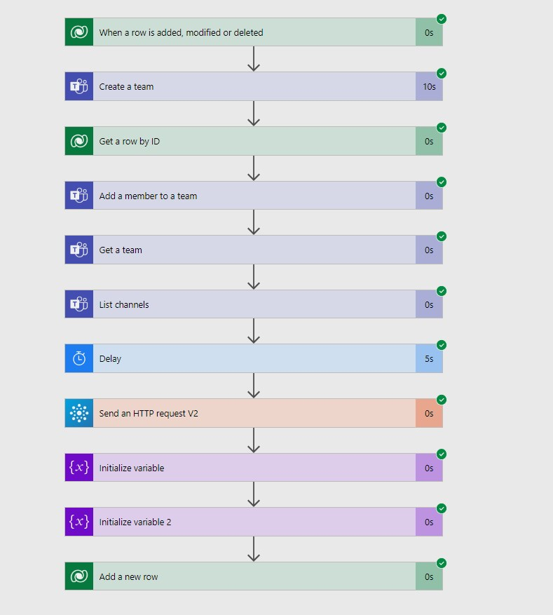

We have covered the standard approach of connecting a Teams team with Dataverse for [the basic](/post/teams/collab-basic) and [enhanced experience](/post/teams/collab-enhanced). But this time we will discuss automation around that. The standard wizard has a lot of steps that you might not want your users to go through every time. They also have a lot of flexibility in where they want to attach the record but that might not be what the IT-department wants as well. 

Our premise for this post will therefore be "Users do need a Team for collaborating with others when an Opportunity reaches a certain stage and this should be a new Team named like the Opportunity". To automate the creation, I have chosen Power Automate as seems to be a perfect fit for its wide variety of connectors.

## Creating the Team
That's the easiest of this whole post since there is a Teams connector and that's one of its actions. Note however that under advanced, the _Visibility_ has a default value of public, which might be unwanted.


## Reading all necessary information
Now the team is already there, only one more thing to do, connect it to Dataverse, right? Yeah, kind of, but to create a _"_Microsoft Teams Collaboration entity_ we need a lot more information than just the ID that was returned from the _Create a Team_ action.

First, we will be getting the Team and its default channel called "General". 


Then we will also want the URL of the Sharepoint Site, which is not returned by any action of the Teams connector. Instead, we will use the _Office 365 Groups_ Connector, which has an action to send a generic HTTP request to the _Graph API_ where we can get it in the property _webUrl_. Please note the wait period of a few seconds here. It drove me insane when the Flow always said "404 not found" and copying the URL in the browser returned the expected result. The Graph API needs a second to catch up, probably due to indexing, anyway after a few seconds it will work, 5 to 10 seconds should be enough. 


For copying: `https://graph.microsoft.com/v1.0/groups/@{outputs('Create_a_team')?['body/newTeamId']}/sites/root?$select=webUrl`

We will need the full URL as well as a relative one, I have extracted these to two variables.


And that's everything we will need to create a Microsoft Teams Collaboration entity.

## Adding a Team member
But before we do that, let's quickly take a side step and add someone to the team. Because if only our Power Automate integration user is in there, that won't yield any value. There need to be users, and probably the person working the opportunity is the right one. For simplicity, I have chosen the _Created by_ here because while I think the _Owner_ makes more sense, I would have needed to catch the fact, that the owner can also be a team.


## Connecting the record
Now, we go on to create the Microsoft Teams Collaboration entity. Let's go with the picture first:


For reference, as code view:
```
"parameters": {
    "entityName": "msdyn_teamscollaborations",
    "item/msdyn_groupid": "@outputs('Get_a_team')?['body/id']",
    "item/msdyn_tenantid": "eba86d05-d196-4bd8-8793-b2cae91984dd",
    "item/msdyn_channelid": "@outputs('List_channels')?['body/value'][0]['id']",
    "item/msdyn_channelfolderrelativeurl": "@{variables('SharepointRelative')}/Shared Documents/General",
    "item/msdyn_teamid": "@outputs('Get_a_team')?['body/internalId']",
    "item/regardingobjectid": "@triggerOutputs()?['body/opportunityid']",
    "item/regardingobjecttypename": "opportunity",
    "item/msdyn_teamsiteurl": "@variables('SharepointFull')",
    "item/msdyn_channelname": "General",
    "item/msdyn_channeltype": "Standard",
    "item/msdyn_teamname": "@triggerOutputs()?['body/name']",
    "item/regardingobjecttypecode": 3
}
```
Most of these should be clear, `Team ID` and `Internal Id` are from the _Get a Team_ action and the `Collaboration Channel ID` value assumes that the first channel shall be connected (for a new team this is the default channel "General"). This assumption around the "General" channel is also applied in the `Collaboration Channel Name` and `CollaborationChannel Relative Folder URL`. For `Collaboration Channel Type` may be _Private_ or _Standard_, so Standard for the default channel and the `Team Site URL` is the `webUrl` we saved to a variable earlier.

An easy way to get the `Collaboration Tenant Identifier` is to look it up in the overview of the Entra ID (aka Azure AD). This, as well as the Sharepoint base URL that I removed to get a relative URL, will likely be fixed because often we deploy between different Environments of the same tenant. If however, you are planning to transport the solution to a different tenant, consider using _Environment Variables_ to be able to adapt the value to the target tenant.


The other values are related to the record in Dataverse. If you are not using Opportunity, of course, the values for `Related Dynamics 365 Record ...` will change and your naming scheme for the Team might be different. An interesting note: I try to avoid the _Entity Code_ whenever possible because it changes for custom entities with deployments. But here you need to set it, otherwise, you will get the error pictured below. This should not be a bigger problem as the integration only works for a limited set of standard entities.

> Note: There are hints, that the limitation to the entities that can be integrated with teams might be lifted, check out this recent change to the Entity.xml of a custom entity: 


## The Result
So first let's picture the full flow that we just picked apart:



After the team is created and connected, the Opportunity will notice and the Teams button will show the existing team (if you have not hidden this button, which is likely in the described scenario from the beginning). Also, the Documents Tab now shows the /Shared Documents/General folder of the Sharepoint site connected to the team.


## Pros and Cons
So there is a catch. We never pinned the Dynamics 365 tab to the Teams channel. The users will have to do that on their own if they like this feature. I am not aware of how this could work with flows, hit me up if you have an idea. Resorting to a classic plugin has the problem that we would need to do the authentication without a good way to store the secret...

But there are many pros as well! For once, in an optimal case does not require any user interaction at all and also makes sure all Teams are created the same way. The fact that the Teams are "managed" by the user creating them (the user is an owner) allows us to implement further logic. You can for example add members to the Team from Dataverse actions, like connecting another user in the _Sales Team_ Connection subgrid on the right. The flow user can also make posts in the channel and I bet you can think of more stuff you want out of the Teams integration. With the standard you might always run into permission issues, either the flow user has very liberal privileges in the corporate Teams, or it will simply not be possible unless the users are trained to include that user in the team.

## Summary
With Power Automate we can certainly mock a connected Teams Team! We will have to leverage a third connector apart from Teams and Dataverse in the Office 365 Groups connector, but the integration will behave very similar to the OOTB experience without the need for the user to select as many options correctly in a multi-step wizard. The Teams channel won't have the Dynamics 365 tab pinned by default, that's something a user will have to add manually. But this approach offers repeatability and allows for further automated activities in Teams down the line.