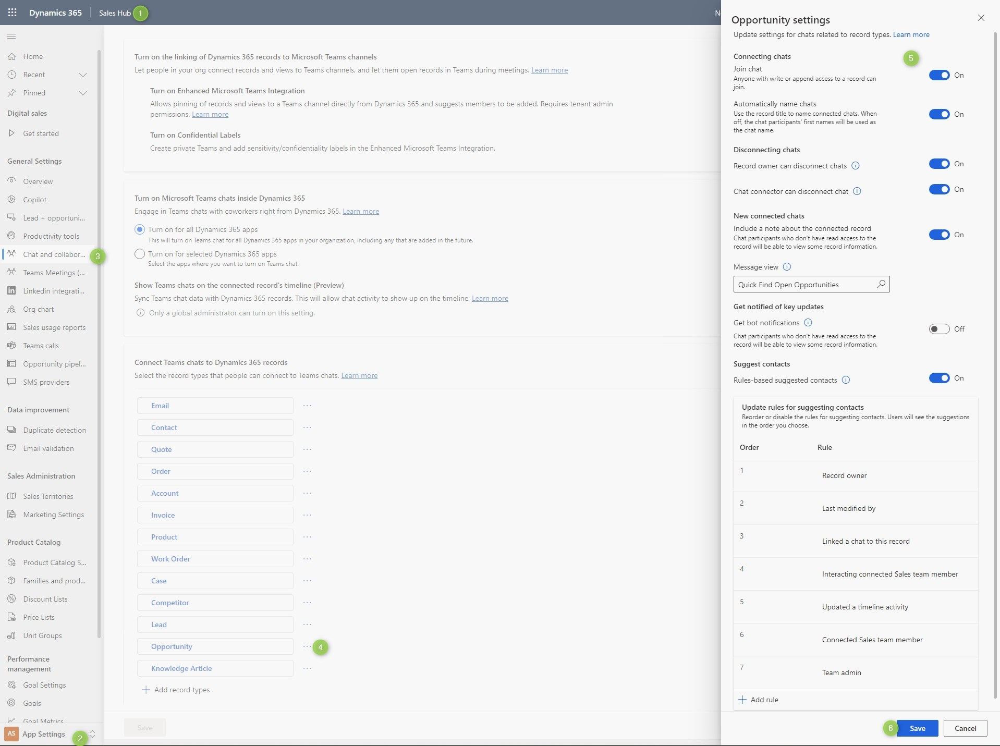
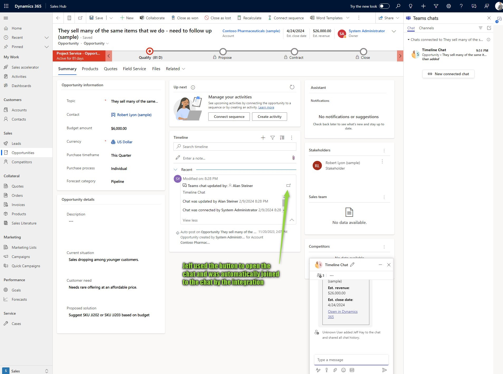
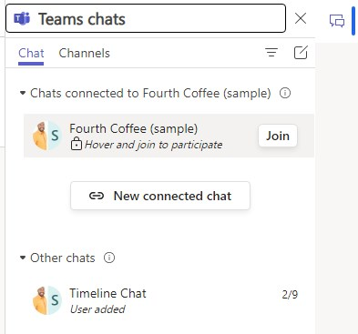
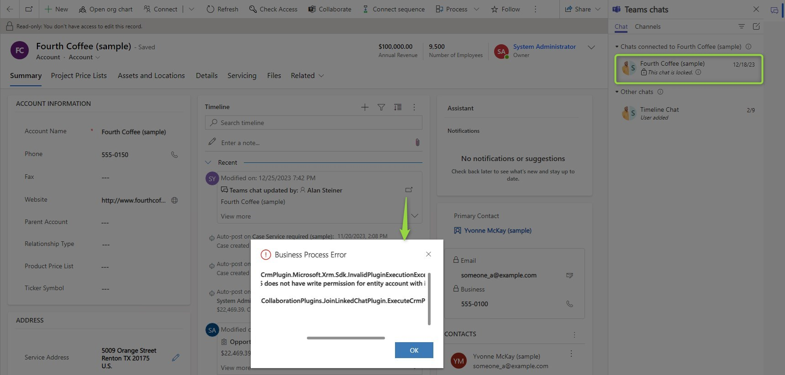
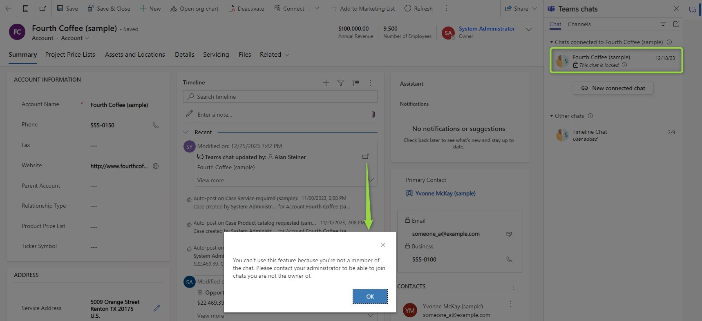
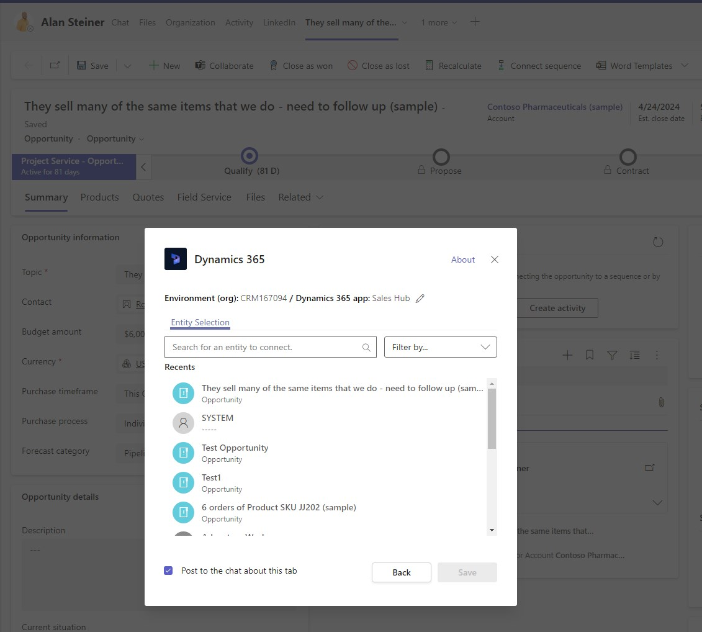

One problem with [the connected chats](/post/teams/chat) in Dynamics is: How do you get access if you are not already part of the group? Dataverse does such a good job of breaking silos in organizations willing to do so, but if Teams chats are widely used, they may become mini-silos where relevant information is only accessible to a very selected group of people. 

But this shall not draw you away from using the Teams integration! Instead, consider the _Self-Join_ option. This enables anyone with the appropriate permissions in Dataverse to join existing connected chats.

## How to enable Self-Join?
The Teams options are found at _Sales Hub_ -> _App Settings_ -> _Chat and Collaborate_. Here you want to scroll down to the entities, select the given entity, activate the switch for _Join chat_ and save.

## How does it feel?
After enabling it, it's pretty straightforward to join an existing conversation. First, we will take a look at what happens if you have the [timeline integration](/post/teams/timeline) enabled as well.

This picture has important information inside: All chat history is shared upon joining. This is good for getting the most out of this functionality, otherwise, you would be starting into the chat with no context of what has been already discussed. But it also means these chats are not as private as a chat you just have with a colleague. Even if you had to add someone in Teams, you could still choose not to share the chat history. This means that you will have to train the users so they understand, that the connected chat is more of an official communication around the record.

If you did not activate the timeline integration, there is of course another way to join via the chat pane.

## When does it not work?
Well firstly if you do not have write or append permission on the record. The chat pane will show the chat as locked and if you try to click the button at the timeline entry, you will receive an error about missing permissions.

The second reason it might not work is when you did not enable the entity for self-joining. Remember that this setting is per entity, so while it might work for one type of record, it might not for another. The chat pane will look the same as if you had no permissions, clicking the button at the timeline entry reveals a different error.

Lastly, it will also not work if you have used the pinned tab in Teams as "connection" as this is not counted as connected chat. This chat won't be listed in the connected chats section and therefore there will be no join button. So you can safely use the Dynamics 365 tab of Teams in chats that you want to keep private, only chats created/manually connected from Dynamics are subject to self-joining.

## Summary
Enabling self-join is done in the collaboration options in a per-entity fashion.
Once you enable self-join for an entity, users with either write or append privileges to a record may join the connected chat(s). They can do so either via the timeline entry ([if this feature is enabled](/post/teams/timeline)) or the chat pane. This does only work for chats that were connected from Dynamics, chats are not connected to Dynamics by adding the Dynamics 365 tab to Teams. 