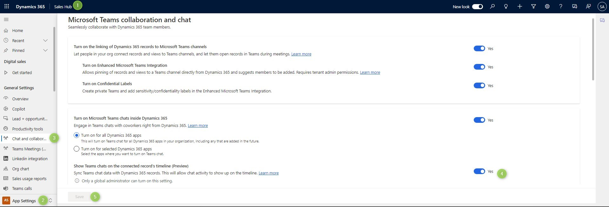
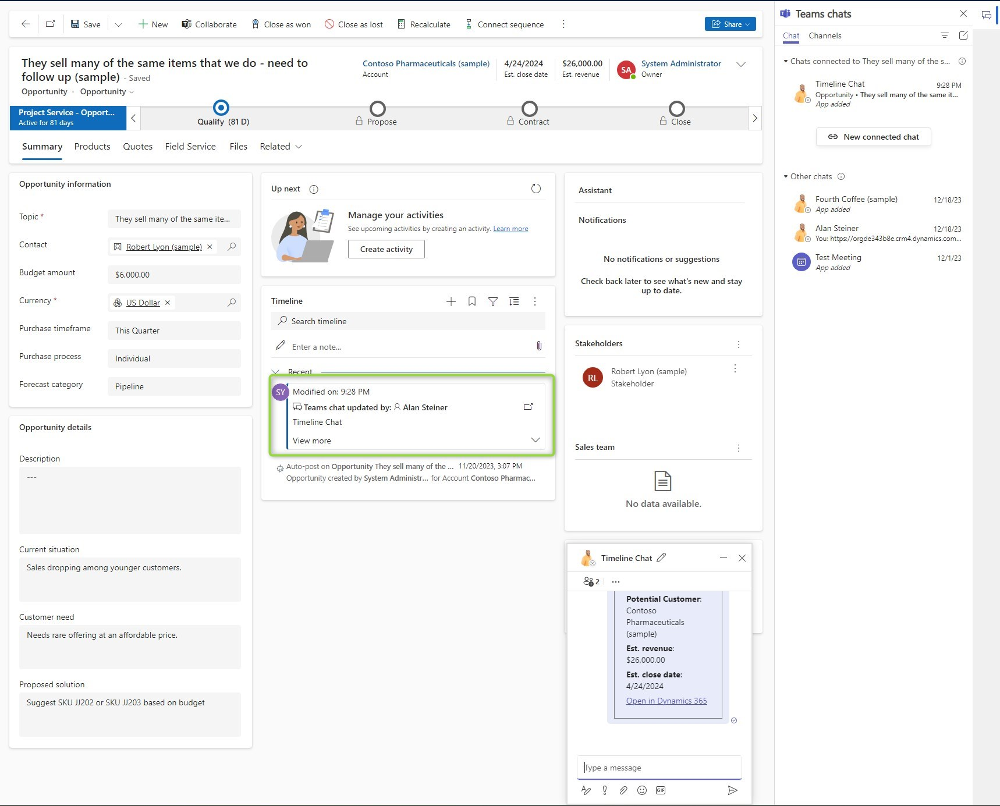
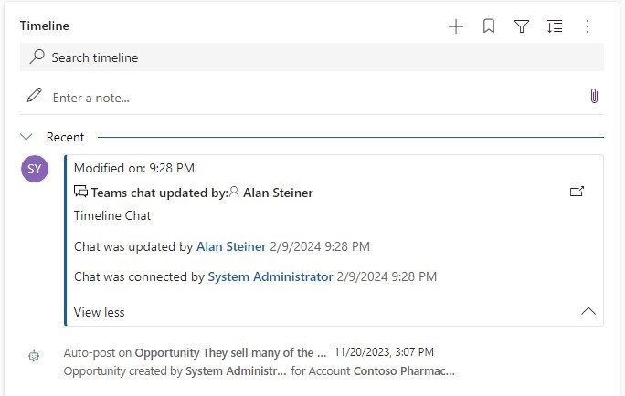
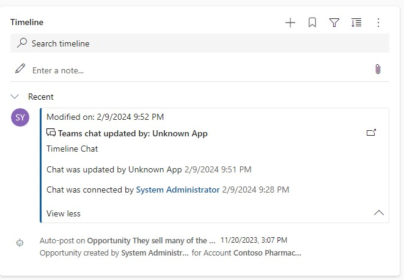
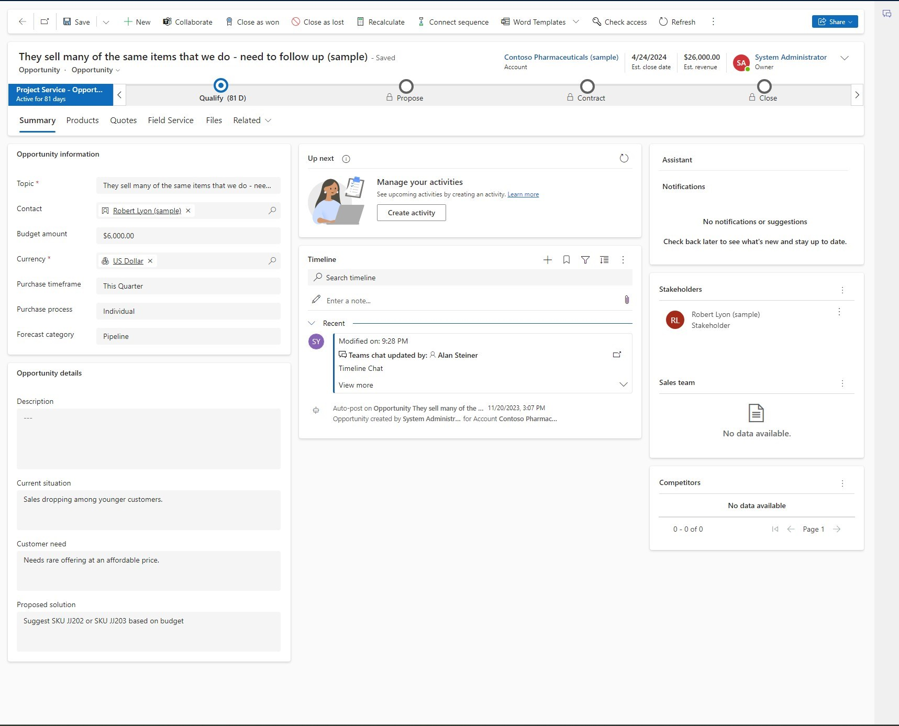
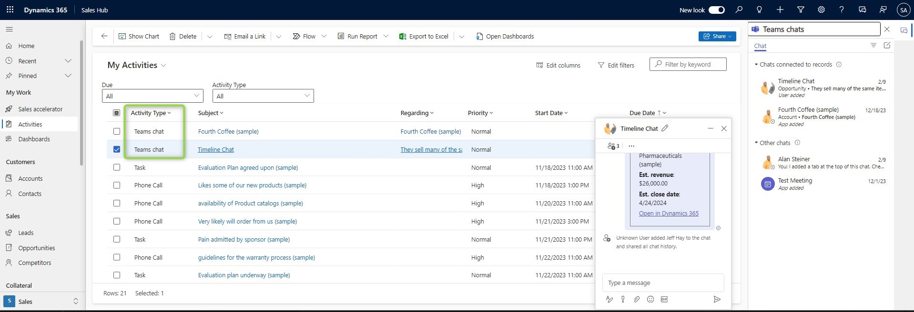
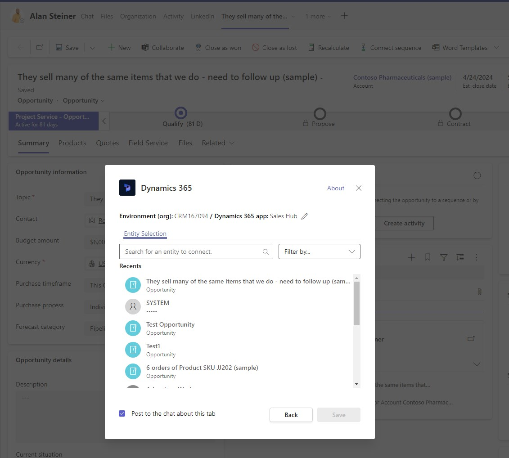

We've already [talked about chat](/post/teams/chat) as the lighter integration of Teams. And there is a preview to make it even better: [Timeline Integration](https://learn.microsoft.com/en-us/dynamics365/release-plan/2023wave1/service/dynamics365-customer-service/view-teams-chat-connected-records-timeline). Even though this is marked as a customer service feature, it will still work nicely in the sales app context I've set in this series.

## How to enable Timeline Integration?
Luckily, the Teams Integration settings are a one-stop job. So we are again at _Sales Hub_ -> _App Settings_ -> _Chat and Collaborate_. Here it's the _Show Teams chats on the connected record's timeline (Preview)_ Flag we are looking for. Also note the fact, that this needs a Global Administrator to enable it because changes in Teams will be captured by an Application and synched back to Dynamics.

## How does it feel?
Well, when you now connect a new chat to a record, here I've used an Opportunity, after some time and manually refreshing the timeline, a new activity will appear. By clicking on the button at the activity, the chat will open.

The activity will display who connected the chat and who did the most recent change. I  did not see that much value in the most recent change. In the examples below, Alan made the change by simply being added to the chat when it was created and in the second example, Jeff self-joined, resulting in an unknown app to perform the most recent change.

 

## Why is it useful?
Those last sentences may sound like I wouldn't like this feature, but I think it's a wonderful feature for discovering chats! Let's take a look at what was shown before I clicked the button. 

Nothing is telling me about the connected chat apart from the Timeline entry. I would need to open the chat drawer with the button at the top right to find the chat. Therefore the chat is easily overlooked and this will limit the adoption of the integration. Therefore I think you should enable this to help the users after the first connection of the chat.

## Activities
The timeline shows activities, which means there are also activity records. When clicking these in Activities, the chat will also open. This might be useful when searching for a certain chat, but you could as well just search in Teams and find the initial note to the record in Dataverse there. So I think this will mostly be used by the administrator to measure adoption...

## When does it not apply?
This only works when you connect the chat from Dynamics as detailed in the [post about chat](/post/teams/chat). That specifically means that it will not make a timeline entry if you pin the Dynamics 365 Tab in a Teams chat, and this is a good decision by MS! Because there are other features like _Self Join_ that would make this a serious issue in regards to privacy. 

So if you want a timeline post to find the chat at a later point in time, start the chat from Dynamics.

## Summary
If you can get a Global Administrator on board to enable the Timeline Integration, do so! It's as simple as flipping a switch and provides the users with a visible hint to existing Teams chats in Dynamics. Once the user identifies the chat in the timeline, he is just one click away from the chat window. Also if there are too many activities and users struggle to find the chat, this can be solved by [pinning the activity](https://learn.microsoft.com/en-us/power-apps/user/add-activities#pin-or-unpin-records-in-timeline)! 

If you choose not to enable this, for example, because it's a preview feature, the chats can still be found via the chat pane, which is opened at the top right once you enabled chats. This has less visibility, but if the users have the chat pane always open, they will likely not bother about the timeline and will notice the chats there.