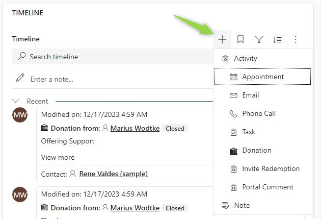

Did you know you can _bring your own data_ to the Dynamics timeline component? In general, the timeline is quite powerful with [its configuration options](https://learn.microsoft.com/en-us/power-apps/maker/model-driven-apps/set-up-timeline-control) in a no-code scenario already. But it's also limited to the standard entities of the timeline: Notes, Posts and Activities. With these, we can work around, e.g. inserting posts for the creation of another entity or just defining an entity as an activity in the first place.

But sometimes this is not feasible, e.g. due to the security setup with activities or you are working with external data that you prefer to not persist. A good example is news articles. They just have less footprint in the system if they are queried the moment the seller opens the Account and compared to a nightly creation of post records, the news will always be up to date.

## The Feature
But getting there will be quite a journey. First of all, I'm talking about a feature Microsoft calls [_Custom Connectors with the timeline control_](https://learn.microsoft.com/en-us/power-apps/maker/model-driven-apps/custom-connectors-timeline-control). This is a high-code extension that you will find in the _Advanced_ section of the Timeline control settings. You enter the unique name of a webresource and the name of the primary class.

 

This class you are specifying needs to implement a certain interface called `IRecordSource` which is found in [Interfaces.d.ts](https://github.com/microsoft/PowerApps-Samples/blob/master/model-driven-apps/custom-connectors/SecondaryRecordSource/solution/Interfaces.d.ts) in the sample linked at the bottom of the article. This requires you to implement 4 (+ 2 optional) methods.

## init
This is the first bummer. The sample (at the time of writing) does not include a definition for the given context since the referenced `mscrm.d.ts` is missing. We will try to fix that later, but you could type it into `any` here and just save it to a class property/field.

``` TS 
async init(context: any, config?: JSON | undefined): Promise<void> {
    this.context = context;
    this.config = config;
};
```

The context contains a lot of functions, way too many to list here. But check the template repository linked at the end, the [Interfaces.ts](https://github.com/Kunter-Bunt/TimelineCustomConnector/blob/main/src/types/Interfaces.ts) contains a partially defined `IControlData` interface, showing a lot of the capabilities. 

Apart from that you have static namespaces like Xrm.WebApi or Xrm.Utility available.

## getRecordSourceInfo
This is a very simple function, it just returns an object with a name property, done. No special requirements for the name, but it should correspond to the module aka the connector you are implementing. I've used the class name as the default.

``` TS 
getRecordSourceInfo(): IRecordSourceInfo {
    return {
        name: MyRecordSource.name
    };
};
```

## getRecordsData
This function is called onLoad, on refresh and whenever the filters or search is used. It shall return the data based on the filters (if present). Here is the absolute minimal extract.

``` TS 
async getRecordsData(request: IRecordsDataRequest, filter?: IFilterRequest | undefined): Promise<IRecordsDataResponse> {
    this.records = this.records ?? [{
        id: "1",
        data: JSON.stringify({ name: "Record 1" }),
        sortDateValue: new Date()
    }]; 

    const response = {
        requestId: request.requestId,
        records: this.records
    }

    return response;
}
```

We will cover an actual sample in the next article about displaying data.


## getRecordUX
This function is called for every record you return from `getRecordsData`. Here you transform the data into something displayable in the timeline. Important parts are Header, Body and Footer, composing the information in the card, an icon and the `sortDateValue` for ordering. 


No code sample here, we cover this in the next article about displaying data. But the template contains the necessary parts for this [in this class](https://github.com/Kunter-Bunt/TimelineCustomConnector/blob/main/src/MyRecordSource.ts).

Also, you can add commands to each record, which is probably another topic in itself, so expect this series to grow quite a bit.

## getFilterDetails
This function gets passed in the filters and shall return the (possibly manipulated) filters. Manipulations might for example be altering an existing filter by adding an option or creating a new filter that fits your extension.

Implementing this is quite complex since you need to consider the existing filters, need to prevent illegal combinations and calculate the count of records matching a filter in combination with all already selected filters. We will have to cover this in a dedicated article, but at least this is one of the optional functions, so we can just ignore it for now.

## getRecordCreate
This function controls what is being shown at the + for creating new records. The objects you return contain an onClick function that is executed as soon as the added option is clicked. You only need to implement the buttons you want to add, options available by the regular configuration options of the timeline are shown regardless. So if you do not intend to add a button, you may skip the implementation of this function.



There is no code sample here, we will have another dedicated article for it.

## The Template
An obvious problem with this feature (at the time of writing) is the lack of samples. [The provided samples](https://github.com/microsoft/PowerApps-Samples/tree/master/model-driven-apps/custom-connectors/SecondaryRecordSource/solution) are compiled already, the definitions are not complete and [the docs article](https://learn.microsoft.com/en-us/power-apps/maker/model-driven-apps/custom-connectors-timeline-control) lacks explanations on the required functions. I try to fix this on this blog by providing more context around the functions but we will also have samples. 

These samples will be built on a template, which is found in [this repository](https://github.com/Kunter-Bunt/TimelineCustomConnector). The plan is that the main branch holds the template for easy cloning/forking/copying and each sample receives a separate branch.

## Summary
Timeline Custom Connectors are a high-code extension configurable for the Dynamics timeline, shown on forms. It allows for a custom experience of records being shown in the timeline, with no constraint on what is shown, even custom commands are implementable. However, a considerable amount of code is required to leverage these capabilities! 

The template in [this repository](https://github.com/Kunter-Bunt/TimelineCustomConnector) tries to improve your time to "getting started" and you should check [the series](/post/timeline/custom/) for more samples. If certain functionality is still missing on this blog you may be able to reverse engineer them from the [MS samples](https://github.com/microsoft/PowerApps-Samples/tree/master/model-driven-apps/custom-connectors/SecondaryRecordSource/solution).