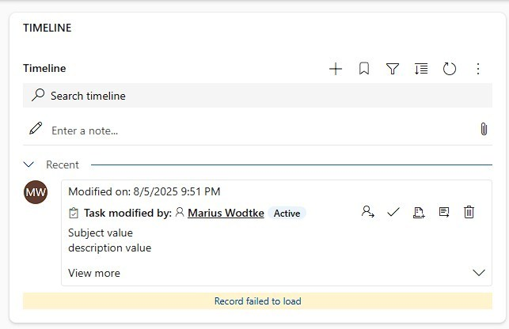
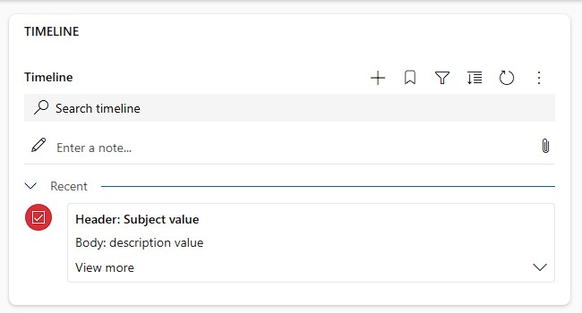

Timeline Custom Connectors allow you to display any form of data in the Dynamics/Model Drive Apps timeline. This [generally available feature](https://learn.microsoft.com/en-us/power-apps/maker/model-driven-apps/custom-connectors-timeline-control) is however hard to implement and lacks official documentation, apart from the single, transpiled(!) [sample](https://github.com/microsoft/PowerApps-Samples/tree/master/model-driven-apps/custom-connectors/SecondaryRecordSource/solution) with incomplete interfaces, there is almost nothing to support you. This is where this blog tries to improve the situation, also check out [the rest of the series](/post/timeline/custom/) for inspiration!  
BTW, if anyone from MS is reading this and is bothered by the tone: Give us some proper docs and ping me, I will happily refine these articles and commend you for fixing the situation!

In this sample we will explore the option of passing an additional configuration to our custom connector. This configuration is specified in a separate WebResource which contains a JSON. This is immediately helpful if you want to use a timeline component differently at different forms/tables because you can reference different files, e.g. `ContactConfiguration.js` and `AccountConfiguration.js`.  
Should you want to change values between environments to for example change a URL needed for retrieving data, this is less ideal. You can still make it work by leveraging the layering system by stacking another (un)managed layer over the original configuration file. But I would suggest using the Environment Variables for this and either hardcode their schema name or reference their names via the configuration file.

## The repository
In general this series consists of programming samples since I expect you to have very specific requirements that can not be solved with standard methods. If they can be bent to fit something like a subgrid, do it! And depending on the pickiness of your stakeholders regarding styling, it might even be worth implementing a PCF instead because you have more control over the content. However, there are certainly situations where the UX of the timeline is preferred.

You can find the full samples in the [TimelineCustomConnector](https://github.com/Kunter-Bunt/TimelineCustomConnector) repository. It has a branch for each sample, for this article, navigate to [Configuration](https://github.com/Kunter-Bunt/TimelineCustomConnector/tree/Configuration). As you will find in the repository, the samples are built with TypeScript and are then transpiled to JavaScript as I would consider using this feature a "real high-code development". It is not done with few lines of code and the ability to debug transpiled MS code should be in your box of tools, this is nothing you can achieve with a bit of vibe-coding like you can sometimes with smaller form script use cases. As GitHub Copilot evolves quickly I feel I must add this: As soon as it is able to attach to the browser console, debug the problems and redeploy autonomously I might change my opinion regarding the last sentence.

## The configuration 
For the sample I introduced a new interface called `IConfiguration`.
``` TS
export interface IConfiguration extends JSON {
    footerField: string;
    bodyField: string;
    headerField: string;
    sortField: string;
    entityName: string;
    selectFields: string;
    filterField: string;
    idField: string;
}
```

This interface defines all the properties I expect to be present. I've used all string here but you may use other simple as well as complex types, so you could also define something like `myField: ISubConfiguration` that is another Interface with more properties inside.

Crucially, this interface `extends JSON`, this allows an easy conversion in `MyRecordSource.ts` where the input to the init method must be JSON to comply with the interface (at least in TypeScript). 

``` TS {hl_lines=[12]}
export class MyRecordSource implements IRecordSource {
    private context?: IControlData<IRecordSourceParams>;
    private config!: IConfiguration;
    private records!: IRecordData[];
    private data!: Data;

    constructor() {
    }

    async init(context: IControlData<IRecordSourceParams>, config?: JSON): Promise<void> {
        this.context = context;
        this.config = config as IConfiguration ?? {};
        this.data = new Data(context, this.config);
    };

    // ...
```

Be careful! This feature is not very fault tolerant, putting an invalid JSON into your configuration file will break the whole component, you will simply not hit any breakpoint from the `init` method forward and will not receive any feedback in the console or similar either. If you can hit a breakpoint in the first line of `init` without a configuration and can't hit it with a configuration, be sure to check the contents with a JSON validator as the OOTB timeline will run `JSON.parse` for you before passing the configuration.

Oh and another thing you might stumble into: While you specify the code file (Resource path) for the timeline custom connector starting with the publisher prefix, the configuration file (Configuration path) needs a `/WebResources/` because unlike the code file, this is not automatically prepended and you will find a 404 call for the configuration in the Network tab of your Developer tools otherwise. So configuration should look a little something like this:

 

TBH I think this might be a bug, but fixing it would be a breaking change, so keep an eye out to the Network tab of the Developer tools to validate the behavior.

## Using configuration
Once you have the configuration file was loaded successfully and you were able to verify the JSON arriving correctly at your breakpoint in `init`, we can start using it. Fortunately we have control from here, so no weird things should happen from now on. You should only be aware that although I can specify properties to be mandatory, I can't enforce this on the configuration file as it is independent, so we can run into null ref exceptions should the configuration not fully specify all properties.

``` JSON
{
    "footerField": "createdon",
    "bodyField": "lastname",
    "headerField": "firstname",
    "sortField": "createdon",
    "entityName": "contact",
    "selectFields": "contactid,createdon,firstname,lastname",
    "filterField": "_parentcustomerid_value",
    "idField": "contactid"
}
```

This is a sample configuration rendering the contacts of an account, remember you can take a look at the full code in the branch [Configuration](https://github.com/Kunter-Bunt/TimelineCustomConnector/tree/Configuration). The configuration is passed to the Data class in the `init` method and is there used build the Dataverse query.

``` TS
export class Data {
    private context: IControlData<IRecordSourceParams>;
    private config: IConfiguration;

    constructor(context: IControlData<IRecordSourceParams>, config: IConfiguration) {
        this.context = context;
        this.config = config;
    }

    // ...

    private async getData(): Promise<any[]> {
        let id = this.context.page.entityId;
        let filter = `$filter=${this.config.filterField} eq ${id}`
        let select = `$select=${this.config.selectFields}`;
        let contacts = await this.context.webAPI.retrieveMultipleRecords(this.config.entityName, `?${filter}&${select}`);
        return contacts.entities;
    }

    // ...
```

And of course we can now use the configuration everywhere we might need it, for example when "rendering" the timeline record in `getRecordUX`:

``` TS {hl_lines=[5]}
    createBody(recordId: string, data: any) {
        return this.context?.factory.createElement(
            "Label",
            { key: `${this.getRecordSourceInfo().name}_${recordId}_body` },
            `Body: ${data[this.config.bodyField]}`
        ) ?? [];
    }
```

And in this case I again have to emphasize that this is a coding sample, the code presented here is very unsafe considering the person crafting the configuration has to match all those separate fields together, ensuring that the bodyField is also found in the selectFields and that the selectFields are actually present in the table specified in entityName. A production ready component would need much more error handling!

But we have a result!


## Task problems
I also tried this with the Task table, the configuration looks like this:
``` JSON
{
    "footerField": "prioritycode@OData.Community.Display.V1.FormattedValue",
    "bodyField": "description",
    "headerField": "subject",
    "sortField": "createdon",
    "entityName": "task",
    "selectFields": "activityid,createdon,description,subject,prioritycode,activitytypecode",
    "filterField": "_regardingobjectid_value",
    "idField": "activityid"
}
```

But this lead to problems!




With debugging into this error I found that a property `dataMap` (object) was missing which should specify an activitytypecode, however setting it in my code did not help as it was rebuilt as an empty object by the timeline. Comparing with the contact sample revealed that completely wrong turns were taken as the contact had a different derivative of the class where the activitytypecode was hardcoded as "customtest", which also sounds odd.  
From here on I discovered that my custom task record was pooled with the OOTB task record, which had the dataMap built correctly. I can only assume what happens here, something like the same entity name leading to this bug? Nevertheless, the fix was to simply disabling Activities, the original task not being rendered lead my record to the correct classes again.



You will also notice that my footer did not render here, but my nerves were already tested enough at this point, I will postpone this problem to another article.

## Summary
Timeline Custom Connectors is a tricky to implement feature due to missing documentation and bad error handling. But you can do a lot of cool stuff with it and with configuration it gets even cooler!

You need to put a (valid) JSON into a WebResource and reference it in the timeline configuration alongside the code file. Note that you will need to prepend a `/WebResources/` for the configuration file as it is not automatically done. 

The content will be passed to the `init` method in an already parsed state and from there to change the behavior of your component. I advise to define an interface for the configuration as it will ease tracking all necessary properties. 

On a side note, if you are trying to render activities that would usually also appear in the timeline anyway and run into issues with "Record failed to load", try deactivating Activities in the timeline configuration as there might be a mixup between the OOTB functionality and your Timeline Custom Connector.