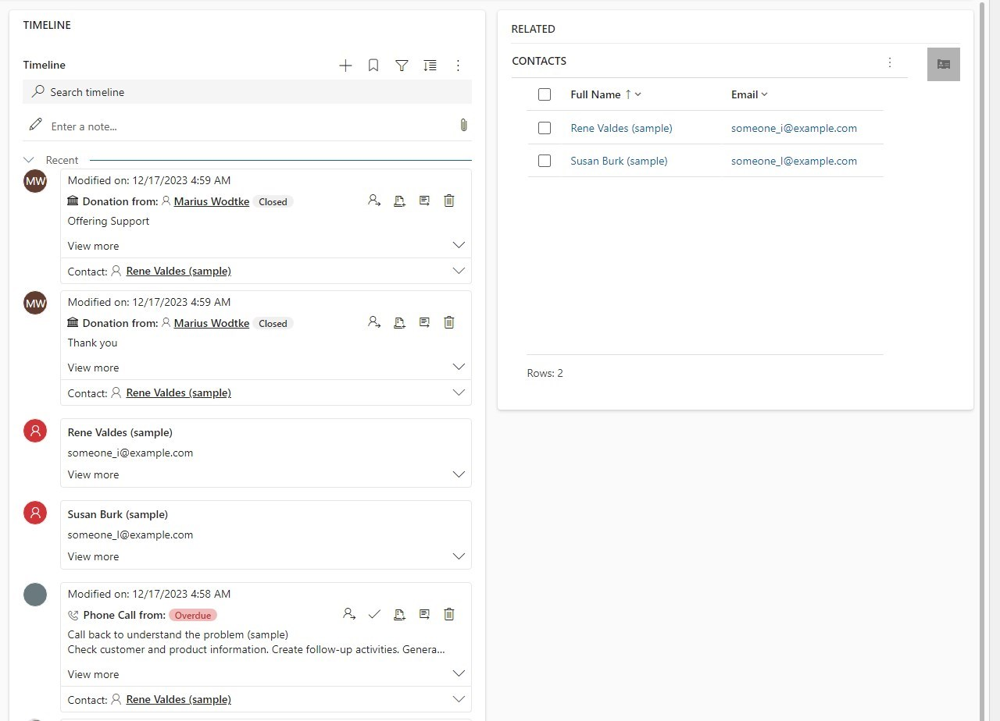

[The first post](/post/timeline/custom/basics/) just displayed a dummy record, not actually that useful. This time we will integrate an entity that would usually not be a fit for the timeline. I initially wanted to use the opportunity, as seeing the opportunities of a customer in their timeline might be a valid request from a sales organization. But my Development Environments of course can't install the Sales module, so instead we will show the contacts of the account. Since it's on the OOTB account form right beside the timeline anyway we can easily verify our results.

## A new class
[The template](https://github.com/Kunter-Bunt/TimelineCustomConnector) already includes webpack, so we can just create a new file (_ContactData.ts_) with a class that we will include in our `MyDataSource` with an import statement.

First, we need to retrieve the contacts from Dataverse. We can use `Xrm.WebApi.retrieveMultiple` for that or use the context given to us in the `init` method, it also includes the WebApi interface. I will use the context here to showcase its usage and I assume it's the preferred option by MS (but this is pure speculation because, at the time of writing, there is no best practice communicated).

``` TS 
private async getData(): Promise<IRecord[]> {
    let accountId = this.context.page.entityId;
    let filter = `$filter=_parentcustomerid_value eq ${accountId}`
    let select = `$select=contactid,fullname,modifiedon,emailaddress1`
    let contacts = await this.context.webAPI.retrieveMultipleRecords("contact", `?${filter}&${select}`);
    return contacts.entities.map(this.mapContact);
}
```

Next, we want to map the returned contact to our `IRecord` interface.

``` TS 
// In Record.ts
export interface IRecord {
    id: string;
    name: string;
    email: string;
    date: string;
}

// In ContactData.ts
private mapContact(contact: any): IRecord {
    let record = {
        id: contact.contactid,
        name: contact.fullname,
        email: contact.emailaddress1,
        date: contact.modifiedon
    };

    return record;
}
```

Of course, you could name the properties more similar to the original fields of contact and if you are using earlybounds, you may skip `IRecord`, since you will have a generated type that you can use. However, in the next code snippet, the data property is a string that we will fill with `JSON.stringify`. We will need to deserialize this JSON again in other parts of the code, so it's a good idea to agree on a common ground on what is in the data property and that's exactly what `IRecord` achieves.

``` TS 
async getRecordsData(request: IRecordsDataRequest): Promise<IRecordData[]> {
    let data = await this.getData();

    return data.map(this.mapRecord);
}

private mapRecord(record: IRecord): IRecordData {
    let recordData = {
        data: JSON.stringify(record),
        id: record.id,
        sortDateValue: record.date
    };

    return recordData;
}
```

You can find the full class [here](https://github.com/Kunter-Bunt/TimelineCustomConnector/blob/DataverseContactData/src/ContactData.ts).

## Changes to MyDataSource
In the original class, the `getRecordsData` method changes, it will now call our new class and return its results. Notice here, how the results are cached in `this.records`, `getRecordsData` is called with every filtering and search action as well and it just makes sense to filter in memory as it will be a smoother experience for the user. I also want to mention that I had trouble with reloading data when filtering, however, the issues of just receiving a never-ending loading icon were not reproducible anymore when preparing this article.

``` TS 
import { ContactData } from "./ContactData";

async getRecordsData(request: IRecordsDataRequest, filter?: IFilterRequest | undefined): Promise<IRecordsDataResponse> {
    this.records = this.records ?? await this.contactData?.getRecordsData(request);

    const response = {
        requestId: request.requestId,
        records: this.records
    }

    return response;
}
```

Some other parts will also change, for example, I changed the icon to the matching `IconOption.ContactEntityIcon`, the header of the card will show the name and the body will show the email.

``` TS {hl_lines=[5,13]}
createHeader(recordId: string, data: IRecord) {
    return this.context?.factory.createElement(
        "Label",
        { key: `${this.getRecordSourceInfo().name}_${recordId}_header` },
        `${data.name}`
    ) ?? [];
}

createBody(recordId: string, data: IRecord) {
    return this.context?.factory.createElement(
        "Label",
        { key: `${this.getRecordSourceInfo().name}_${recordId}_body` },
        `${data.email}`
    ) ?? [];
}
```

You can find the full class [here](https://github.com/Kunter-Bunt/TimelineCustomConnector/blob/DataverseContactData/src/MyRecordSource.ts).

## The result
If we open an account now, with the form selected where our custom connector is configured for the timeline, the timeline now displays the contacts.



As teased in the beginning, we can nicely see that the results are correct by just comparing them to the _related contacts_ grid on the right. 

If you want to take a look at the full code of this sample, check out [the DataverseContactData branch](https://github.com/Kunter-Bunt/TimelineCustomConnector/tree/DataverseContactData).

## Summary
Since we don't need to handle any secrets, showing data from Dataverse in the timeline is straightforward. This can enable you to fulfill requirements to show data in the timeline which usually would not be a fit for example because it's not an activity entity. You should of course question the requirement, is it really needed? Because we need to invest time coding the connector and will have future costs for maintaining a custom component. Right now, this simple sample is already 150 lines of code, and we haven't handled any filtering yet. However, sometimes there are strong business reasons to not use a standard grid and then we have a great tool in our toolbox.

For showing custom data, add a class/method to [the template](https://github.com/Kunter-Bunt/TimelineCustomConnector) to retrieve the data using `WebApi.retrieveMultiple`. Next, map the data to an interface like `IRecord` and serialize the records to the `IRecordData` interface. Return these serialized records from the `getRecordsData`. You will receive them back in `getRecordUX` where you may deserialize your records again and build a card form showing the data, comprising of header, body and footer.