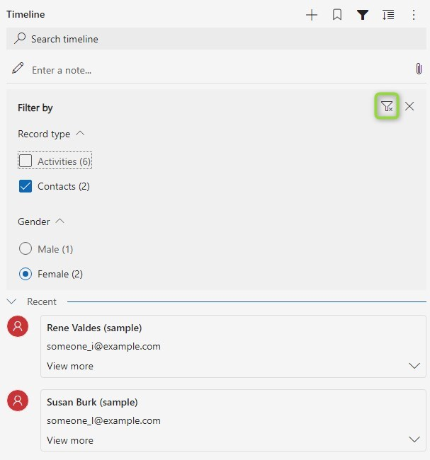

In [the last post](/post/timeline/custom/data/) of this series about Timeline Custom Connectors we added contacts of an account to the timeline. But we have not included them at all in the filters of the timeline, meaning you can't view the contacts in isolation or filter them out to only show activities.

## Prior considerations
You don't need to implement filtering, you can skip the `getFilterDetails` at all, it's optional. And considering my field experiences, there is a considerable amount of user-groups that use the timeline to get a glance at recent activity. Filters are totally irrelevant for them since they are able to identify the relevant records by simply scrolling through.

But of course this is not true for all organizations. The more data is displayed in the timeline, the more users crave for filtering. And us adding more data could be the reason, users finally say "why can't I only display X".

When implementing `getFilterDetails` we can return a partial set of filters that will be merged with the filters returned by the other modules (implemented by MS). We can both extend existing filters as well as introduce custom, new filter categories. For the sample I extended the _Module_ which usually has things like Activities, Posts and Notes with the new value _Contacts_. Also we are going to introduce a new filter for the gender of contacts. I don't have a good use case for this as I can't imagine contacts being a good fit for the timeline, but it will show well that you can have both Checkboxes (`MultiSelect`) as well as Radiobuttons (`SingleSelect`).

The reason why I kind of hinted to skip implementing filters if possible is the `count` property. An option with zero records will not be shown, if a category (`FilterGroup`) has no option with at least one records, it will be hidden. But you also can't just put one to all options, if an "invalid" combination of filters is chosen, the timeline will start to misbehave with infinite loads. So the only option for us is implementing the count correctly, which is harder than you might think. ;)

To help you getting started yourself, this article has a branch in the sample repository called [Filters](https://github.com/Kunter-Bunt/TimelineCustomConnector/tree/Filters). Here you will find the full code of the commented snippets we discuss in the coming sections.

## Changes to ContactData
Just for completeness: The data being retrieved from contact in the previous branch [DataverseContactData](https://github.com/Kunter-Bunt/TimelineCustomConnector/blob/DataverseContactData/src/ContactData.ts) did not include the gender. So I added the gender as a number to the `IRecord` interface, retrieved it from Dataverse and mapped it to the record. This will allow us to filter on this property.

## A new class
Now to the real thing, the [ContactFilter](https://github.com/Kunter-Bunt/TimelineCustomConnector/blob/Filters/src/ContactFilter.ts) class.

In this class I introduced a `getFilterDetails` that will not only get the `IFilterRequest` like the method in the official interface, but also the records we retrieved in the [ContactData](https://github.com/Kunter-Bunt/TimelineCustomConnector/blob/Filters/src/ContactData.ts) class. And then we can just define a filter like this and return it:

``` TS
{
    name: FilterGroupName.RecordType,
    type: FilterGroupType.MultiSelect,
    options: [
        {
            value: "Contacts",
            label: "Contacts",
            count: 1,
        }
    ]
}
```

But remember, we still need to cover the count properly before this is usable, but the "Record Type" filter should now show a new option "Contacts (1)". Alongside we will see "Activities (x)" from Microsofts Activities module. So extending an existing filter just requires you to match the name, in the FilterGroupName enum you will find more predefined filters.

With our custom filter we can do very similarly, we are just going to define more options and make use of the fact that label and value are two separate properties, allowing us to match the OptionsetValues with the values of the filter options. Also I will introduce variables for the strings here as a best practice since I will need them multiple times.

``` TS
private readonly gender = "Gender";
private readonly male = "Male";
private readonly maleNumber = "1";
private readonly female = "Female";
private readonly femaleNumber = "2";
...
{
    name: this.gender,
    type: FilterGroupType.SingleSelect,
    options: [
        {
            label: this.male,
            value: this.maleNumber,
            count: 1,
        },
        {
            label: this.female,
            value: this.femaleNumber,
            count: 1,
        }
    ]
}
```

Now we need the correct count. For this we have the method `getFilteredRecords(records: IRecord[], filter?: IFilterRequest, additional?: IAdditionalFilter)`. It also takes the current records plus the filter and should return all records matching the filters. This is of course necessary to determine what the `getRecordsData` function from the official interface should return when filters are applied. But the optional _additional_ parameter will represent "what if the user selected this option?". So the combination of existing filters being passed to us by the pipeline plus an imaginary additional filter will determine the final count.

``` TS
private readonly filterExecutors: { [key: string]: (record: IRecord, selectedFilter: ISelectedFilter) => boolean } = {
    [FilterGroupName.RecordType]: this.filterModule,
    [this.gender]: this.filterGender
};

getFilteredRecords(records: IRecord[], filter?: IFilterRequest, additional?: IAdditionalFilter): IRecord[] {
    let selectedFilters = this.getSelectedFilters(filter, additional);

    let filteredRecords = records;
    selectedFilters?.forEach(selectedFilter => {
        let filterExecutor = this.filterExecutors[selectedFilter.name]?.bind(this);
        if (filterExecutor)
            filteredRecords = filteredRecords.filter(record => filterExecutor(record, selectedFilter));
    });

    return filteredRecords;
}

private filterModule(record: IRecord, selectedFilter: ISelectedFilter): boolean {
    return selectedFilter.options.some(val => val.value === this.contacts);
}

private filterGender(record: IRecord, selectedFilter: ISelectedFilter): boolean {
    return selectedFilter.options.some(val => val.value === record.gender.toString());
}
```

What you can see here that the methods `filterModule` and `filterGender` are custom for each type of filter since I could imagine an interface that will fit for any situation. Just take the RecordType as a sample: To have something like a _matching property .ToString matches the value_ for the record type, we would need to enrich our IRecord interface with a RecordType that is static for all records.

Instead here the dictionary `filterExecutors` just stores functions for each FilterGroup and those functions can do all the fancy stuff we need to determine the correct outcome.

For the method `getSelectedFilters` I will just link you to [the sample repository](https://github.com/Kunter-Bunt/TimelineCustomConnector/blob/Filters/src/ContactFilter.ts#L90), since it's a little to long for display. In essence it just extracts all the groups that have at least one option selected, all the others are ignored in filtering. Afterwards, if present, the additional filter either needs to be added, or just the new option needs to be added or in case of SingleSelect, the existing option might need to be replaced.

So last thing to do, apply this new function to the count, here is a sample.
``` TS  {hl_lines=[8,9,10,11,12,13]}
{
    name: FilterGroupName.RecordType,
    type: FilterGroupType.MultiSelect,
    options: [
        {
            value: this.contacts,
            label: this.contacts,
            count: this.getFilteredRecords(records, filter,
                {
                    name: FilterGroupName.RecordType,
                    value: this.contacts,
                    type: FilterGroupType.MultiSelect,
                }).length,
        }
    ]
}
```

## Changes to MyDataSource
Well, a) `getFilterDetails` needs to call `getFilterDetails`:
``` TS
async getFilterDetails(filter?: IFilterRequest | undefined): Promise<IFilterGroup[]> {
    return this.contactFilter?.getFilterDetails(this.records.map(record => JSON.parse(record.data) as IRecord), filter) ?? [];
}
```

and b) we should also the selected filters to `getRecordsData`:
``` TS  {hl_lines=[3,7]}
async getRecordsData(request: IRecordsDataRequest, filter?: IFilterRequest | undefined): Promise<IRecordsDataResponse> {
    this.records = this.records ?? await this.contactData?.getRecordsData(request);
    let filteredRecords = this.contactFilter?.getFilteredRecords(this.records.map(record => JSON.parse(record.data) as IRecord), filter) ?? []
    
    const response = {
        requestId: request.requestId,
        records: this.records.filter(record => filteredRecords.some(filteredRecord => filteredRecord.id === record.id)),
    }

    return response;
}
```

## The result
Now, what will it look like in the system? Let's look at some pictures.




We can nicely see how selecting filters affects other groups, even between different modules. We can also see the importance of those "imaginary filters" we added in calculating the count of records.

With the Single Select I noticed that once you selected the filter, you cannot deselect it unless you use the button to clear all filters, which will also clear the other groups. This is not ideal and might be a reason to simply go with Multi Select everywhere to avoid this behavior, even if a Single Select might be a proper choice like our gender use case.

## Summary
Implementing filters requires quite some code! But once implemented it has a nice feel and gives the user options to find what they need in crowded timelines. 

To implement filters you have the option to extend existing ones by matching their _FilterGroupName_ or adding new groups. Implementing filters is optional, but when you choose to, you will have to make sure the count of remaining records if that option was chosen is calculated correctly. When you use [the sample](https://github.com/Kunter-Bunt/TimelineCustomConnector/blob/Filters/src/ContactFilter.ts) as a template you can do so by just implementing a function for each _FilterGroup_ and then registering it to the `filterExecutors`. Afterwards you will just have to add the according _FilterGroup_ in the list returned from `getFilterDetails`. Still: The ContactFilter class is the biggest we had so far in this series and it's code is much less trivial than the samples before. 