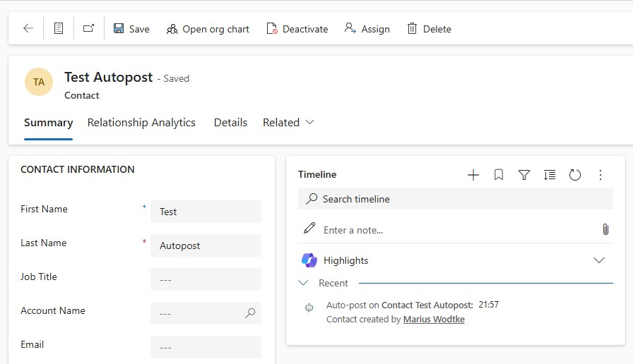
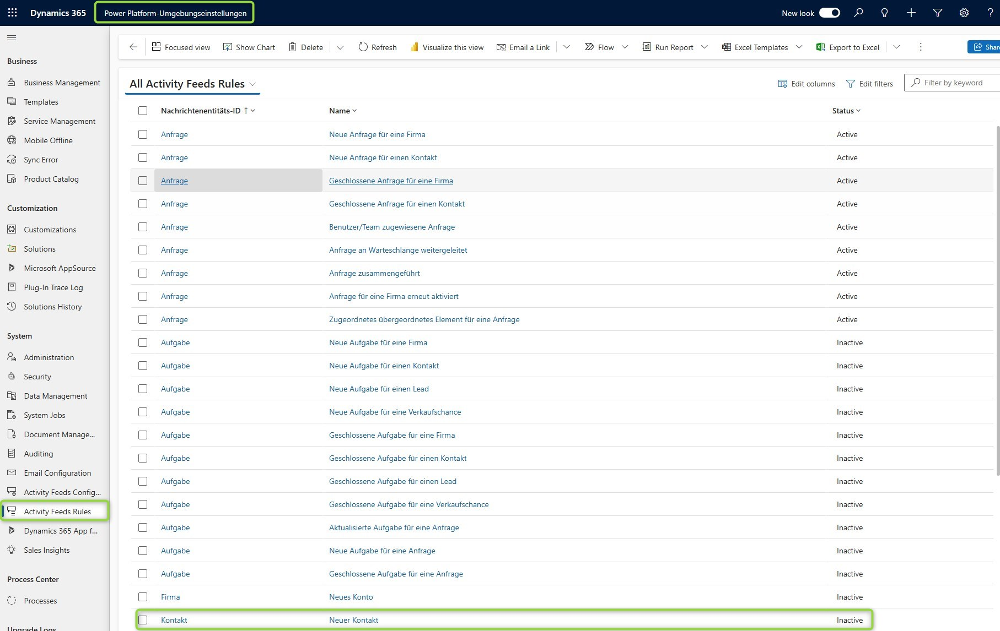
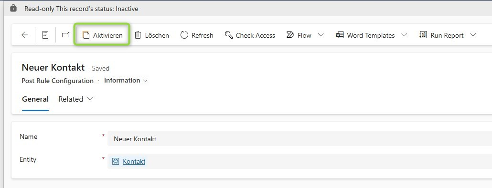
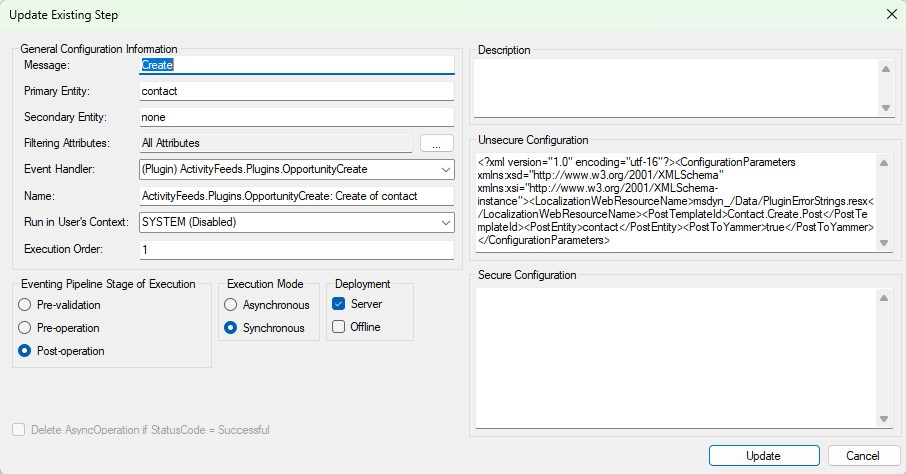

Posts in the timeline are certainly a topic for debate. Do you allow users to create them, why shouldn't they use Notes instead? And of course the question "Do you really need an element describing that the current record was created?" 

There are reasons to have it, for example because the date is included you could economize the Created On field from a form with a Timeline and it is kind of a close to the timeline.

But on the other hand, this information is completely redundant and does occupy space in the database! A good reason to forgo auto-posts for organizations with a lot of records that will have auto-posts enabled by default.

Fortunately we can control auto-posts to a certain degree. Microsoft predefined for which events auto-posts may be generated and you can decide to enable or disable this feature for the given events.

And if you are wondering what exactly an auto-post is, it's these messages within the timeline.

## Preconditions
This might only apply to you if you came here to enable auto-posting: It is only available on environments with _Dynamics 365 Apps_ enabled! So for example you won't be able to test this on a developer environment even though you are able to set up timelines.

The other thing I'd like to mention: Definitely check your active rules. For this post I created a new environment and there were far less active rules than environments created in the past. For example the mentioned rules for the creation of contacts, accounts and leads were not active by default! So apparently Microsoft is adjusting these as well to have less default auto-posting, maybe I should change the title of this post to "Are you missing auto-posts?"

## Configuration
So first of all I have to apologize for the looks of these pictures, somehow my environment was created in german and the translation only partly worked. I will try my best to also describe the things seen in english.

So you will find the auto-post rules in the _Power Platform Environment Settings_ app under _System_, _Activity Feed Rules_. Here you find a list of the predefined rules of Microsoft, the names are in the base language of the environment. For the sample I took "New Contact" configuration and activated it. After that of course when I create a new Contact it immediately receives the corresponding auto-post you see in the picture above.

## How does it work?
When you activate an auto-post rule that creates a plugin step. The name of the plugin is a little off, but we can see from the xml in the Unsecure Configuration that this plugin is configurable and is configured to work for Contact creation.

You can also see that the step is synchronous. This ensures that the timeline post is already there when the form refreshes after the Contact creation, when the timeline loads.

This however has performance implications. If you want to push a lot contacts you might to spare any synchronous step on creation. Also consider this for rules that work on N:N relationships (Associate). Because associate cannot be filtered down to specific relationships or entities, having a synchronous step here will impact all associates happening in the system!

## Summary
The performance implications of auto-post rules are a good reason to sit together with IT and Business to decide on what rules offer a benefit and should be used, everything else should be omitted. While I always talk about reducing the amount of active rules, it might also be the case that you find very useful rules that are not active in your environment and I definitely don't want to discourage you from activating them! I just want to raise awareness that they are executed in a synchronous manner, something you try to usually limit.

To find out what rules are active, head to the _Power Platform Environment Settings_ app, _System_, _Activity Feed Rules_. Here you can select rules and (de-)activate them. However, the menu point is only found in environments that had the switch for _Dynamics 365 Apps_ active when they were created. 